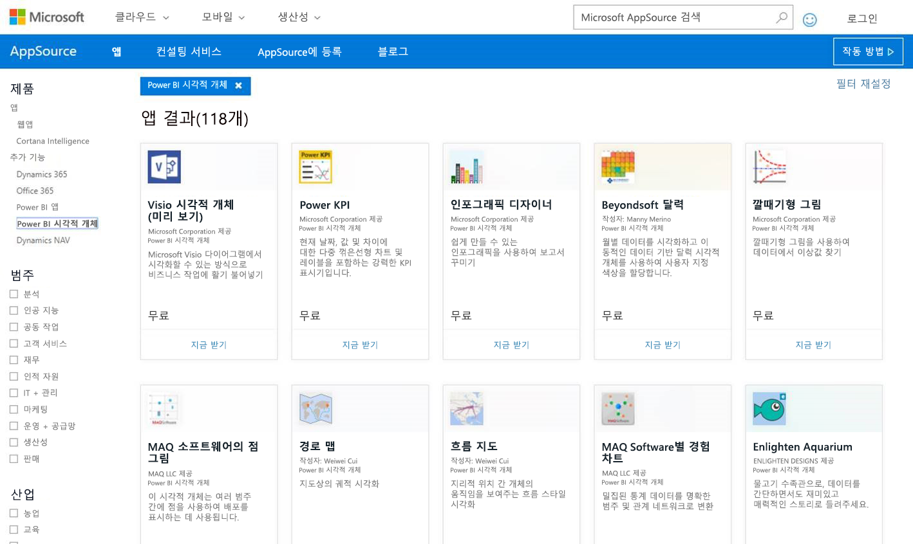
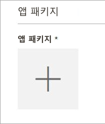
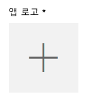
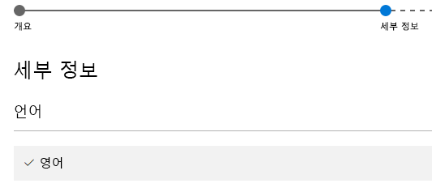

# AppSource에 사용자 지정 시각적 개체 게시

다른 사람이 검색하고 사용할 수 있도록 사용자 지정 시각적 개체를 AppSource에 게시하는 방법을 알아봅니다.

사용자 지정 시각적 개체를 만든 후에는 다른 사람이 검색하고 사용할 수 있도록 AppSource에 게시할 수 있습니다. 이렇게 하려면 몇 가지 준비가 필요합니다. 사용자 지정 시각적 개체를 만드는 방법에 대한 자세한 내용은 [Power BI 사용자 지정 시각적 개체 개발](custom-visual-develop-tutorial.md)을 참조하세요.

   

## AppSource란?

**AppSource**는 Microsoft 제품 및 서비스에 대한 SaaS 앱과 추가 기능을 찾을 수 있는 곳입니다. [AppSource](https://appsource.microsoft.com/marketplace/apps?product=power-bi-visuals)는 전보다 효율적이고, 멋지고, 통찰력 있게 작업할 수 있도록 도와주는 솔루션을 수백만 명의 Office 365, Dynamics 365, Cortana Intelligence 등의 사용자와 연결해 줍니다.

## 사용자 지정 시각적 개체를 제출하기 위한 준비

사용자 지정 시각적 개체를 코딩하고 테스트하고 pbiviz 파일로 패키지를 생성한 후 제출을 위해 다음 사항도 준비해야 합니다.

| 항목 | 필수 | 설명 |
| --- | --- | --- |
| Pbiviz 패키지에 필요한 모든 메타데이터 포함 |예 |시각적 개체 이름 표시 이름 GUID 버전 설명 작성자 이름 및 전자 메일 |
| 샘플 .pbix 보고서 파일 |예 |시각적 개체를 소개하는 경우 사용자가 시각적 개체에 익숙해질 수 있도록 도움을 줘야 합니다. 시각적 개체가 사용자에게 도움이 되는 가치를 강조하고 사용 사례, 서식 지정 옵션 등을 제공해야 합니다. 팁과 요령, 피해야 할 것 등을 포함하는 *"힌트"* 페이지를 마지막에 추가할 수도 있습니다. 샘플 .pbix 보고서 파일은 모든 외부 연결 없이 오프라인으로 작업해야 합니다. |
| 아이콘 |예 |스토어 맨 앞에 표시되는 사용자 지정 시각적 개체 로고를 포함해야 합니다. 가능한 형식은 png, .jpg, .jpeg 또는 .gif입니다. 정확히 300px(너비) x 300px(높이)여야 합니다. **중요** 아이콘을 제출하기 전에 [간단한 가이드](https://docs.microsoft.com/office/dev/store/craft-effective-appsource-store-images)를 주의 깊게 검토하세요. |
| 스크린샷 |예 |스크린샷을 하나 이상 제공해야 합니다. 가능한 형식은 png, .jpg, .jpeg 또는 .gif입니다. 정확히 1366px(너비) x 768px(높이)여야 합니다. 파일 크기는 1024KB를 초과할 수 없습니다. *활용도를 높이려면, 각 스크린샷에 표시되는 주요 기능의 가치 제안을 분명히 전달하기 위한 텍스트 거품을 추가합니다.* |
| 다운로드 링크 지원 |예 |시각화 개체에 문제가 있는 고객을 지원하기 위한 URL을 제공합니다. 이 링크는 SellerDashboard 목록의 일부로 입력되고 AppSource의 시각적 개체 목록에 액세스할 때 사용자에게 표시됩니다. URL 형식에 https:// 또는 http:// 를 포함해야 합니다. |
| 개인정보처리방침 링크 |예 |시각화 개체를 사용하는 고객에 대해 개인 정보 취급 방침에 대한 링크를 제공합니다. 이 링크는 SellerDashboard 목록의 일부로 입력되고 AppSource의 시각적 개체 목록에 액세스할 때 사용자에게 표시됩니다. 링크 형식에 https:// 또는 http:// 를 포함해야 합니다. |
| EULA(최종 사용자 사용권 계약) |예 |EULA 파일을 업로드해야 합니다. 자체적인 EULA를 사용하거나 Office 스토어 내에 있는 Power BI 사용자 지정 시각적 개체에 대한 기본 EULA를 사용할 수 있습니다. 기본 EULA를 사용하려면 판매자 대시보드의 “최종 사용자 사용권 계약” 파일 업로드 대화 상자에 다음 URL을 붙여넣습니다. [https://visuals.azureedge.net/app-store/Power BI - Default Custom Visual EULA.pdf](https://visuals.azureedge.net/app-store/Power%20BI%20-%20Default%20Custom%20Visual%20EULA.pdf). |
| 비디오 링크 |아니요 |사용자 지정 시각적 개체에 대한 사용자의 관심을 높이려면 시각적 개체에 대한 비디오 링크를 제공하는 것이 좋습니다. URL 형식에 https:// 또는 http:// 를 포함해야 합니다. |
| GitHub 리포지토리 |아니요 |다른 개발자가 피드백을 제공하고 코드에 대한 개선을 제안할 수 있도록 시각적 개체의 소스와 함께 샘플 데이터가 있는 [GitHub](https://www.github.com) 리포지토리의 유효한 공개 링크를 제공하는 것이 좋습니다. |

## Power BI에 제출

제출은 Power BI 사용자 지정 시각적 개체 제출 팀에 전자 메일을 보내는 것으로 시작됩니다. [pbivizsubmit@microsoft.com](mailto:pbivizsubmit@microsoft.com)에 전자 메일을 보냅니다.

> [!IMPORTANT]
> .pbiviz 패키지를 만들기 전에 pbiviz.json 파일 “description”, “supportUrl”, “author”, “name” 및 “email” 필드를 입력해야 합니다.

메일에 **.pbiviz 파일**과 **샘플 보고서 .pbix 파일**을 첨부합니다. Power BI 팀이 지침 및 업로드할 앱 패키지 XML 파일이 포함된 회신을 보냅니다. XML 앱 패키지는 Office 개발자 센터를 통해 시각적 개체를 제출하기 위해 필요합니다.

> [!NOTE]
> 품질을 개선하고 기존 보고서가 중단되지 않도록 하기 위한 기존의 시각적 개체에 대한 업데이트는 스토어에서 승인 후 프로덕션 환경에 도달하기까지 추가로 2주가 걸립니다.

## AppSource에 제출

Power BI 팀으로부터 앱 패키지 XML을 받은 후에는 [개발자 센터](https://sellerdashboard.microsoft.com/Application/Summary)로 이동하여 AppSource에 시각적 개체를 제출합니다.

> [!NOTE]
> [Office 개발자 센터](https://dev.office.com/)에 로그인할 수 있는 유효한 Office 개발자 계정이 있어야 합니다. Office 개발자 계정은 Microsoft 계정(Live ID 즉, hotmail.com 또는 outlook.com)이어야 합니다.

> [!IMPORTANT]
> AppSource에 제출하기 전에 .pbiviz 파일과 .pbix 파일이 포함된 전자 메일을 Power BI 팀에 보내야 합니다. 그러면 Power BI 팀이 해당 파일을 공개 공유 서버에 업로드할 수 있습니다. 그렇지 않으면 스토어에서 파일을 검색할 수 없습니다. 새로운 시각적 개체 제출, 기존 시각적 개체의 업데이트 및 거부된 제출에 대한 수정 사항 각각에 대해 파일을 보내야 합니다.

### 시각적 개체를 제출하는 프로세스

다음 단계에 따라 제출을 완료합니다.

1. **새 앱 추가**를 선택합니다.

    

2. **Power BI 사용자 지정 시각적 개체**와 **다음**을 차례로 선택합니다.

3. **앱 패키지** 아래 **+** 를 선택하고 파일 열기 대화 상자에서 Power BI 팀으로부터 받은 앱 패키지 XML 파일을 선택합니다.

    

4. 유효한 Power BI 앱 패키지인 승인을 수신합니다.

    

5. **일반 정보** 세부 사항을 작성합니다.

   * ‘제출 제목:’ 개발자 센터에서 불려질 제출의 이름입니다.
   * ‘버전:’ 버전 번호가 추가 기능 앱 패키지에서 자동으로 채워집니다.
   * ‘릴리스 날짜(UTC):’ 앱을 스토어에 릴리스할 날짜를 선택합니다. 미래의 날짜를 선택하면 해당 날짜가 될 때까지 앱이 스토어에 제공되지 않습니다.
   * ‘범주:’ 첫 번째 범주는 “데이터 시각화 + BI”라고 자동 입력됩니다. 모든 Power BI 사용자 지정 시각적 개체에 이런 식으로 태그가 지정됩니다. 사용자가 시각적 개체를 손쉽게 검색하는 데 도움을 주기 위해 추가 범주를 2개까지 제공할 수 있습니다.
   * *테스팅 메모:* 선택 사항, Microsoft의 테스터에 대한 지침을 제공하려는 경우 입력합니다.
   * *앱에서 암호화를 호출, 지원, 포함 또는 사용합니다.* 를 선택되지 않은 상태로 둡니다.
   * *이 추가 기능을 iPad용 Office 추가 기능 카탈로그에서 제공:* 을 선택되지 않은 상태로 둡니다.
6. **앱 로고** 아래 **+** 를 선택하여 시각적 개체의 로고를 업로드합니다. 그런 다음 파일 열기 대화 상자에서 아이콘 파일을 선택합니다. 파일은 .png, .jpg, .jpeg 또는 .gif 형식이어야 합니다. 정확히 300px(너비) x 300px(높이)여야 하고 크기는 512KB를 초과할 수 없습니다.

    

7. **지원 문서** 세부 사항을 입력합니다.

   * 지원 문서 링크
   * 개인정보처리방침 링크
   * 비디오 링크
   * 최종 사용자 사용권 계약(EULA)

       EULA 파일을 업로드해야 합니다. 자체적인 EULA를 사용하거나 Office 스토어 내에 있는 Power BI 사용자 지정 시각적 개체에 대한 기본 EULA를 사용할 수 있습니다. 기본 EULA를 사용하려면 판매자 대시보드의 “최종 사용자 사용권 계약” 파일 업로드 대화 상자에 다음 URL을 붙여넣습니다. [https://visuals.azureedge.net/app-store/Power BI - Default Custom Visual EULA.pdf](https://visuals.azureedge.net/app-store/Power%20BI%20-%20Default%20Custom%20Visual%20EULA.pdf).

8. **다음**을 선택하여 **세부 정보** 페이지로 이동합니다.

9. **언어**를 선택하고 목록에서 언어를 선택합니다.

    

10. "설명" 세부 정보를 입력합니다.

    * ‘앱 이름(현재 언어용):’ 상점에 표시될 앱의 제목을 입력합니다.
    * 짧은 설명: 상점에 표시될 앱에 대한 최대 100자의 짧은 설명을 입력합니다. 이 설명은 로고와 함께 최상위 페이지에 표시됩니다. pbiviz 패키지의 설명을 사용할 수 있습니다.
    * 긴 설명: 앱 세부 정보 페이지를 통해 고객에게 표시될 앱에 대한 보다 자세한 설명을 입력합니다. 시각적 개체를 오픈 소스로 전환하여 커뮤니티를 통해 향상시키려면 GitHub와 같은 공용 리포지토리에 대한 링크를 여기에 제공합니다.

11. 스크린샷을 하나 이상 업로드합니다. 가능한 형식은 png, .jpg, .jpeg 또는 .gif입니다. 정확히 1366px(너비) x 768px(높이)여야 합니다. 파일 크기는 1024KB를 초과할 수 없습니다. *활용도를 높이려면, 각 스크린샷에 표시되는 주요 기능의 가치 제안을 분명히 전달하기 위한 텍스트 거품을 추가합니다.*

12. 언어를 더 추가하려면 **언어 추가**를 선택하고 10단계와 11단계를 반복합니다. 언어를 더 추가하면 사용자가 자신의 언어로 사용자 지정 시각적 개체의 세부 정보를 보는 데 도움이 됩니다. 목록에 없는 언어는 처음에 선택된 언어로 기본값이 설정됩니다.

13. 언어 추가가 완료되면 **다음**을 선택하여 **액세스 차단** 페이지로 이동합니다.

14. 특정 국가나 지역의 고객이 여러분의 앱을 사용하거나 구매하지 못하도록 하려면 해당 확인란을 선택하고 목록에서 선택합니다.

15. **다음**을 선택하여 **가격 책정** 페이지로 이동합니다.

16. 현재는 *무료* 시각적 개체만 지원되며 시각적 개체 내 추가 구매(앱에서 바로 구매)는 허용되지 않습니다. **이 앱은 무료입니다.** 를 선택합니다.

    > [!NOTE]
    > 무료가 아닌 다른 옵션을 선택하거나 제출된 시각적 개체에 앱에서 바로 구매한 콘텐츠가 있는 경우 제출이 거부됩니다.

17. 지금은 **초안으로 저장**을 선택하고 나중에 제출하거나, **승인을 위해 제출**을 선택하고 Office 스토어에 사용자 지정 시각적 개체를 제출할 수 있습니다.

## 제출 상태 및 사용 현황 추적

[유효성 검사 정책](https://dev.office.com/officestore/docs/validation-policies#13-power-bi-custom-visuals)을 검토할 수 있습니다.

제출 후에 [앱 대시보드](https://sellerdashboard.microsoft.com/Application/Summary/)에서 제출 상태를 볼 수 있습니다.

## 시각적 개체 인증

시각적 개체를 만든 후 인증된 시각적 개체를 선택적으로 얻을 수 있습니다. 즉, Power BI 서비스 내에서 실행할 수 있으며, PowerPoint로 내보내는 것처럼 서비스의 다른 기능과 함께 사용할 수 있습니다. 자세한 내용은 [*인증된*사용자 지정 시각적 개체 가져오기](../power-bi-custom-visuals-certified.md)를 참조하세요.

## 다음 단계

[Power BI 사용자 지정 시각적 개체 개발](custom-visual-develop-tutorial.md)  
[Power BI의 시각화](../visuals/power-bi-report-visualizations.md)  
[Power BI의 사용자 지정 시각화](../power-bi-custom-visuals.md)  
[*인증된* 사용자 지정 시각적 개체 가져오기](../power-bi-custom-visuals-certified.md)

궁금한 점이 더 있나요? [Power BI 커뮤니티에 질문합니다.](http://community.powerbi.com/)
