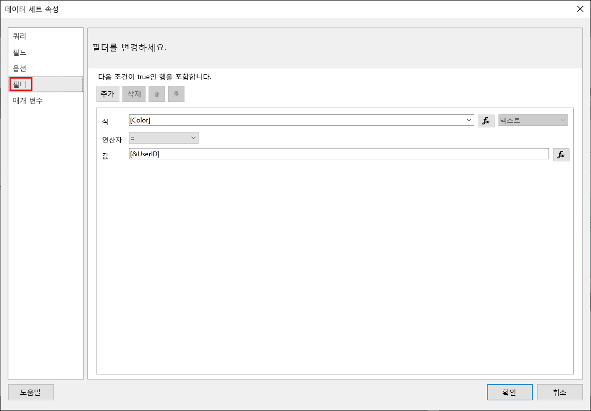
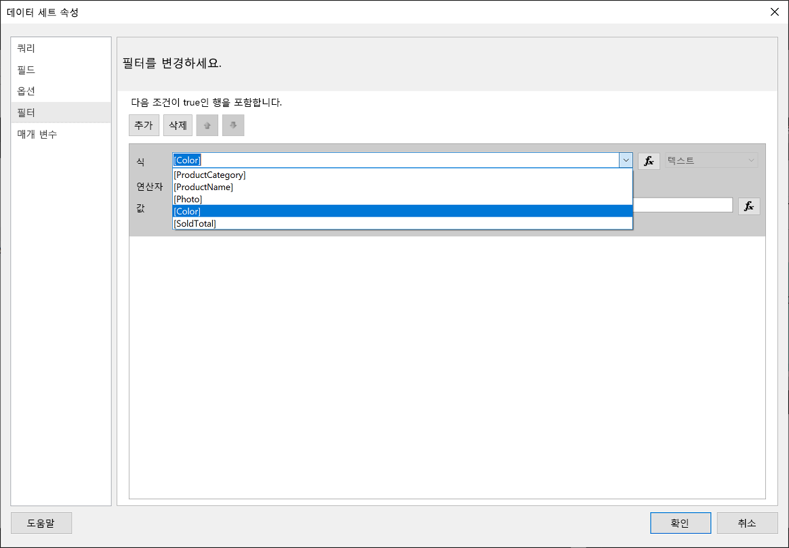
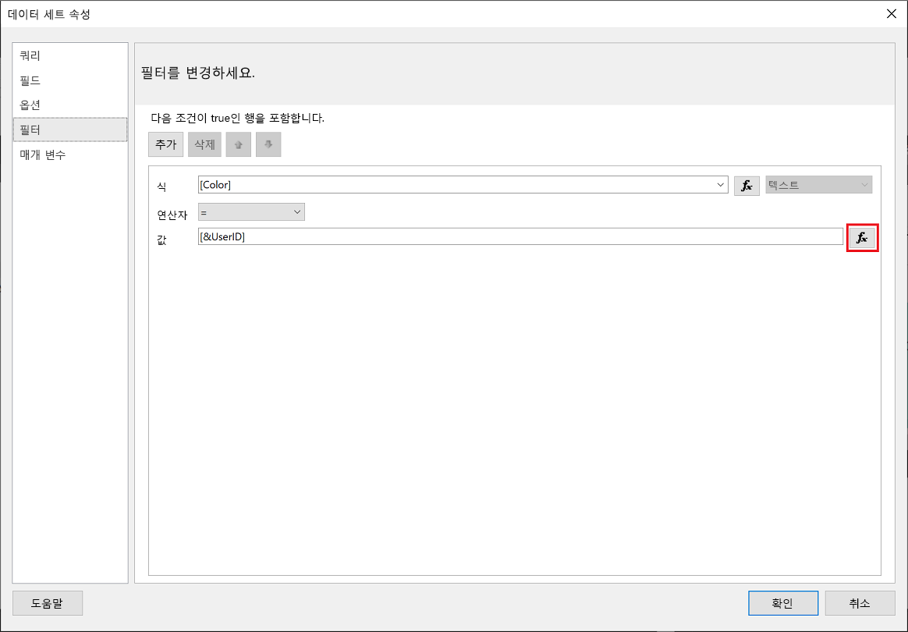
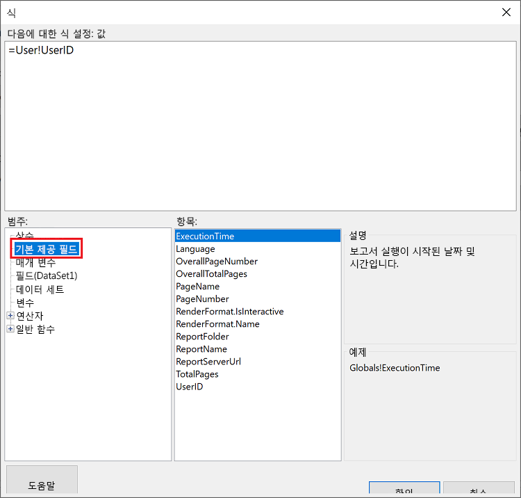
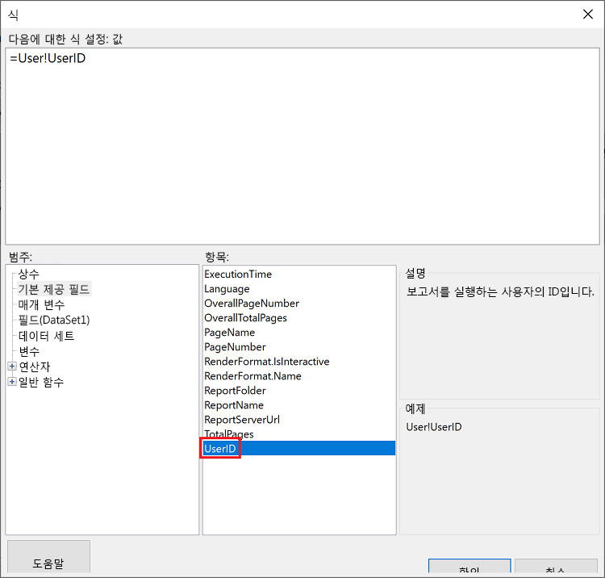
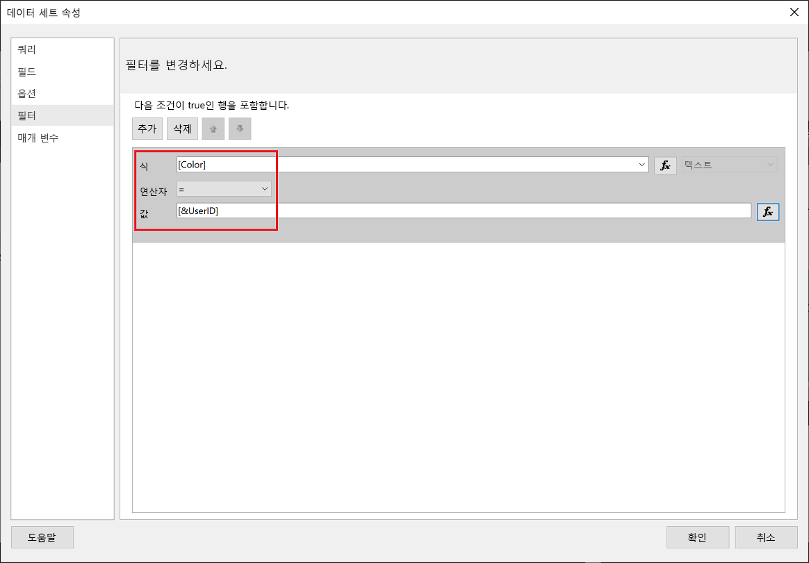
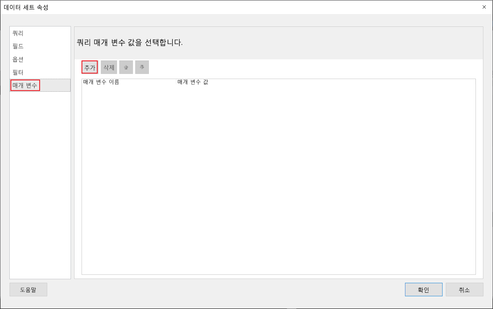
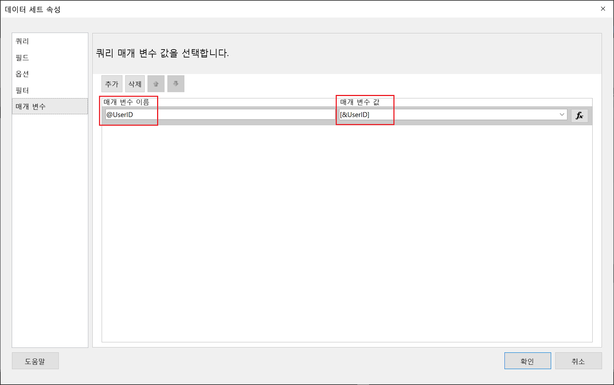
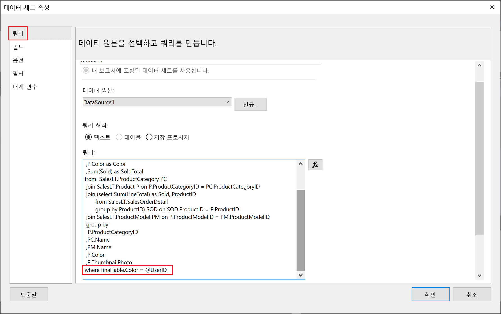

# <a name="implementing-row-level-security-in-embedded-paginated-reports-preview"></a>포함된 페이지를 매긴 보고서에서 행 수준 보안 구현(미리 보기)

페이지를 매긴 보고서를 포함하는 경우 표시할 데이터를 제어할 수 있습니다. 이를 통해 사용자별로 표시되는 정보를 조정할 수 있습니다. 예를 들어, 전세계 판매 결과가 들어 있는, 페이지를 매긴 Power BI 보고서가 있는 경우 특정 지역의 판매 결과만 사용할 수 있도록 해당 보고서를 포함할 수 있습니다.

이 기능은 나머지 데이터를 데이터의 나머지 부분을 손상시키지 않는 방식으로 데이터의 하위 집합을 표시하는 안전한 방법을 제공합니다. 이는 페이지를 매기지 않은 Power BI 보고서, 대시보드, 타일 및 데이터 세트에 데이터를 표시하는 안전한 방법을 제공하는 [RLS(행 수준 보안)](embedded-row-level-security.md) 기능과 비슷합니다.  

> [!Note]
> 이 기능은 고객을 위해 페이지를 매긴 보고서를 포함하는 데 사용됩니다.

## <a name="configuring-a-parameter-to-filter-the-dataset"></a>매개 변수를 구성하여 데이터 세트 필터링

페이지를 매긴 Power BI 보고서에 행 수준 보안을 적용하는 경우 **UserID** 특성에 [매개 변수](../report-builder-parameters.md)를 할당해야 합니다. 이 매개 변수는 보고서가 포함되기 전에 데이터 세트에서 가져온 데이터를 제한합니다.

**UserID**에 매개 변수를 할당한 후 [보고서 GenerateTokenForCreateInGroup](https://docs.microsoft.com/rest/api/power-bi/embedtoken/reports_generatetokenforcreateingroup) API를 사용하여 포함 토큰을 가져옵니다.

## <a name="use-userid-as-a-filter-at-report-or-query-level"></a>보고서 또는 쿼리 수준에서 필터로 UserID 사용

[Power BI 보고서 작성기](../report-builder-power-bi.md)에서 **UserId**를 *필터*로 사용하거나 데이터 원본에 대한 *쿼리*에 사용할 수 있습니다.

### <a name="using-the-filter"></a>필터 사용

1. **데이터 세트 속성** 창의 왼쪽 창에서 **필터**를 선택합니다.

    

2. **식** 드롭다운 메뉴에서 데이터를 필터링하는 데 사용할 매개 변수를 선택합니다.

     

3. **값** 함수 단추를 클릭합니다. 

    

4. **식** 창의 **범주** 목록에서 **기본 제공 필드**를 선택합니다.

    

5. **항목** 목록에서 **UserID**를 선택하고 **확인**을 클릭합니다.

    

6. **데이터 세트 속성** 창에서 식이 *선택한 매개 변수 = UserID*인지 확인하고 **확인**을 클릭합니다.

    

### <a name="using-a-query"></a>쿼리 사용

1. **데이터 세트 속성** 창의 왼쪽 창에서 **매개 변수**를 선택하고 **추가**를 클릭합니다.

    

2. **매개 변수 이름**에 **\@UserID**를 입력하고 **매개 변수 값**에서 **[&UserID]** 를 추가합니다.

     

3. 왼쪽 창에서 **쿼리**를 선택하고 쿼리에서 **UserID** 매개 변수를 쿼리의 일부로 추가한 후 **확인**을 클릭합니다.
    > [!NOTE]
    > 아래 스크린샷에서는 색 매개 변수가 예로 사용됩니다(whereFinalTable.Color = @UserID). 필요한 경우 더 복잡한 쿼리를 만들 수 있습니다.

    

## <a name="passing-the-configured-parameter-using-the-embed-token"></a>포함 토큰을 사용하여 구성된 매개 변수 전달

고객을 위해 페이지를 매긴 보고서를 포함할 때 포함 토큰을 가져오기 위해 [보고서 GenerateTokenForCreateInGroup](https://docs.microsoft.com/rest/api/power-bi/embedtoken/reports_generatetokenforcreateingroup) API가 사용됩니다. 이 토큰을 사용하여 페이지를 매긴 보고서에서 가져온 일부 데이터를 필터링할 수도 있습니다.

일부 데이터만 표시하려면 표시할 정보가 들어 있는 `username` 필드를 할당합니다. 예를 들어, 색 매개 변수가 있는 페이지를 매긴 보고서에서 `username` 필드에 *녹색*을 입력하면 포함 토큰이 색 열에 *녹색* 값이 있는 데이터만 표시하도록 포함된 데이터를 제한합니다.

```JSON
{
    "accessLevel": "View",
    "reportId": "cfafbeb1-8037-4d0c-896e-a46fb27ff229",
    "identities": [
            {
                    // Replace the 'username' with a paginated report parameter
                    "username":     "...",
                    "reports: [
                        "cfafbeb1-8037-4d0c-896e-a46fb27ff229"
                    ]
            }
    ]
}
```
