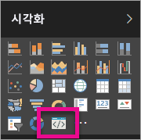

# Power BI Power BI 시각적 개체 문제 해결

## 디버그

**Pbiviz 명령어가 없습니다(또는 유사한 오류)**

`pbiviz`를 터미널/명령줄에서 실행하는 경우 도움말 화면이 표시됩니다. 그렇지 않은 경우 개발자 도구가 올바르게 설치되지 않았습니다. 4\.0 버전 이상의 NodeJS를 설치했는지 확인합니다.

**시각화 탭에 디버그 시각적 개체가 없습니다**

**시각화** 탭에는 프롬프트 아이콘처럼 보이는 디버그 시각적 개체가 있습니다.

디버그 시각적 개체가 보이지 않으면 Power BI 설정에서 사용할 수 있도록 설정되었는지 확인합니다.

> [!NOTE]
> 디버그 시각적 개체는 현재 Power BI 서비스에서만 제공되며, Power BI Desktop이나 모바일 앱에는 제공되지 않습니다. 패키징된 시각적 개체는 어디서나 변함 없이 작동됩니다.

**시각적 개체 서버에 연결할 수 없습니다**

시각적 개체 프로젝트의 루트에 있는 터미널 명령줄에서 `pbiviz start` 명령으로 시각적 개체 서버를 실행합니다. 서버가 실행 중이 아닌 경우 SSL 인증서가 올바르게 설치되지 않았을 수도 있습니다.

질문, 의견 또는 문제가 있으면 언제든지 Power BI 시각적 개체 지원 팀 *pbicvsupport@microsoft.com*  에 문의하세요.

## 다음 단계

자세한 내용은 [Power BI Power BI 시각적 개체에 대한 질문과 대답](power-bi-custom-visuals-faq.md#organizational-visuals)을 참조하세요.