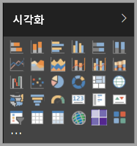

# Power BI의 시각적 개체

Power BI에는 기본 제공되는 많은 Power BI 시각적 개체가 포함되어 있습니다. 이러한 시각적 개체는 [Power BI Desktop](https://powerbi.microsoft.com/desktop/) 및 [Power BI 서비스](https://app.powerbi.com)의 시각화 창에서 사용 가능하며 Power BI 콘텐츠를 만들고 편집하는 데 사용할 수 있습니다.

Microsoft [AppSource](https://nam06.safelinks.protection.outlook.com/?url=https%3A%2F%2Fappsource.microsoft.com%2Fen-us%2Fmarketplace%2Fapps%3Fpage%3D1%26product%3Dpower-bi-visuals&data=02%7C01%7CKesem.Sharabi%40microsoft.com%7C6d9286afacb3468d4cde08d740b76694%7C72f988bf86f141af91ab2d7cd011db47%7C1%7C0%7C637049028749147718&sdata=igWm0e1vXdgGcbyvngQBrHQVAkahPnxPC1ZhUPntGI8%3D&reserved=0) 또는 Power BI를 통해 더 많은 Power BI 시각적 개체를 사용할 수 있습니다. 이러한 시각적 개체는 Microsoft 및 Microsoft 파트너에서 만들며 AppSource 유효성 검사 팀에서 테스트하고 유효성을 검사합니다.

사용자, 사용자 조직 또는 전체 Power BI 커뮤니티에서 사용할 고유한 Power BI 시각적 개체를 사용자가 개발할 수도 있습니다.

## 기본 Power BI 시각적 개체

기본 제공되는 Power BI 시각적 개체는 *Power BI Desktop* 및 *Power BI 서비스*의 시각화 창에서 사용할 수 있습니다.

Power BI 시각적 개체를 시각화 창에서 고정 해제하려면 해당 시각적 개체를 마우스 오른쪽 단추로 클릭하고 **고정 해제**를 선택합니다.

시각화 창에서 기본 Power BI 시각적 개체를 복원하려면 **사용자 지정 시각적 개체 가져오기**를 클릭하고 **기본 시각적 개체 복원**을 선택합니다. 

## AppSource Power BI 시각적 개체

Microsoft 및 커뮤니티 멤버는 공익을 위해 Power BI 시각적 개체 개발에 기여하며 [AppSource](https://appsource.microsoft.com/marketplace/apps?product=power-bi-visuals)에 시각적 개체를 게시합니다. 이러한 시각적 개체를 다운로드하여 Power BI 보고서에 추가할 수 있습니다. Microsoft는 이들 Power BI 시각적 개체의 기능과 품질을 테스트하고 승인했습니다.

### AppSource란?

[AppSource](office-store.md)에는 Microsoft 소프트웨어에 대한 앱, 추가 기능 및 확장이 있습니다. AppSource는 Office 365, Azure, Dynamics 365, Cortana 및 Power BI와 같은 제품을 사용하고 있는 수백만 명의 사용자가 이전보다 더 효율적이며 통찰력 있게 작업을 수행할 수 있도록 도와주는 솔루션을 사용자와 연결합니다.

### 인증된 Power BI 시각적 개체

인증된 Power BI 시각적 개체는 Microsoft Power BI 팀이 테스트하고 승인한 특정 지정 코드 요구 사항을 충족하는 [AppSource](https://nam06.safelinks.protection.outlook.com/?url=https%3A%2F%2Fappsource.microsoft.com%2Fen-us%2Fmarketplace%2Fapps%3Fpage%3D1%26product%3Dpower-bi-visuals&data=02%7C01%7CKesem.Sharabi%40microsoft.com%7C6d9286afacb3468d4cde08d740b76694%7C72f988bf86f141af91ab2d7cd011db47%7C1%7C0%7C637049028749147718&sdata=igWm0e1vXdgGcbyvngQBrHQVAkahPnxPC1ZhUPntGI8%3D&reserved=0)의 시각적 개체입니다. 테스트는 시각적 개체가 외부 서비스 또는 리소스에 액세스하지 않는지 확인하도록 설계되었습니다.

인증된 Power BI 시각적 개체의 목록을 보거나 사용자의 고유한 시각적 개체를 제출하려면 [인증된 Power BI 시각적 개체](power-bi-custom-visuals-certified.md)를 참조하세요.

### Power BI 시각적 개체의 샘플

AppSource에 있는 각각의 Power BI 시각적 개체에는 해당 시각적 개체의 작동 방식을 보여 주는 데이터 샘플이 있습니다. 샘플을 다운로드하려면 [AppSource](https://nam06.safelinks.protection.outlook.com/?url=https%3A%2F%2Fappsource.microsoft.com%2Fen-us%2Fmarketplace%2Fapps%3Fpage%3D1%26product%3Dpower-bi-visuals&data=02%7C01%7CKesem.Sharabi%40microsoft.com%7C6d9286afacb3468d4cde08d740b76694%7C72f988bf86f141af91ab2d7cd011db47%7C1%7C0%7C637049028749147718&sdata=igWm0e1vXdgGcbyvngQBrHQVAkahPnxPC1ZhUPntGI8%3D&reserved=0)에서 Power BI 시각적 개체를 선택하고 ‘샘플 사용해 보기’ 섹션에서 **샘플 보고서**를 클릭합니다.

## 조직의 저장소

Power BI 관리자는 Power BI 시각적 개체를 승인하고 조직에 배포합니다. 이렇게 하면 보고서 작성자가 쉽게 Power BI 시각적 개체를 발견하고, 업데이트하고, 사용할 수 있습니다. 관리자는 버전을 업데이트하고 Power BI 시각적 개체를 사용하도록 설정하거나 사용하지 않도록 설정하는 등의 작업을 통해 쉽게 시각적 개체를 관리할 수 있습니다.

조직의 저장소에 액세스하려면 ‘시각화’ 창에서 **사용자 지정 시각적 개체 가져오기**를 클릭하고 **마켓플레이스에서 가져오기**를 선택한 후 ‘Power BI 시각적 개체’ 창 맨 위에 있는 **내 조직** 탭을 선택합니다.

[조직 시각적 개체에 대해 자세히 알아봅니다](power-bi-custom-visuals-organization.md).

## 시각적 개체 파일

Power BI 시각적 개체는 제공되는 데이터를 렌더링하기 위한 코드가 포함된 패키지입니다. 누구나 사용자 지정 시각적 개체를 만들고 단일 `.pbiviz` 파일로 패키지화한 다음, Power BI 보고서로 가져올 수 있습니다.

Power BI 시각적 개체를 가져오려면 ‘시각화’ 창에서 **사용자 지정 시각적 개체 가져오기**를 클릭하고 **파일에서 가져오기**를 선택합니다.

고유한 시각적 개체를 만들어 AppSource에 추가하려는 웹 개발자인 경우 [Power BI 시각적 개체를 개발](visuals/custom-visual-develop-tutorial.md)하고 [Power BI 시각적 개체를 AppSource에 게시](office-store.md)하는 방법을 배울 수 있습니다.

> [!WARNING]
> Power BI 시각적 개체에는 보안 또는 개인 정보 위험이 있는 코드가 포함되어 있을 수 있습니다. 보고서로 가져오기 전에 작성자 및 Power BI 시각적 개체 원본을 신뢰할 수 있는지 확인합니다.

## 다음 단계

* 개발자인 경우 [Power BI 시각적 개체 개발](./visuals/custom-visual-develop-tutorial.md) 자습서로 시작하세요.

* [Power BI 시각적 개체 프로젝트 구조화](./visuals/visual-project-structure.md) 방법에 대해 알아봅니다.

* [Power BI 시각적 개체에 대한 지침](guidelines-powerbi-visuals.md)을 살펴봅니다.

궁금한 점이 더 있나요? [Power BI 시각적 개체에 대한 질문과 대답](power-bi-custom-visuals-faq.md) 페이지 또는 [Power BI 커뮤니티](http://community.powerbi.com/)에서 알아보세요.