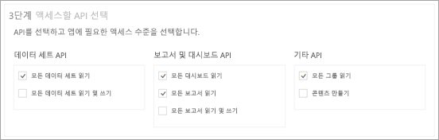
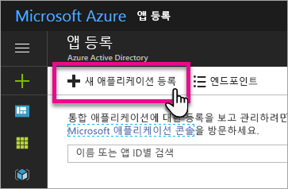
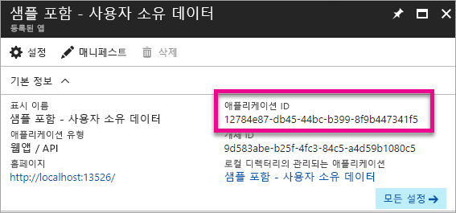
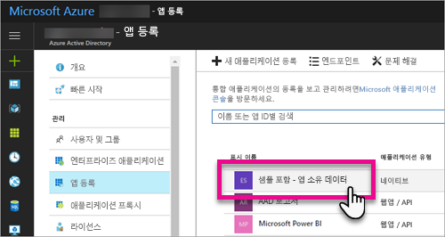
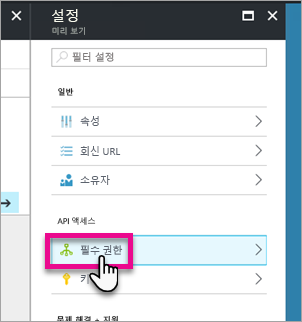
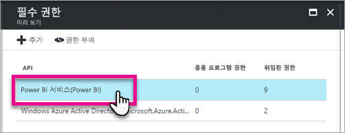
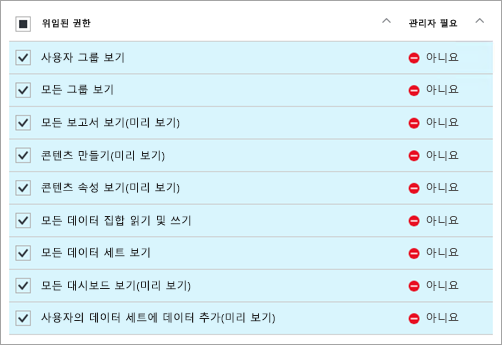
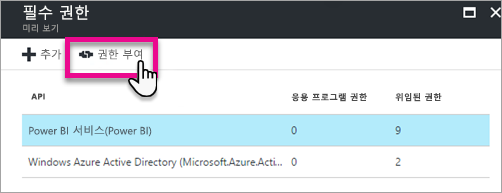

# <a name="register-an-azure-ad-app-to-embed-power-bi-content"></a>포함된 Power BI 콘텐츠에 Azure AD 앱 등록

Power BI 콘텐츠 포함에 사용하기 위해 Azure AD(Azure Active Directory) 내에서 애플리케이션을 등록하는 방법에 대해 알아봅니다.

Azure AD에 애플리케이션을 등록하면 애플리케이션에서 Power BI REST API에 액세스할 수 있습니다. 애플리케이션을 등록하면 애플리케이션의 ID를 설정하고 Power BI REST 리소스에 대한 권한을 지정할 수 있습니다.

> [!IMPORTANT]
> Power BI 앱을 등록하려면 먼저 [Azure Active Directory 테넌트 및 조직 사용자](create-an-azure-active-directory-tenant.md)가 있어야 합니다. 테넌트의 사용자를 Power BI에 아직 등록하지 않은 경우 앱 등록이 성공적으로 완료되지 않습니다.

두 가지 방법으로 애플리케이션을 등록합니다. 즉, [Power BI 앱 등록 도구](https://dev.powerbi.com/apps/)를 사용하거나 Azure Portal 내에서 직접 수행하면 됩니다. Power BI 앱 등록 도구는 입력해야 할 필드가 단 몇 개만 있으므로 가장 쉬운 옵션입니다. 앱을 변경하려는 경우 Azure Portal을 사용합니다.

## <a name="register-with-the-power-bi-app-registration-tool"></a>Power BI 앱 등록 도구를 사용하여 등록

애플리케이션을 **Azure Active Directory**에 등록하여 애플리케이션의 ID를 설정하고 Power BI REST 리소스에 대한 사용 권한을 지정하세요. 콘솔 앱 또는 웹 사이트 같은 애플리케이션을 등록하면 애플리케이션에서 사용 권한을 요청한 사용자에게 자신을 식별하기 위해 사용하는 ID를 받습니다.

Power BI 앱 등록 도구를 사용하여 애플리케이션을 등록하는 방법은 다음과 같습니다.

1. [dev.powerbi.com/apps](https://dev.powerbi.com/apps)로 이동합니다.
2. **기존 계정으로 로그인**을 선택합니다.
3. **앱 이름**을 제공합니다.
4. 앱 형식 선택은 사용하는 애플리케이션의 유형에 따라 달라집니다.

   * 클라이언트 디바이스에서 실행되는 앱에 대해 **네이티브 앱**을 사용합니다. 웹 애플리케이션의 경우에도 애플리케이션이 무엇인지와 관계없이 고객에 대한 콘텐츠를 포함하는 경우 **네이티브 앱**을 선택합니다.
   * 웹앱 또는 웹 API에 대해 **서버 쪽 웹앱**을 사용합니다.

5. **리디렉션 URL** 및 **홈 페이지 URL**에 대한 값을 입력합니다. **리디렉션 URL**은 모든 유효한 URL과 함께 작동합니다.

    응용 프로그램 형식으로 **서버 쪽 웹앱**을 선택한 경우에만 **홈 페이지 URL**을 사용할 수 있습니다.

    *고객에 대한 콘텐츠 포함* 및 *integrate-dashboard-web-app* 샘플의 경우 **리디렉션 URL**은 `http://localhost:13526/Redirect`입니다. 보고서 및 타일 샘플의 경우 **리디렉션 URL**은 `http://localhost:13526/`입니다.
6. 액세스 권한이 있는 애플리케이션에 대한 API를 선택합니다. Power BI 액세스 권한에 대한 자세한 내용은 [Power BI 사용 권한](power-bi-permissions.md)을 참조하세요.

    
7. **앱 등록**을 선택합니다.

    그런 다음, **클라이언트 ID**가 제공되고 **서버 측 웹앱**을 선택하면 **클라이언트 암호**가 수신됩니다. **클라이언트 ID**는 나중에 필요한 경우 Azure Portal에서 검색할 수 있습니다. **클라이언트 암호**를 분실한 경우 Azure Portal에서 새로 만들어야 합니다.

8. Azure로 이동하여 **사용 권한 부여**를 선택합니다.

   > [!Note]
   > 테넌트의 사용자는 이 단계를 완료하려면 **_사용 권한 부여_** 에 대한 액세스 권한이 필요합니다.

* 합니다.
* **앱 등록**을 검색하고 선택합니다.
* 앱을 선택합니다.
* **설정**을 선택합니다.
* **필요한 권한**을 선택합니다.
* **Power BI 서비스**를 선택하여 앱 등록 사이트에서 선택한 권한을 확인합니다.
* **권한 부여**를 선택합니다.

이제 등록된 애플리케이션을 사용자 지정 애플리케이션의 일부로 사용하여 Power BI 서비스와 상호 작용할 수 있습니다.

> [!IMPORTANT]
> 고객에 대한 콘텐츠를 포함하는 경우 Azure Portal 내에서 추가 권한을 구성해야 합니다. 자세한 내용은 [애플리케이션에 권한 적용](#apply-permissions-to-your-application)을 참조하세요.

## <a name="register-with-the-azure-portal"></a>Azure Portal에 등록

애플리케이션을 등록하기 위한 다른 옵션은 Azure Portal에서 직접 수행하는 것입니다. 애플리케이션을 등록하려면 다음이 단계를 수행합니다.

1. [Microsoft Power BI API 약관](https://powerbi.microsoft.com/api-terms)에 동의합니다.
2. [Azure Portal](https://portal.azure.com)에 로그인합니다.
3. 페이지의 오른쪽 위에서 사용자 계정을 선택하여 Azure AD 테넌트를 선택합니다.
4. 왼쪽 탐색 창에서 **더 많은 서비스**를 선택하고, **보안 + ID**아래에서 **앱 등록**을 선택하고, **새 애플리케이션 등록**을 선택합니다.

    
5. 메시지에 따라 새 애플리케이션을 만듭니다.

   * 웹 애플리케이션의 경우 사용자가 로그인할 수 있는 앱의 기준 URL인 로그온 URL을 제공합니다(예: `http://localhost:13526`).
   * 네이티브 애플리케이션의 경우 Azure AD가 토큰 응답을 반환하기 위해 사용하는 **리디렉션 URI**를 제공합니다. 애플리케이션에 대한 값을 입력합니다(예: `http://myapplication/Redirect`).

Azure Active Directory에 애플리케이션을 등록하는 방법에 대한 자세한 내용은 [Azure Active Directory와 애플리케이션 통합](https://docs.microsoft.com/azure/active-directory/develop/active-directory-integrating-applications)을 참조하세요.

## <a name="how-to-get-the-client-id"></a>클라이언트 ID를 가져오는 방법

애플리케이션을 등록하면 **클라이언트 ID**가 수신됩니다.  **클라이언트 ID**는 응용 프로그램이 사용자를 식별하도록 사용자에게 권한을 요청합니다.

클라이언트 ID를 가져오는 방법은 다음과 같습니다.

1. [Azure Portal](https://portal.azure.com)에 로그인합니다.
2. 페이지의 오른쪽 위에서 사용자 계정을 선택하여 Azure AD 테넌트를 선택합니다.
3. 왼쪽의 탐색 창에서 **추가 서비스**를 선택하고 **앱 등록**을 선택합니다.
4. 사용해야 하는 클라이언트 ID를 검색할 애플리케이션을 선택합니다.
5. **응용 프로그램 ID**가 GUID로 나열됩니다. 이것은 애플리케이션에 대한 클라이언트 ID입니다.

    

## <a name="apply-permissions-to-your-application-within-azure-ad"></a>Azure AD 내 애플리케이션에 권한 적용

> [!IMPORTANT]
> 이 섹션은 **조직에 대한 콘텐츠를 포함하는** 애플리케이션에만 적용됩니다.

앱 등록 페이지에서 제공하는 권한 외에도 애플리케이션에 대한 추가 권한을 사용하도록 설정합니다. Azure AD 포털을 통해, 또는 프로그래밍 방식으로 수행할 수 있습니다.

포함에 사용된 ‘마스터’ 계정 또는 전역 관리자 계정 중 하나를 사용하여 로그인할 수 있습니다.

### <a name="using-the-azure-ad-portal"></a>Azure AD 포털 사용

1. Azure Portal 내에서 [앱 등록](https://portal.azure.com/#blade/Microsoft_AAD_IAM/ApplicationsListBlade)으로 이동한 후 포함에 사용할 앱을 선택합니다.

    
2. **API 액세스**에서 **필요한 권한**을 선택합니다.

    

3. **필요한 권한**에서 **Power BI 서비스(Power BI)** 를 선택합니다.

    

   > [!NOTE]
   > Azure AD 포털에서 직접 앱을 만든 경우 **Power BI 서비스(Power BI)** 는 표시되지 않을 수도 있습니다. 그렇지 않은 경우 **+ 추가**, **1 선택 및 API**를 차례로 선택합니다. API 목록에서 **Power BI 서비스**를 선택하고 **선택**을 선택합니다.  **Power BI 서비스(Power BI)** 를 **+추가** 내에서 사용할 수 없는 경우 적어도 한 명의 사용자를 Power BI에 등록합니다.

4. **위임된 권한**에서 모든 권한을 선택합니다. 선택 항목을 저장하려면 하나씩 선택합니다. 완료되면 **저장**을 선택합니다.

    
5. **필요한 권한**에서 **사용 권한 부여**를 선택합니다.

    Azure AD에서 동의하도록 요구하는 메시지가 표시되지 않게 하려면 **권한 부여** 작업이 *마스터 계정*에 필요합니다. 이 작업을 수행하는 계정이 전역 관리자인 경우, 조직 내 모든 사용자에게 이 애플리케이션에 대한 권한을 부여합니다. 이 작업을 수행하는 계정이 *마스터 계정*이고 전역 관리자가 아닌 경우, 이 애플리케이션의 *마스터 계정*에만 권한을 부여합니다.

    

### <a name="applying-permissions-programmatically"></a>프로그래밍 방식으로 권한 적용

1. 테넌트 내에서 기존 서비스 주체(사용자)를 가져와야 합니다. 이 작업을 수행하는 방법에 대한 자세한 내용은 [Get servicePrincipal](https://developer.microsoft.com/en-us/graph/docs/api-reference/beta/api/serviceprincipal_get)을 참조하세요.

    {id} 없이 *Get servicePrincipal* API를 호출하면 테넌트 내의 모든 서비스 주체를 가져옵니다.
2. **appId** 속성으로 앱 클라이언트 ID가 있는 서비스 주체를 확인합니다.

3. 앱에서 누락된 경우 새 서비스 계획을 만듭니다.

    ```json
    Post https://graph.microsoft.com/beta/servicePrincipals
    Authorization: Bearer ey..qw
    Content-Type: application/json
    {
    "accountEnabled" : true,
    "appId" : "{App_Client_ID}",
    "displayName" : "{App_DisplayName}"
    }
    ```

4. Power BI API에 앱 권한 부여

   기존 테넌트를 사용하고 있고 모든 테넌트 사용자를 대신하여 권한을 부여하는 데 관심이 없는 경우 **contentType**의 값을 **Principal**로 바꾸면 특정 사용자에게 권한을 부여할 수 있습니다.

   **consentType**의 값은 **AllPrincipals** 또는 **Principal** 중 하나를 제공할 수 있습니다.

   * **AllPrincipals**는 테넌트 관리자가 테넌트의 모든 사용자를 대신하여 권한을 부여하는 데만 사용할 수 있습니다.
   * **Principal**은 특정 사용자를 대신하여 권한을 부여하는 데 사용됩니다. 이 경우 요청 본문에 추가 속성을 추가해야 합니다(*principalId = {User_ObjectId}*).

     비대화형 로그인을 수행할 때 불가능한 Azure AD의 동의 요청을 피하기 위해 마스터 계정에 ‘사용 권한을 부여’해야 합니다.

     ```json
     Post https://graph.microsoft.com/beta/OAuth2PermissionGrants
     Authorization: Bearer ey..qw
     Content-Type: application/json
     {
     "clientId":"{Service_Plan_ID}",
     "consentType":"AllPrincipals",
     "resourceId":"c78a3685-1ce7-52cd-95f7-dc5aea8ec98e",
     "scope":"Dataset.ReadWrite.All Dashboard.Read.All Report.Read.All Group.Read Group.Read.All Content.Create Metadata.View_Any Dataset.Read.All Data.Alter_Any",
     "expiryTime":"2018-03-29T14:35:32.4943409+03:00",
     "startTime":"2017-03-29T14:35:32.4933413+03:00"
     }
     ```

    **resourceId** *c78a3685-1ce7-52cd-95f7-dc5aea8ec98e*는 전역적이지 않지만 테넌트 종속입니다. 이 값은 AAD 테넌트에서 "Power BI 서비스" 애플리케이션의 objectId입니다.

    사용자는 Azure Portal에서 이 값을 신속하게 가져올 수 있습니다.
    1. https://portal.azure.com/#blade/Microsoft_AAD_IAM/StartboardApplicationsMenuBlade/AllApps
    2. 검색 상자에서 "Power BI 서비스" 검색

5. AAD(Azure Active Directory)에 앱 사용 권한 부여

   **consentType**의 값은 **AllPrincipals** 또는 **Principal** 중 하나를 제공할 수 있습니다.

   * **AllPrincipals**는 테넌트 관리자가 테넌트의 모든 사용자를 대신하여 권한을 부여하는 데만 사용할 수 있습니다.
   * **Principal**은 특정 사용자를 대신하여 권한을 부여하는 데 사용됩니다. 이 경우 요청 본문에 추가 속성을 추가해야 합니다(*principalId = {User_ObjectId}*).

   비대화형 로그인을 수행할 때 불가능한 Azure AD의 동의 요청을 피하기 위해 마스터 계정에 ‘사용 권한을 부여’해야 합니다.

   ```json
   Post https://graph.microsoft.com/beta/OAuth2PermissionGrants
   Authorization: Bearer ey..qw
   Content-Type: application/json
   { 
   "clientId":"{Service_Plan_ID}",
   "consentType":"AllPrincipals",
   "resourceId":"61e57743-d5cf-41ba-bd1a-2b381390a3f1",
   "scope":"User.Read Directory.AccessAsUser.All",
   "expiryTime":"2018-03-29T14:35:32.4943409+03:00",
   "startTime":"2017-03-29T14:35:32.4933413+03:00"
   }
   ```

## <a name="next-steps"></a>다음 단계

이제 Azure AD에서 애플리케이션을 등록했으므로 애플리케이션 내에서 사용자를 인증해야 합니다. 자세한 내용은 [사용자 인증 및 Power BI 앱에 대한 Azure AD 액세스 토큰 가져오기](get-azuread-access-token.md)를 살펴보세요.

궁금한 점이 더 있나요? [Power BI 커뮤니티에 질문합니다.](http://community.powerbi.com/)
