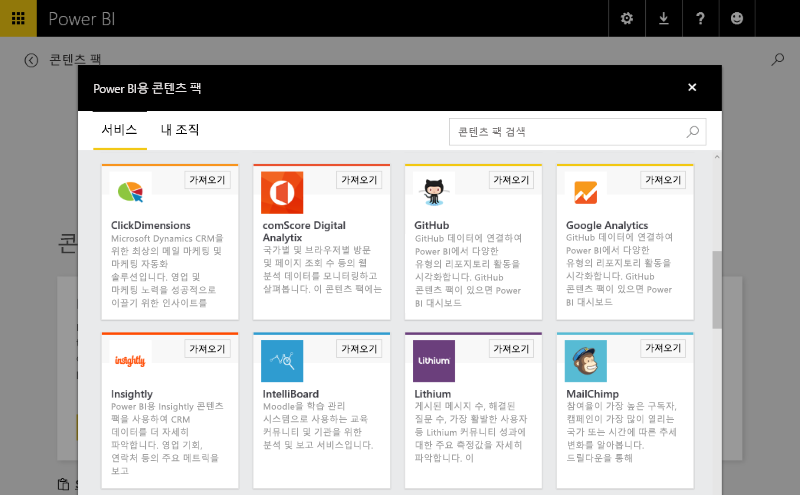
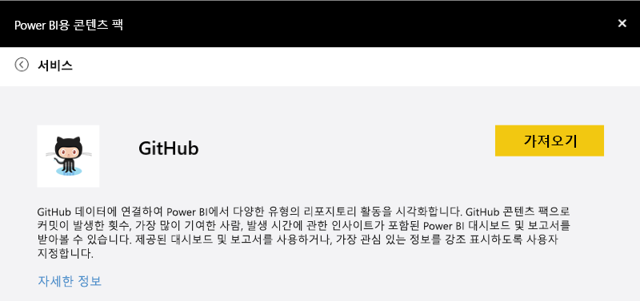
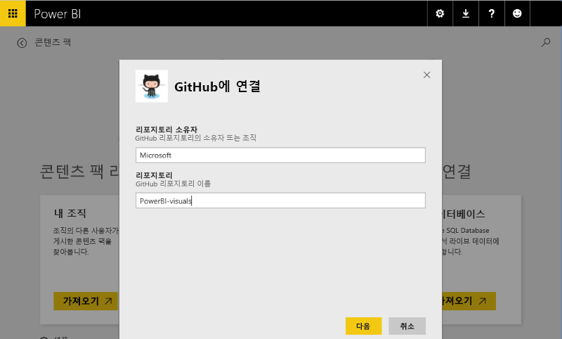
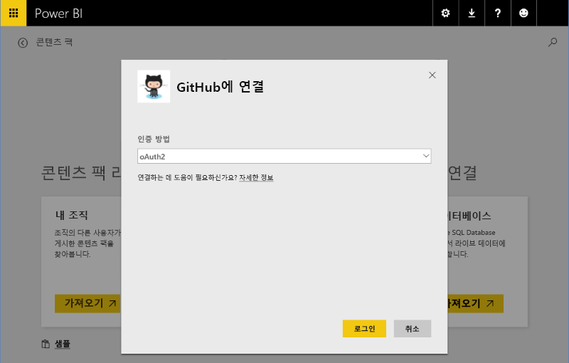
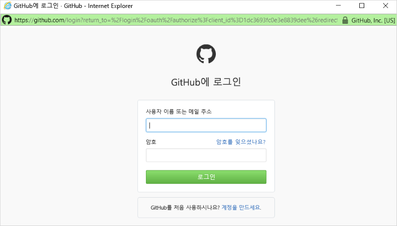
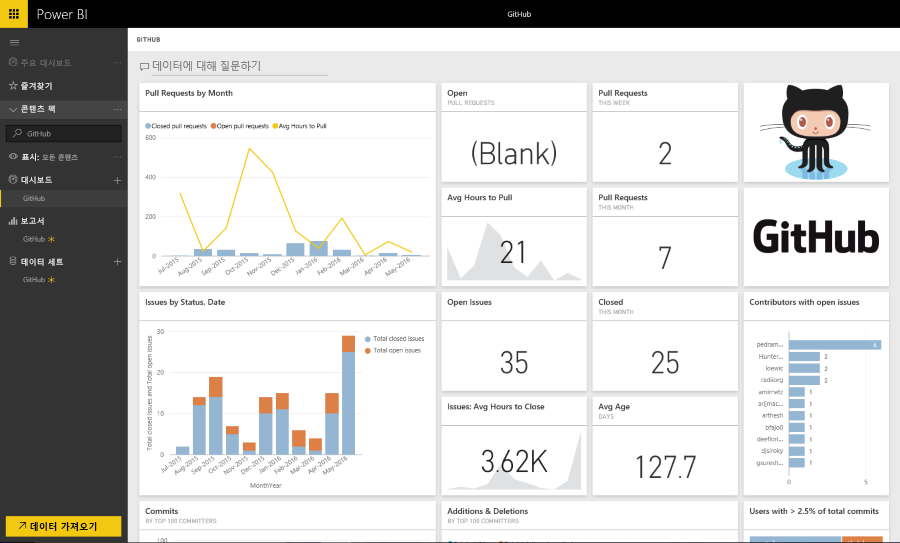

# Power BI에서 템플릿 콘텐츠 팩 환경
이 섹션에서는 사용자가 ISV [콘텐츠 팩](../service-connect-to-services.md)에 연결하는 일반적인 환경을 강조 표시합니다. 

https://app.powerbi.com/getdata/services에서 릴리스된 콘텐츠 팩에 연결하여 직접 연결해 보세요(예: 아래 설명된 [GitHub 콘텐츠 팩](https://app.powerbi.com/getdata/services/github)).

## 연결
시작하려면 사용자가 콘텐츠 팩 갤러리를 탐색하여 연결할 콘텐츠 팩을 선택합니다. 콘텐츠 팩 항목에는 이름, 아이콘 및 사용자에게 더 많은 정보를 제공하는 설명 텍스트가 제공됩니다.

## 매개 변수
선택하면 매개 변수를 제공하라는 메시지가 표시됩니다(필요한 경우). 매개 변수 대화 상자는 콘텐츠 팩을 만드는 동안 작성자에 의해 선언적으로 제공됩니다.

현재 매개 변수 UI는 매우 기본적이며 드롭다운 목록을 열거할 방법이 없고 데이터 입력 유효성 검사가 regex로 제한됩니다.

## 자격 증명
매개 변수 다음으로 사용자에게 로그인하라는 메시지가 표시됩니다.  원본에서 여러 유형의 인증을 지원하는 경우 사용자는 적절한 옵션을 선택합니다. 원본에서 OAuth를 필요로 하는 경우 사용자가 로그인을 누를 때 서비스의 로그인 UI가 팝업됩니다.  그렇지 않으면 사용자는 제공된 대화 상자에서 자격 증명을 입력할 수 있습니다.

## 인스턴스화
로그인에 성공하면 콘텐츠 팩에 포함된 아티팩트(모델, 보고서 및 대시보드)가 탐색 모음에 나타납니다.  이러한 아티팩트는 각 사용자의 계정에 추가됩니다.  데이터는 비동기적으로 로드되어 데이터 집합(모델)을 채웁니다.  그러면 사용자는 대시보드, 보고서 및 모델을 사용할 수 있습니다.

기본적으로 사용자에게는 매일 새로 고침 일정이 구성되어 모델에서 쿼리를 다시 평가합니다.  사용자에게 제공된 자격 증명에서는 표시하지 않고 데이터를 새로 고칠 수 있도록 허용해야 합니다.

## 탐색 및 모니터링
콘텐츠 팩이 사용자의 계정으로 하이드레이션되었으면 데이터/정보를 탐색 및 모니터링할 수 있습니다.

일반적으로 다음이 포함됩니다.

* 대시보드 보기 및 사용자 지정.
* 보고서 보기 및 사용자 지정.
* 자연어를 사용하여 데이터에 대해 질문하기.
* 탐색 캔버스를 사용하여 데이터 모델에서 데이터 탐색

보다 나은 탐색 환경을 구현하기 위해서는 신중하게 자연어 모델링(동의어)을 제공하고 이해할 수 있는 모델 스키마를 제공해야 합니다.

