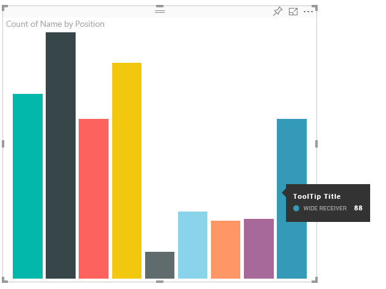
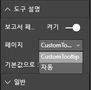

# <a name="tooltips-in-power-bi-visuals"></a>Power BI 시각적 개체의 도구 설명

이제 시각적 개체에서 Power BI 도구 설명 지원을 사용할 수 있습니다. Power BI 도구 설명은 다음과 같은 상호 작용을 처리합니다.

* 도구 설명 표시,
* 도구 설명 숨김,
* 도구 설명 이동

도구 설명은 제목, 지정된 색의 값, 지정된 좌표 집합의 불투명도를 사용하는 텍스트 요소를 표시할 수 있습니다. 이 데이터는 API에 제공되고, Power BI 호스트는 네이티브 시각적 개체의 도구 설명을 렌더링하는 것과 동일한 방식으로 렌더링합니다.

다음 그림은 샘플 가로 막대형 차트의 도구 설명을 보여 줍니다.



위의 도구 설명 그림은 단일 막대 범주와 값을 보여 줍니다. 단일 도구 설명을 확장하여 여러 값을 표시할 수 있습니다.

## <a name="manage-tooltips"></a>도구 설명 관리

도구 설명을 관리하는 데 사용하는 인터페이스는 “ITooltipService”입니다. 도구 설명을 표시, 제거 또는 이동해야 함을 호스트에 알리는 데 사용됩니다.

```typescript
    interface ITooltipService {
        enabled(): boolean;
        show(options: TooltipShowOptions): void;
        move(options: TooltipMoveOptions): void;
        hide(options: TooltipHideOptions): void;
    }
```

시각적 개체는 시각적 개체 내의 마우스 이벤트를 수신 대기하고, 필요에 따라 `Tooltip****Options` 개체에 채워진 적절한 콘텐츠를 사용하여 `show()`, `move()` 및 `hide()` 대리자를 호출해야 합니다.
그러면 `TooltipShowOptions` 및 `TooltipHideOptions`가 이러한 이벤트에서 표시할 내용과 동작을 정의합니다.

이 메서드를 호출하려면 마우스 이동, 터치 이벤트 등의 사용자 이벤트가 필요하기 때문에 해당 이벤트의 수신기를 만드는 것이 좋습니다. 그러면 수신기가 `TooltipService` 멤버를 호출합니다.
샘플에서는 `TooltipServiceWrapper`라는 클래스에 집계됩니다.

### <a name="the-tooltipservicewrapper-class"></a>TooltipServiceWrapper 클래스

이 클래스의 기본 개념은 `TooltipService` 인스턴스를 포함하고, 관련 요소의 D3 마우스 이벤트를 수신 대기한 다음, 필요한 경우 `show()` 및 `hide()` 요소를 호출하는 것입니다.

이 클래스는 기본 D3 코드와의 인터페이스에 주로 적용되는 이러한 이벤트의 모든 관련 상태와 논리를 포함하고 관리합니다. D3 인터페이스 및 변환에 대해서는 이 문서에서 설명하지 않습니다.

[SampleBarChart 시각적 개체 리포지토리](https://github.com/Microsoft/PowerBI-visuals-sampleBarChart/commit/981b021612d7b333adffe9f723ab27783c76fb14)에서 전체 샘플 코드를 확인할 수 있습니다.

### <a name="create-tooltipservicewrapper"></a>TooltipServiceWrapper 만들기

이제 막대형 차트 생성자에 호스트 `tooltipService` 인스턴스를 사용하여 생성자에서 인스턴스화된 `TooltipServiceWrapper` 멤버가 있습니다.

```typescript
        private tooltipServiceWrapper: ITooltipServiceWrapper;

        this.tooltipServiceWrapper = createTooltipServiceWrapper(this.host.tooltipService, options.element);
```

`TooltipServiceWrapper` 클래스는 시각적 개체 및 터치 매개 변수의 루트 D3 요소로 `tooltipService` 인스턴스도 포함합니다.

```typescript
    class TooltipServiceWrapper implements ITooltipServiceWrapper {
        private handleTouchTimeoutId: number;
        private visualHostTooltipService: ITooltipService;
        private rootElement: Element;
        private handleTouchDelay: number;

        constructor(tooltipService: ITooltipService, rootElement: Element, handleTouchDelay: number) {
            this.visualHostTooltipService = tooltipService;
            this.handleTouchDelay = handleTouchDelay;
            this.rootElement = rootElement;
        }
        .
        .
        .
    }
```

이 클래스에서 이벤트 수신기를 등록하는 단일 진입점은 `addTooltip` 메서드입니다.

### <a name="the-addtooltip-method"></a>addTooltip 메서드

```typescript
        public addTooltip<T>(
            selection: d3.Selection<Element>,
            getTooltipInfoDelegate: (args: TooltipEventArgs<T>) => VisualTooltipDataItem[],
            getDataPointIdentity: (args: TooltipEventArgs<T>) => ISelectionId,
            reloadTooltipDataOnMouseMove?: boolean): void {

            if (!selection || !this.visualHostTooltipService.enabled()) {
                return;
            }
        ...
        ...
        }
```

* **selection: d3.Selection<Element>** : 도구 설명이 처리되는 d3 요소입니다.

* **getTooltipInfoDelegate: (args: TooltipEventArgs<T>) => VisualTooltipDataItem[]** : 컨텍스트에 따라 도구 설명 콘텐츠(표시할 내용)를 채우기 위한 대리자입니다.

* **getDataPointIdentity: (args: TooltipEventArgs<T>) => ISelectionId**: 데이터 요소 ID를 검색하기 위한 대리자입니다(이 샘플에서는 사용되지 않음). 

* **reloadTooltipDataOnMouseMove? boolean**: MouseMove 이벤트 중에 도구 설명 데이터를 새로 고칠지 여부를 나타내는 부울입니다(이 샘플에서는 사용되지 않음).

보시는 것처럼, `tooltipService`가 사용되지 않거나 실제로 선택한 항목이 없으면 `addTooltip`은 아무 작업도 수행하지 않고 종료됩니다.

### <a name="call-the-show-method-to-display-a-tooltip"></a>show 메서드를 호출하여 도구 설명 표시

다음 코드와 같이 `addTooltip` 메서드는 D3 `mouseover` 이벤트를 수신 대기합니다.

```typescript
        ...
        ...
        selection.on("mouseover.tooltip", () => {
            // Ignore mouseover while handling touch events
            if (!this.canDisplayTooltip(d3.event))
                return;

            let tooltipEventArgs = this.makeTooltipEventArgs<T>(rootNode, true, false);
            if (!tooltipEventArgs)
                return;

            let tooltipInfo = getTooltipInfoDelegate(tooltipEventArgs);
            if (tooltipInfo == null)
                return;

            let selectionId = getDataPointIdentity(tooltipEventArgs);

            this.visualHostTooltipService.show({
                coordinates: tooltipEventArgs.coordinates,
                isTouchEvent: false,
                dataItems: tooltipInfo,
                identities: selectionId ? [selectionId] : [],
            });
        });
```

* **makeTooltipEventArgs**: 선택한 D3 요소의 컨텍스트를 tooltipEventArgs로 추출합니다. 좌표도 계산합니다.

* **getTooltipInfoDelegate**: tooltipEventArgs에서 도구 설명 콘텐츠를 작성합니다. 시각적 개체의 논리이므로 BarChart 클래스 콜백으로, 도구 설명에 표시되는 실제 텍스트 콘텐츠입니다.

* **getDataPointIdentity**: 이 샘플에서는 사용되지 않습니다.

* **this.visualHostTooltipService.show**: 도구 설명을 표시하는 호출입니다.  

`mouseout` 및 `mousemove` 이벤트 샘플에서 추가 처리를 확인할 수 있습니다.

자세한 내용은 [SampleBarChart 시각적 개체 리포지토리](https://github.com/Microsoft/PowerBI-visuals-sampleBarChart/commit/981b021612d7b333adffe9f723ab27783c76fb14)를 참조하세요.

### <a name="populate-the-tooltip-content-by-the-gettooltipdata-method"></a>GetTooltipData 메서드를 통해 도구 설명 콘텐츠 채우기

BarChart 클래스는 데이터 요소의 `category`, `value` 및 `color`를 VisualTooltipDataItem[] 요소로 추출하는 `getTooltipData` 멤버를 사용하여 추가되었습니다.

```typescript
        private static getTooltipData(value: any): VisualTooltipDataItem[] {
            return [{
                displayName: value.category,
                value: value.value.toString(),
                color: value.color,
                header: 'ToolTip Title'
            }];
        }
```

위의 구현에서 `header` 멤버는 상수이지만, 동적 값이 필요한 더 복잡한 구현에 사용할 수 있습니다. `VisualTooltipDataItem[]`을 둘 이상의 요소로 채울 수 있습니다. 그러면 도구 설명에 여러 줄이 추가됩니다. 도구 설명이 여러 데이터 요소의 데이터를 표시할 수 있는 누적 가로 막대형 차트와 같은 시각적 개체에 유용할 수 있습니다.

### <a name="call-the-addtooltip-method"></a>addTooltip 메서드 호출

최종 단계는 실제 데이터가 변경될 수 있는 경우 `addTooltip` 메서드를 호출하는 것입니다. 이 호출은 `BarChart.update()` 메서드에서 수행됩니다. 모든 ‘bar’ 요소의 선택을 모니터링하기 위해 호출되며, 앞에서 설명한 대로 `BarChart.getTooltipData()`만 전달합니다.

```typescript
        this.tooltipServiceWrapper.addTooltip(this.barContainer.selectAll('.bar'),
            (tooltipEvent: TooltipEventArgs<number>) => BarChart.getTooltipData(tooltipEvent.data),
            (tooltipEvent: TooltipEventArgs<number>) => null);
```

## <a name="add-report-page-tooltips"></a>보고서 페이지 도구 설명 추가

보고서 페이지 도구 설명 지원을 추가하기 위한 대부분의 변경 내용은 *capabilities.json* 파일에서 찾을 수 있습니다.

샘플 스키마는 다음과 같습니다.

```json
{
    "tooltips": {
        "supportedTypes": {
            "default": true,
            "canvas": true
        },
        "roles": [
            "tooltips"
        ]
    }
}
```

**서식** 창에서 보고서 페이지 도구 설명을 정의할 수 있습니다.



* `supportedTypes`: 시각적 개체에서 지원되고 필드에도 반영되는 도구 설명 구성입니다. 
   * `default`: 데이터 필드를 통한 “자동” 도구 설명 바인딩이 지원되는지 여부를 지정합니다. 
   * `canvas`: 보고서 페이지 도구 설명이 지원되는지 여부를 지정합니다.

* `roles`: (선택 사항) 정의하면, 필드에서 선택한 도구 설명 옵션에도 바인딩되는 데이터 역할을 지정합니다.

자세한 내용은 [보고서 페이지 도구 설명 사용 지침](https://powerbi.microsoft.com/blog/power-bi-desktop-march-2018-feature-summary/#tooltips)을 참조하세요.

보고서 페이지 도구 설명을 표시하기 위해 Power BI 호스트는 `ITooltipService.Show(options: TooltipShowOptions)` 또는 `ITooltipService.Move(options: TooltipMoveOptions)`를 호출한 다음, selectionId(이전 `options` 인수의 `identities` 속성)를 사용합니다. 도구 설명을 통해 검색되려면 SelectionId가 마우스로 가리킨 항목의 선택한 데이터(범주, 계열 등)를 나타내야 합니다.

selectionId를 도구 설명 표시 호출로 보내는 예제는 다음 코드에 나와 있습니다.

```typescript
    this.tooltipServiceWrapper.addTooltip(this.barContainer.selectAll('.bar'),
        (tooltipEvent: TooltipEventArgs<number>) => BarChart.getTooltipData(tooltipEvent.data),
        (tooltipEvent: TooltipEventArgs<number>) => tooltipEvent.data.selectionID);
```
