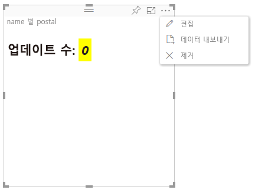

# Power BI 시각적 개체의 고급 편집 모드

Power BI 시각적 개체에서 고급 UI 컨트롤이 필요한 경우 고급 편집 모드를 활용할 수 있습니다. 보고서 편집 모드인 경우, **편집** 단추를 선택하여 편집 모드를 **고급**으로 설정합니다. 시각적 개체는 `EditMode` 플래그를 사용하여 이 UI 컨트롤을 표시할지 여부를 결정할 수 있습니다.

기본적으로 시각적 개체는 고급 편집 모드를 지원하지 않습니다. 다른 동작이 필요한 경우, `advancedEditModeSupport` 속성을 설정하여 시각적 개체의 *capabilities.json* 파일에서 이 동작을 명시적으로 지정해야 합니다.

가능한 값은 다음과 같습니다.

- `0` - NotSupported

- `1` - SupportedNoAction

- `2` - SupportedInFocus

## 고급 편집 모드 시작

**편집** 단추가 표시되는 경우는 다음과 같습니다.

* *capabilities.json* 파일에서 `advancedEditModeSupport` 속성이 `SupportedNoAction` 또는 `SupportedInFocus` 중 하나로 설정되었습니다.

* 시각적 개체가 보고서 편집 모드에서 표시되었습니다.

*capabilities.json*에 `advancedEditModeSupport` 속성이 없거나 `NotSupported`로 설정된 경우에는 **편집** 단추가 표시되지 않습니다.

**편집**을 선택하면, 시각적 개체는 EditMode가 `Advanced`로 설정된 update() 호출을 가져옵니다. *capabilities.json* 파일에 설정된 값에 따라 다음 작업이 수행됩니다.

* `SupportedNoAction`: 호스트에 추가 작업이 필요하지 않습니다.
* `SupportedInFocus`: 호스트에서 시각적 개체가 포커스 모드로 표시됩니다.

## 고급 편집 모드 종료

**보고서로 돌아가기** 단추가 표시되는 경우는 다음과 같습니다.

* *capabilities.json* 파일에서 `advancedEditModeSupport` 속성이 `SupportedInFocus`로 설정되었습니다.
