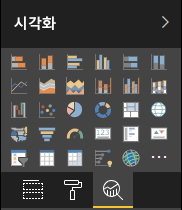

# <a name="the-analytics-pane-in-power-bi-visuals"></a>Power BI 시각적 개체의 분석 창

**분석** 창은 2018년 11월에 [네이티브 시각적 개체](https://docs.microsoft.com/power-bi/desktop-analytics-pane)에 대해 도입되었습니다.
이 문서에서는 API v2.5.0을 사용하는 Power BI 시각적 개체가 **분석 창**에 해당 속성을 제공하고 관리할 수 있는 방법을 설명합니다.



## <a name="manage-the-analytics-pane"></a>분석 창 관리

[**서식** 창](https://docs.microsoft.com/power-bi/developer/visuals/custom-visual-develop-tutorial-format-options)에서 속성을 관리하는 것과 동일한 방법으로, 시각적 개체의 *capabilities.json* 파일에서 개체를 정의하여 **분석** 창을 관리합니다.

**분석** 창의 차이점은 다음과 같습니다.

* 개체 정의 아래에 값이 2인 **objectCategory** 필드를 추가합니다.

    > [!NOTE]
    > 선택적 `objectCategory` 필드는 API 2.5.0에서 도입되었습니다. 개체가 제어하는 시각적 개체의 측면을 정의합니다(1 = 서식, 2 = 분석). `Formatting`은 모양과 느낌, 색, 축, 레이블 등의 요소에 사용됩니다. `Analytics`는 예측, 추세선, 참조선, 도형 등의 요소에 사용됩니다.
    >
    > 값을 지정하지 않으면, `objectCategory`는 기본적으로 “서식”으로 설정됩니다.

* 개체에는 다음 두 가지 속성이 있어야 합니다.
    * `bool` 형식의 `show`(기본값은 `false`임)
    * `text` 형식의 `displayName`. 선택한 기본값이 인스턴스의 초기 표시 이름이 됩니다.

```json
{
  "objects": {
    "YourAnalyticsPropertiesCard": {
      "displayName": "Your analytics properties card's name",
      "objectCategory": 2,
      "properties": {
        "show": {
          "type": {
            "bool": true
          }
        },
        "displayName": {
          "type": {
            "text": true
          }
        },
      ... //any other properties for your Analytics card
      }
    }
  ...
  }
}
```

**서식** 개체와 동일한 방식으로 다른 속성을 정의할 수 있습니다. **서식** 창과 동일한 방식으로 개체를 열거할 수도 있습니다.

## <a name="known-limitations-and-issues-of-the-analytics-pane"></a>분석 창의 알려진 제한 사항 및 문제

* **분석** 창에서는 다중 인스턴스가 아직 지원되지 않습니다. 개체에 static 이외의 [selector](https://microsoft.github.io/PowerBI-visuals/docs/concepts/objects-and-properties/#selector)(즉, “selector”: null)를 사용할 수 없으며, Power BI 시각적 개체에 사용자 정의된 카드 인스턴스를 여러 개 사용할 수 없습니다.
* `integer` 형식의 속성이 올바르게 표시되지 않습니다. 해결 방법으로, `numeric` 형식을 대신 사용합니다.

> [!NOTE]
> * 새 정보를 추가하거나 제공된 정보를 새롭게 조명하는 개체(예: 중요한 추세를 보여 주는 동적 참조선)에 대해서만 **분석** 창을 사용합니다.
> * 시각적 개체의 모양과 느낌(즉, 서식)을 제어하는 모든 옵션은 **서식** 창으로 제한되어야 합니다.
