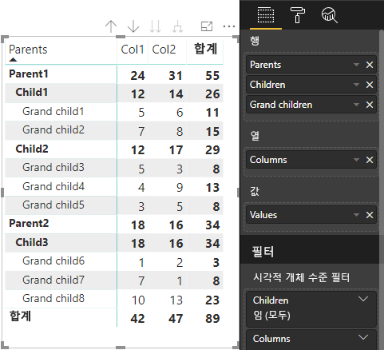

# <a name="understand-data-view-mapping-in-power-bi-visuals"></a>Power BI 시각적 개체의 데이터 뷰 매핑 이해

이 문서에서는 데이터 뷰 매핑에 대해 설명하고, 데이터 역할 간의 관계 및 데이터 역할을 사용하여 조건부 요구 사항을 지정할 수 있는 방법을 설명합니다. 각 `dataMappings` 유형에 대해서도 설명합니다.

유효한 매핑마다 데이터 뷰를 생성하지만, 현재는 시각적 개체당 하나의 쿼리만 수행할 수 있습니다. 일반적으로 하나의 데이터 뷰만 가져옵니다. 그러나 다음과 같이 특정 조건으로 여러 데이터 매핑을 제공할 수 있습니다.

```json
"dataViewMappings": [
    {
        "conditions": [ ... ],
        "categorical": { ... },
        "single": { ... },
        "table": { ... },
        "matrix": { ... }
    }
]
```

Power BI는 `dataViewMappings`에 유효한 매핑이 채워진 경우에만 데이터 뷰에 대한 매핑을 만듭니다.

즉, `dataViewMappings`에 `categorical`만 정의되어 있고 `table`, `single` 등의 다른 매핑은 정의되지 않았을 수 있습니다. 예:

```json
"dataViewMappings": [
    {
        "categorical": { ... }
    }
]
```

Power BI는 단일 `categorical` 매핑을 사용하여 데이터 뷰를 생성하고, `table` 및 다른 매핑은 정의되지 않습니다.

```javascript
{
    "categorical": {
        "categories": [ ... ],
        "values": [ ... ]
    },
    "metadata": { ... }
}
```

## <a name="conditions"></a>조건

이 섹션에서는 특정 데이터 매핑의 조건을 설명합니다. 여러 조건 집합을 제공할 수 있으며, 데이터가 설명된 조건 집합 중 하나와 일치하면 시각적 개체가 데이터를 유효한 것으로 허용합니다.

현재, 각 필드에 대해 최소값과 최댓값을 지정할 수 있습니다. 값은 해당 데이터 역할에 바인딩할 수 있는 필드 수를 나타냅니다. 

> [!NOTE]
> 조건에서 데이터 역할을 생략하면 필드를 원하는 개수만큼 포함할 수 있습니다.

### <a name="example-1"></a>예제 1

여러 필드를 각 데이터 역할로 끌어올 수 있습니다. 이 예제에서는 범주를 하나의 데이터 필드로 제한하고, 측정값을 두 개의 데이터 필드로 제한합니다.

```json
"conditions": [
    { "category": { "max": 1 }, "y": { "max": 2 } },
]
```

### <a name="example-2"></a>예제 2

이 예제에서는 다음 두 조건 중 하나가 필수입니다.
* 정확히 하나의 범주 데이터 필드와 정확히 두 개의 측정값
* 정확히 두 개의 범주와 정확히 하나의 측정값

```json
"conditions": [
    { "category": { "min": 1, "max": 1 }, "measure": { "min": 2, "max": 2 } },
    { "category": { "min": 2, "max": 2 }, "measure": { "min": 1, "max": 1 } }
]
```

## <a name="single-data-mapping"></a>단일 데이터 매핑

단일 데이터 매핑은 가장 간단한 형태의 데이터 매핑입니다. 단일 측정값 필드를 허용하고 합계를 제공합니다. 필드가 숫자이면 합계를 제공합니다. 숫자가 아니면 고유 값 개수를 제공합니다.

단일 데이터 매핑을 사용하려면 매핑할 데이터 역할의 이름을 정의해야 합니다. 이 매핑은 단일 측정값 필드에만 적용됩니다. 두 번째 필드를 할당하면 데이터 뷰가 생성되지 않으므로, 데이터를 단일 필드로 제한하는 조건을 포함하는 것도 좋은 방법입니다.

> [!NOTE]
> 이 데이터 매핑은 다른 데이터 매핑과 함께 사용할 수 없습니다. 데이터를 단일 숫자 값으로 줄이기 위한 것입니다.

### <a name="example-3"></a>예제 3

```json
{
    "dataRoles": [
        {
            "displayName": "Y",
            "name": "Y",
            "kind": "Measure"
        }
    ],
    "dataViewMappings": [
        {
            "conditions": [
                {
                    "Y": {
                        "max": 1
                    }
                }
            ],
            "single": {
                "role": "Y"
            }
        }
    ]
}
```

결과 데이터 뷰에는 다른 유형(테이블, 범주 등)이 계속 포함되지만, 각 매핑에는 단일 값만 포함됩니다. 단일 필드의 값에만 액세스하는 것이 좋습니다.

```JSON
{
    "dataView": [
        {
            "metadata": null,
            "categorical": null,
            "matrix": null,
            "table": null,
            "tree": null,
            "single": {
                "value": 94163140.3560001
            }
        }
    ]
}
```

간단한 데이터 뷰 매핑을 처리하기 위한 코드 샘플

```typescript
"use strict";
import powerbi from "powerbi-visuals-api";
import DataView = powerbi.DataView;
import DataViewSingle = powerbi.DataViewSingle;
// standart imports
// ...

export class Visual implements IVisual {
    private target: HTMLElement;
    private host: IVisualHost;
    private valueText: HTMLParagraphElement;

    constructor(options: VisualConstructorOptions) {
        // constructor body
        this.target = options.element;
        this.host = options.host;
        this.valueText = document.createElement("p");
        this.target.appendChild(this.valueText);
        // ...
    }

    public update(options: VisualUpdateOptions) {
        const dataView: DataView = options.dataViews[0];
        const singleDataView: DataViewSingle = dataView.single;

        if (!singleDataView ||
            !singleDataView.value ) {
            return
        }

        this.valueText.innerText = singleDataView.value.toString();
    }
}
```

따라서 시각적 개체는 Power BI의 단일 값을 표시합니다.


## <a name="categorical-data-mapping"></a>범주 데이터 매핑

범주 데이터 매핑은 하나 또는 두 개의 독립적인 데이터 그룹화를 가져오는 데 사용됩니다.

### <a name="example-4"></a>예제 4

데이터 역할에 대한 이전 예제의 정의는 다음과 같습니다.

```json
"dataRole":[
    {
        "displayName": "Category",
        "name": "category",
        "kind": "Grouping"
    },
    {
        "displayName": "Y Axis",
        "name": "measure",
        "kind": "Measure"
    }
]
```

매핑은 다음과 같습니다.

```json
"dataViewMappings": {
    "categorical": {
        "categories": {
            "for": { "in": "category" }
        },
        "values": {
            "select": [
                { "bind": { "to": "measure" } }
            ]
        }
    }
}
```

이 간단한 예제는 “`category`로 끌어오는 모든 필드에 대해 해당 데이터가 `categorical.categories`에 매핑되도록 `category` 데이터 역할을 매핑합니다. 또한 `measure` 데이터 역할을 `categorical.values`에 매핑합니다.”로 정의합니다.

* **for...in**: 이 데이터 역할의 모든 항목을 데이터 쿼리에 포함합니다.
* **bind...to**: *for...in*과 동일한 결과를 생성하지만, 데이터 역할에 단일 필드로 제한하는 조건이 포함될 것으로 예상합니다.

### <a name="example-5"></a>예제 5

이 예제에서는 이전 예제의 처음 두 데이터 역할을 사용하고 `grouping` 및 `measure2`도 추가로 정의합니다.

```json
"dataRole":[
    {
        "displayName": "Category",
        "name": "category",
        "kind": "Grouping"
    },
    {
        "displayName": "Y Axis",
        "name": "measure",
        "kind": "Measure"
    },
    {
        "displayName": "Grouping with",
        "name": "grouping",
        "kind": "Grouping"
    },
    {
        "displayName": "X Axis",
        "name": "measure2",
        "kind": "Grouping"
    }
]
```

매핑은 다음과 같습니다.

```json
"dataViewMappings":{
    "categorical": {
        "categories": {
            "for": { "in": "category" }
        },
        "values": {
            "group": {
                "by": "grouping",
                "select":[
                    { "bind": { "to": "measure" } },
                    { "bind": { "to": "measure2" } }
                ]
            }
        }
    }
}
```

여기서 차이점은 categorical.values를 매핑하는 방법에 있습니다. “`measure` 및 `measure2` 데이터 역할을 `grouping` 데이터 역할로 그룹화되도록 매핑합니다.”로 정의합니다.

### <a name="example-6"></a>예제 6

데이터 역할은 다음과 같습니다.

```json
"dataRoles": [
    {
        "displayName": "Categories",
        "name": "category",
        "kind": "Grouping"
    },
    {
        "displayName": "Measures",
        "name": "measure",
        "kind": "Measure"
    },
    {
        "displayName": "Series",
        "name": "series",
        "kind": "Measure"
    }
]
```

데이터 뷰 매핑은 다음과 같습니다.

```json
"dataViewMappings": [
    {
        "categorical": {
            "categories": {
                "for": {
                    "in": "category"
                }
            },
            "values": {
                "group": {
                    "by": "series",
                    "select": [{
                            "for": {
                                "in": "measure"
                            }
                        }
                    ]
                }
            }
        }
    }
]
```

범주 데이터 뷰를 다음과 같이 시각화할 수 있습니다.

| 범주별 |  |  | | | |
|-----|-----|------|------|------|------|
| | Year | 2013 | 2014 | 2015 | 2016 |
| 국가 | | |
| 미국 | | x | x | 650 | 350 |
| 캐나다 | | x | 630 | 490 | x |
| 멕시코 | | 645 | x | x | x |
| 영국 | | x | x | 831 | x |

Power BI는 범주 데이터 뷰로 생성합니다. 범주 집합입니다.

```JSON
{
    "categorical": {
        "categories": [
            {
                "source": {...},
                "values": [
                    "Canada",
                    "USA",
                    "UK",
                    "Mexico"
                ],
                "identity": [...],
                "identityFields": [...],
            }
        ]
    }
}
```

각 범주도 값 집합에 매핑됩니다. 각 값은 연도로 표시된 계열별로 그룹화됩니다.

예를 들어 각 `values` 배열은 각 연도의 데이터를 나타냅니다.
또한 각 `values` 배열에는 캐나다, 미국, 영국 및 멕시코에 대해 각각 4개의 값이 있습니다.

```JSON
{
    "values": [
        // Values for 2013 year
        {
            "source": {...},
            "values": [
                null, // Value for `Canada` category
                null, // Value for `USA` category
                null, // Value for `UK` category
                645 // Value for `Mexico` category
            ],
            "identity": [...],
        },
        // Values for 2014 year
        {
            "source": {...},
            "values": [
                630, // Value for `Canada` category
                null, // Value for `USA` category
                null, // Value for `UK` category
                null // Value for `Mexico` category
            ],
            "identity": [...],
        },
        // Values for 2015 year
        {
            "source": {...},
            "values": [
                490, // Value for `Canada` category
                650, // Value for `USA` category
                831, // Value for `UK` category
                null // Value for `Mexico` category
            ],
            "identity": [...],
        },
        // Values for 2016 year
        {
            "source": {...},
            "values": [
                null, // Value for `Canada` category
                350, // Value for `USA` category
                null, // Value for `UK` category
                null // Value for `Mexico` category
            ],
            "identity": [...],
        }
    ]
}
```

범주 데이터 뷰 매핑을 처리하기 위한 코드 샘플은 아래에 설명되어 있습니다. 이 샘플에서는 계층 구조 `Country => Year => Value`을(를) 만듭니다.

```typescript
"use strict";
import powerbi from "powerbi-visuals-api";
import DataView = powerbi.DataView;
import DataViewDataViewCategoricalSingle = powerbi.DataViewCategorical;
import DataViewValueColumnGroup = powerbi.DataViewValueColumnGroup;
import PrimitiveValue = powerbi.PrimitiveValue;
// standart imports
// ...

export class Visual implements IVisual {
    private target: HTMLElement;
    private host: IVisualHost;
    private categories: HTMLElement;

    constructor(options: VisualConstructorOptions) {
        // constructor body
        this.target = options.element;
        this.host = options.host;
        this.categories = document.createElement("pre");
        this.target.appendChild(this.categories);
        // ...
    }

    public update(options: VisualUpdateOptions) {
        const dataView: DataView = options.dataViews[0];
        const categoricalDataView: DataViewCategorical = dataView.categorical;

        if (!categoricalDataView ||
            !categoricalDataView.categories ||
            !categoricalDataView.categories[0] ||
            !categoricalDataView.values) {
            return;
        }

        // Categories have only one column in data buckets
        // If you want to support several columns of categories data bucket, you should iterate categoricalDataView.categories array.
        const categoryFieldIndex = 0;
        // Measure has only one column in data buckets.
        // If you want to support several columns on data bucket, you should iterate years.values array in map function
        const measureFieldIndex = 0;
        let categories: PrimitiveValue[] = categoricalDataView.categories[categoryFieldIndex].values;
        let values: DataViewValueColumnGroup[] = categoricalDataView.values.grouped();

        let data = {};
        // iterate categories/countries
        categories.map((category: PrimitiveValue, categoryIndex: number) => {
            data[category.toString()] = {};
            // iterate series/years
            values.map((years: DataViewValueColumnGroup) => {
                if (!data[category.toString()][years.name] && years.values[measureFieldIndex].values[categoryIndex]) {
                    data[category.toString()][years.name] = []
                }
                if (years.values[0].values[categoryIndex]) {
                    data[category.toString()][years.name].push(years.values[measureFieldIndex].values[categoryIndex]);
                }
            });
        });

        this.categories.innerText = JSON.stringify(data, null, 6);
        console.log(data);
    }
}
```

시각적 개체의 결과는 다음과 같습니다.


## <a name="table-data-mapping"></a>테이블 데이터 매핑

테이블 데이터 뷰는 간단한 데이터 매핑입니다. 기본적으로 숫자 데이터 요소를 집계할 수 있는 데이터 요소 목록입니다.

### <a name="example-7"></a>예제 7

다음은 지정된 기능입니다.

```json
"dataRoles": [
    {
        "displayName": "Column",
        "name": "column",
        "kind": "Measure"
    },
    {
        "displayName": "Value",
        "name": "value",
        "kind": "Measure"
    }
]
```

```json
"dataViewMappings": [
    {
        "table": {
            "rows": {
                "select": [
                    {
                        "for": {
                            "in": "column"
                        }
                    },
                    {
                        "for": {
                            "in": "value"
                        }
                    }
                ]
            }
        }
    }
]
```

다음과 같이 테이블 데이터 뷰를 시각화할 수 있습니다.  

데이터 예:

| 국가| Year | 영업 |
|-----|-----|------|
| 미국 | 2016 | 100 |
| 미국 | 2015 | 50 |
| 캐나다 | 2015 | 200 |
| 캐나다 | 2015 | 50 |
| 멕시코 | 2013 | 300 |
| 영국 | 2014 | 150 |
| 미국 | 2015 | 75 |

데이터 바인딩:


Power BI는 데이터를 테이블 데이터 뷰로 표시합니다. 데이터가 정렬되었다고 가정하면 안 됩니다.

```JSON
{
    "table" : {
        "columns": [...],
        "rows": [
            [
                "Canada",
                2014,
                630
            ],
            [
                "Canada",
                2015,
                490
            ],
            [
                "Mexico",
                2013,
                645
            ],
            [
                "UK",
                2014,
                831
            ],
            [
                "USA",
                2015,
                650
            ],
            [
                "USA",
                2016,
                350
            ]
        ]
    }
}
```

원하는 필드를 선택한 다음 합계를 선택하면 데이터를 집계할 수 있습니다.  


테이블 데이터 뷰 매핑을 처리하기 위한 코드 샘플입니다.

```typescript
"use strict";
import "./../style/visual.less";
import powerbi from "powerbi-visuals-api";
// ...
import DataViewMetadataColumn = powerbi.DataViewMetadataColumn;
import DataViewTable = powerbi.DataViewTable;
import DataViewTableRow = powerbi.DataViewTableRow;
import PrimitiveValue = powerbi.PrimitiveValue;
// other imports
// ...

export class Visual implements IVisual {
    private target: HTMLElement;
    private host: IVisualHost;
    private table: HTMLParagraphElement;

    constructor(options: VisualConstructorOptions) {
        // constructor body
        this.target = options.element;
        this.host = options.host;
        this.table = document.createElement("table");
        this.target.appendChild(this.table);
        // ...
    }

    public update(options: VisualUpdateOptions) {
        const dataView: DataView = options.dataViews[0];
        const tableDataView: DataViewTable = dataView.table;

        if (!tableDataView) {
            return
        }
        while(this.table.firstChild) {
            this.table.removeChild(this.table.firstChild);
        }

        //draw header
        const tableHeader = document.createElement("th");
        tableDataView.columns.forEach((column: DataViewMetadataColumn) => {
            const tableHeaderColumn = document.createElement("td");
            tableHeaderColumn.innerText = column.displayName
            tableHeader.appendChild(tableHeaderColumn);
        });
        this.table.appendChild(tableHeader);

        //draw rows
        tableDataView.rows.forEach((row: DataViewTableRow) => {
            const tableRow = document.createElement("tr");
            row.forEach((columnValue: PrimitiveValue) => {
                const cell = document.createElement("td");
                cell.innerText = columnValue.toString();
                tableRow.appendChild(cell);
            })
            this.table.appendChild(tableRow);
        });
    }
}
```

시각적 스타일 파일 `style/visual.less`에 테이블의 레이아웃이 포함되어 있습니다.

```less
table {
    display: flex;
    flex-direction: column;
}

tr, th {
    display: flex;
    flex: 1;
}

td {
    flex: 1;
    border: 1px solid black;
}
```


## <a name="matrix-data-mapping"></a>행렬 데이터 매핑

행렬 데이터 매핑은 테이블 데이터 매핑과 비슷하지만, 행이 계층적으로 표시됩니다. 모든 데이터 역할 값을 열 머리글 값으로 사용할 수 있습니다.

```json
{
    "dataRoles": [
        {
            "name": "Category",
            "displayName": "Category",
            "displayNameKey": "Visual_Category",
            "kind": "Grouping"
        },
        {
            "name": "Column",
            "displayName": "Column",
            "displayNameKey": "Visual_Column",
            "kind": "Grouping"
        },
        {
            "name": "Measure",
            "displayName": "Measure",
            "displayNameKey": "Visual_Values",
            "kind": "Measure"
        }
    ],
    "dataViewMappings": [
        {
            "matrix": {
                "rows": {
                    "for": {
                        "in": "Category"
                    }
                },
                "columns": {
                    "for": {
                        "in": "Column"
                    }
                },
                "values": {
                    "select": [
                        {
                            "for": {
                                "in": "Measure"
                            }
                        }
                    ]
                }
            }
        }
    ]
}
```

Power BI는 계층적 데이터 구조를 만듭니다. 트리 계층 구조의 루트에는 `Category` 데이터 역할의 **Parents** 열에 있는 데이터가 포함되고, 데이터 역할 테이블의 **Children** 열에 있는 자식이 있습니다.

데이터 세트:

| 부모 | 자식 | 손자 | 열 | 값 |
|-----|-----|------|-------|-------|
| Parent1 | Child1 | Grand child1 | Col1 | 5 |
| Parent1 | Child1 | Grand child1 | Col2 | 6 |
| Parent1 | Child1 | Grand child2 | Col1 | 7 |
| Parent1 | Child1 | Grand child2 | Col2 | 8 |
| Parent1 | Child2 | Grand child3 | Col1 | 5 |
| Parent1 | Child2 | Grand child3 | Col2 | 3 |
| Parent1 | Child2 | Grand child4 | Col1 | 4 |
| Parent1 | Child2 | Grand child4 | Col2 | 9 |
| Parent1 | Child2 | Grand child5 | Col1 | 3 |
| Parent1 | Child2 | Grand child5 | Col2 | 5 |
| Parent2 | Child3 | Grand child6 | Col1 | 1 |
| Parent2 | Child3 | Grand child6 | Col2 | 2 |
| Parent2 | Child3 | Grand child7 | Col1 | 7 |
| Parent2 | Child3 | Grand child7 | Col2 | 1 |
| Parent2 | Child3 | Grand child8 | Col1 | 10 |
| Parent2 | Child3 | Grand child8 | Col2 | 13 |

Power BI의 핵심 행렬 시각적 개체는 데이터를 테이블로 렌더링합니다.



시각적 개체는 다음 코드에 설명된 대로 데이터 구조를 가져옵니다. 여기에는 처음 두 개의 테이블 행만 나와 있습니다.

```json
{
    "metadata": {...},
    "matrix": {
        "rows": {
            "levels": [...],
            "root": {
                "childIdentityFields": [...],
                "children": [
                    {
                        "level": 0,
                        "levelValues": [...],
                        "value": "Parent1",
                        "identity": {...},
                        "childIdentityFields": [...],
                        "children": [
                            {
                                "level": 1,
                                "levelValues": [...],
                                "value": "Child1",
                                "identity": {...},
                                "childIdentityFields": [...],
                                "children": [
                                    {
                                        "level": 2,
                                        "levelValues": [...],
                                        "value": "Grand child1",
                                        "identity": {...},
                                        "values": {
                                            "0": {
                                                "value": 5 // value for Col1
                                            },
                                            "1": {
                                                "value": 6 // value for Col2
                                            }
                                        }
                                    },
                                    ...
                                ]
                            },
                            ...
                        ]
                    },
                    ...
                ]
            }
        },
        "columns": {
            "levels": [...],
            "root": {
                "childIdentityFields": [...],
                "children": [
                    {
                        "level": 0,
                        "levelValues": [...],
                        "value": "Col1",
                        "identity": {...}
                    },
                    {
                        "level": 0,
                        "levelValues": [...],
                        "value": "Col2",
                        "identity": {...}
                    },
                    ...
                ]
            }
        },
        "valueSources": [...]
    }
}
```

## <a name="data-reduction-algorithm"></a>데이터 감소 알고리즘

데이터 뷰에 받을 데이터 양을 제어하기 위해 데이터 감소 알고리즘을 적용할 수 있습니다.

기본적으로 모든 Power BI 시각적 개체에는 *count*가 1000개 데이터 요소로 설정된 top 데이터 감소 알고리즘이 적용되어 있습니다. *capabilities.json* 파일에서 다음 속성을 설정하는 것과 같습니다.

```json
"dataReductionAlgorithm": {
    "top": {
        "count": 1000
    }
}
```

*count* 값을 최대 30000까지 임의의 정수 값으로 수정할 수 있습니다. R 기반 Power BI 시각적 개체는 최대 150000개의 행을 지원할 수 있습니다.

## <a name="data-reduction-algorithm-types"></a>데이터 감소 알고리즘 유형

데이터 감소 알고리즘 설정에는 다음 네 가지 유형이 있습니다.

* `top`: 데이터를 데이터 세트 위쪽에서 가져온 값으로 제한하려는 경우에 사용합니다. 데이터 세트에서 처음 *count*개의 값을 가져옵니다.
* `bottom`: 데이터를 데이터 세트 아래쪽에서 가져온 값으로 제한하려는 경우에 사용합니다. 데이터 세트에서 마지막 “count”개의 값을 가져옵니다.
* `sample`: *count*개의 항목으로 제한된 간단한 샘플링 알고리즘을 통해 데이터 세트를 줄입니다. 즉, 첫 번째 항목과 마지막 항목이 포함되고 그 사이에 동일한 간격으로 *count*개의 항목이 포함됩니다.
예를 들어 데이터 세트 [0, 1, 2, ... 100]이 있고 *count*가 9이면 값 [0, 10, 20 ... 100]이 표시됩니다.
* `window`: *count*개의 요소를 포함하는 데이터 요소 ‘창’을 한 번에 하나씩 로드합니다. 현재 `top`과 `window`는 동일합니다. 창 설정을 완전히 지원하기 위해 작업 중입니다.

## <a name="data-reduction-algorithm-usage"></a>데이터 감소 알고리즘 사용

데이터 감소 알고리즘은 범주, 테이블 또는 행렬 데이터 뷰 매핑에서 사용할 수 있습니다.

범주 데이터 매핑의 경우 알고리즘을 `categories`로 설정하고 `values` 섹션을 그룹화할 수 있습니다.

### <a name="example-8"></a>예제 8

```json
"dataViewMappings": {
    "categorical": {
        "categories": {
            "for": { "in": "category" },
            "dataReductionAlgorithm": {
                "window": {
                    "count": 300
                }
            }  
        },
        "values": {
            "group": {
                "by": "series",
                "select": [{
                        "for": {
                            "in": "measure"
                        }
                    }
                ],
                "dataReductionAlgorithm": {
                    "top": {
                        "count": 100
                    }
                }  
            }
        }
    }
}
```

데이터 뷰 매핑 테이블의 `rows` 섹션에 데이터 감소 알고리즘을 적용할 수 있습니다.

### <a name="example-9"></a>예제 9

```json
"dataViewMappings": [
    {
        "table": {
            "rows": {
                "for": {
                    "in": "values"
                },
                "dataReductionAlgorithm": {
                    "top": {
                        "count": 2000
                    }
                }
            }
        }
    }
]
```

데이터 뷰 매핑 행렬의 `rows` 및 `columns` 섹션에 데이터 감소 알고리즘을 적용할 수 있습니다.

## <a name="next-steps"></a>다음 단계

방법 [Power BI 시각적 개체에서 데이터 뷰 매핑의 드릴다운 지원 추가](drill-down-support.md)를 참조하세요.
