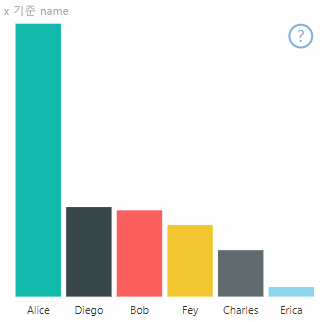
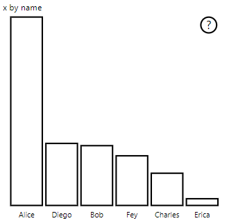

# <a name="high-contrast-mode-support-in-power-bi-visuals"></a>Power BI 시각적 개체의 고대비 모드 지원

Windows ‘고대비’ 설정을 사용하면 서로 다른 색을 표시하여 텍스트와 앱을 더욱 알아보기 쉽게 지정할 수 있습니다.  이 문서에서는 Power BI 시각적 개체에 고대비 모드 지원을 추가하는 방법을 설명합니다. 자세한 내용은 [Power BI의 고대비 지원](https://powerbi.microsoft.com/blog/power-bi-desktop-june-2018-feature-summary/#highContrast)을 참조하세요.

고대비 지원 구현을 보려면 [PowerBI-visuals-sampleBarChart 시각적 개체 리포지토리](https://github.com/Microsoft/PowerBI-visuals-sampleBarChart/commit/61011c82b66ca0d3321868f1d089c65101ca42e6)로 이동합니다.

## <a name="on-initialization"></a>초기화 시

`options.host`의 colorPalette 멤버에는 여러 개의 고대비 모드 속성이 있습니다. 이러한 속성을 사용하여 고대비 모드가 활성 상태인지 여부를 확인하고, 활성 상태이면 사용할 색을 결정할 수 있습니다.

### <a name="detect-that-power-bi-is-in-high-contrast-mode"></a>Power BI가 고대비 모드에 있는지 검색

`host.colorPalette.isHighContrast`가 `true`이면 고대비 모드가 활성 상태이며, 그에 따라 시각적 개체가 그려져야 합니다.

### <a name="get-high-contrast-colors"></a>고대비 색 가져오기

고대비 모드에서는 시각적 개체가 다음 설정으로 제한되어야 합니다.

* **전경색**은 선, 아이콘, 텍스트 및 도형의 윤곽선 또는 채우기를 그리는 데 사용됩니다.
* **배경색**은 배경과 윤곽선이 있는 도형의 채우기 색으로 사용됩니다.
* **전경 - 선택됨** 색은 선택한 요소 또는 활성 요소를 나타내는 데 사용됩니다.
* **하이퍼링크** 색은 하이퍼링크 텍스트에만 사용됩니다.

> [!NOTE]
> 보조 색이 필요한 경우 전경색을 특정 불투명도로 사용할 수 있습니다(Power BI 네이티브 시각적 개체는 40% 불투명도를 사용함). 시각적 개체의 세부 정보를 알아보기 쉽게 유지하려면 이 기능은 가급적 사용하지 않는 것이 좋습니다.

초기화 중에 다음 값을 저장할 수 있습니다.

```typescript
private isHighContrast: boolean;

private foregroundColor: string;
private backgroundColor: string;
private foregroundSelectedColor: string;
private hyperlinkColor: string;
//...

constructor(options: VisualConstructorOptions) {
    this.host = options.host;
    let colorPalette: ISandboxExtendedColorPalette = host.colorPalette;
    //...
    this.isHighContrast = colorPalette.isHighContrast;
    if (this.isHighContrast) {
        this.foregroundColor = colorPalette.foreground.value;
        this.backgroundColor = colorPalette.background.value;
        this.foregroundSelectedColor = colorPalette.foregroundSelected.value;
        this.hyperlinkColor = colorPalette.hyperlink.value;
    }
```

또는 초기화 중에 `host` 개체를 저장하고, 업데이트 시 관련 `colorPalette` 속성에 액세스할 수 있습니다.

## <a name="on-update"></a>업데이트 시

고대비 지원의 특정 구현은 시각적 개체마다 차이가 있으며, 그래픽 디자인의 세부 정보에 따라 달라집니다. 제한된 색으로 중요한 세부 정보를 알아보기 쉽게 유지하기 위해, 일반적으로 고대비 모드에서는 기본 모드와는 약간 다른 디자인이 필요합니다.

Power BI 네이티브 시각적 개체는 다음과 같은 지침을 따릅니다.

* 모든 데이터 요소는 동일한 색(전경)을 사용합니다.
* 모든 텍스트, 축, 화살표, 선 등은 전경색을 사용합니다.
* 두꺼운 도형은 두꺼운 스트로크(최소 2픽셀) 및 배경색 채우기를 사용한 윤곽선으로 그려집니다.
* 데이터 요소가 관련된 경우 각기 다른 표식 모양으로 구분되고, 데이터 선은 각기 다른 대시로 구분됩니다.
* 데이터 요소를 강조 표시하면 다른 모든 요소의 불투명도가 40%로 변경됩니다.
* 슬라이서의 경우 활성 필터 요소가 전경 - 선택됨 색을 사용합니다.

예를 들어 다음 샘플 가로 막대형 차트에서는 모든 막대가 2픽셀 두께의 전경 윤곽선과 배경 채우기로 그려집니다. 기본 색이 적용된 모양과 몇 가지 고대비 테마가 적용된 모양을 비교합니다.





다음 섹션에서는 고대비를 지원하기 위해 변경된 `visualTransform` 함수의 한곳을 보여 줍니다. 업데이트 중에 렌더링의 일부로 호출됩니다.

### <a name="before"></a>전

```typescript
for (let i = 0, len = Math.max(category.values.length, dataValue.values.length); i < len; i++) {
    let defaultColor: Fill = {
        solid: {
            color: colorPalette.getColor(category.values[i] + '').value
        }
    };

    barChartDataPoints.push({
        category: category.values[i] + '',
        value: dataValue.values[i],
        color: getCategoricalObjectValue<Fill>(category, i, 'colorSelector', 'fill', defaultColor).solid.color,
        selectionId: host.createSelectionIdBuilder()
            .withCategory(category, i)
            .createSelectionId()
    });
}
```

### <a name="after"></a>후

```typescript
for (let i = 0, len = Math.max(category.values.length, dataValue.values.length); i < len; i++) {
    const color: string = getColumnColorByIndex(category, i, colorPalette);

    const selectionId: ISelectionId = host.createSelectionIdBuilder()
        .withCategory(category, i)
        .createSelectionId();

    barChartDataPoints.push({
        color,
        strokeColor,
        strokeWidth,
        selectionId,
        value: dataValue.values[i],
        category: `${category.values[i]}`,
    });
}

//...

function getColumnColorByIndex(
    category: DataViewCategoryColumn,
    index: number,
    colorPalette: ISandboxExtendedColorPalette,
): string {
    if (colorPalette.isHighContrast) {
        return colorPalette.background.value;
    }

    const defaultColor: Fill = {
        solid: {
            color: colorPalette.getColor(`${category.values[index]}`).value,
        }
    };

    return getCategoricalObjectValue<Fill>(category, index, 'colorSelector', 'fill', defaultColor).solid.color;
}
```
