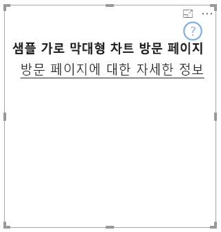

# <a name="landing-page"></a>방문 페이지

API 2.3.0을 사용하면 시각적 개체에 방문 페이지를 추가할 수 있습니다. 이렇게 하려면 기능에 `supportsLandingPage`를 추가하고 true로 설정합니다. 그러면 데이터를 추가하기 전에도 시각적 개체가 초기화되고 업데이트되므로(더 이상 워터마크가 표시되지 않음), 데이터가 없는 경우 시각적 개체에 표시할 고유한 방문 페이지를 디자인할 수 있습니다.

```typescript
export class BarChart implements IVisual {
    //...
    private element: HTMLElement;
    private isLandingPageOn: boolean;
    private LandingPageRemoved: boolean;
    private LandingPage: d3.Selection<any>;

    constructor(options: VisualConstructorOptions) {
            //...
            this.element = options.element;
            //...
    }

    public update(options: VisualUpdateOptions) {
    //...
        this.HandleLandingPage(options);
    }

    private HandleLandingPage(options: VisualUpdateOptions) {
        if(!options.dataViews || !options.dataViews.length) {
            if(!this.isLandingPageOn) {
                this.isLandingPageOn = true;
                const SampleLandingPage: Element = this.createSampleLandingPage(); //create a landing page
                this.element.appendChild(SampleLandingPage);
                this.LandingPage = d3.select(SampleLandingPage);
            }

        } else {
                if(this.isLandingPageOn && !this.LandingPageRemoved){
                    this.LandingPageRemoved = true;
                    this.LandingPage.remove();
                }
        }
    }
```

샘플


