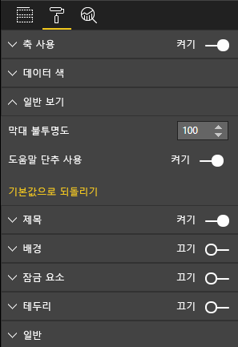

# <a name="launch-url"></a>시작 URL

시작 URL을 사용하면 실제 작업을 Power BI에 위임하여 새 브라우저 탭(또는 창)을 열 수 있습니다.

## <a name="sample"></a>샘플

```typescript
   this.host.launchUrl('https://powerbi.microsoft.com');
```

## <a name="usage"></a>사용량

`host.launchUrl()` API 호출을 사용하고 대상 URL을 문자열 인수로 전달합니다.

```typescript
this.host.launchUrl('http://some.link.net');
```

## <a name="restrictions"></a>제한 사항

* 절대 경로만 사용하고 상대 경로를 사용하지 않습니다. `http://some.link.net/subfolder/page.html`은 유효하지만 `/page.html`은 열리지 않습니다.
* 현재는 `http` 및 `https` 프로토콜만 지원됩니다. `ftp`, `mailto` 등을 사용하지 않습니다.

## <a name="best-practices"></a>모범 사례

1. 대부분의 경우 사용자의 명시적 작업에 대한 응답으로만 링크를 여는 것이 가장 좋습니다. 링크 또는 단추를 클릭하면 새 탭이 열린다는 것을 사용자가 쉽게 파악할 수 있도록 합니다. 사용자 작업 없이 또는 다른 작업의 부작용으로 `launchUrl()` 호출을 트리거하면 사용자가 당황하거나 불만을 가질 수 있습니다.
2. 링크가 시각적 개체의 적절한 기능에 중요하지 않은 경우 보고서 작성자에게 링크를 사용하지 않도록 설정하고 숨기는 방법을 제공해야 합니다. 특히 타사 애플리케이션에 보고서를 포함하거나 웹에 게시하는 것과 같은 특별한 Power BI 사용 사례에 적용됩니다.
3. 루프, 시각적 개체의 `update` 함수 또는 자주 되풀이되는 기타 코드 내에서 `launchUrl()` 호출을 트리거하지 않습니다.

## <a name="step-by-step-example"></a>단계별 예제

### <a name="adding-a-link-launching-element"></a>링크 시작 요소 추가

시각적 개체의 `constructor` 함수에 다음 줄이 추가되었습니다.

```typescript
    this.helpLinkElement = this.createHelpLinkElement();
    options.element.appendChild(this.helpLinkElement);
```

또한 앵커 요소를 만들고 연결하는 private 함수가 추가되었습니다.

```typescript
private createHelpLinkElement(): Element {
    let linkElement = document.createElement("a");
    linkElement.textContent = "?";
    linkElement.setAttribute("title", "Open documentation");
    linkElement.setAttribute("class", "helpLink");
    linkElement.addEventListener("click", () => {
        this.host.launchUrl("https://docs.microsoft.com/power-bi/developer/custom-visual-develop-tutorial");
    });
    return linkElement;
};
```

마지막으로, visual.less 파일의 항목이 링크 요소의 스타일을 정의합니다.

```less
.helpLink {
    position: absolute;
    top: 0px;
    right: 12px;
    display: block;
    width: 20px;
    height: 20px;
    border: 2px solid #80B0E0;
    border-radius: 20px;
    color: #80B0E0;
    text-align: center;
    font-size: 16px;
    line-height: 20px;
    background-color: #FFFFFF;
    transition: all 900ms ease;

    &:hover {
        background-color: #DDEEFF;
        color: #5080B0;
        border-color: #5080B0;
        transition: all 250ms ease;
    }

    &.hidden {
        display: none;
    }
}
```

### <a name="adding-a-toggling-mechanism"></a>토글 메커니즘 추가

이 작업을 수행하려면 보고서의 작성자가 링크 요소의 표시 여부를 토글(기본적으로 숨김으로 설정되어 있음)할 수 있도록 정적 개체([정적 개체 자습서](https://microsoft.github.io/PowerBI-visuals/docs/concepts/objects-and-properties) 참조)를 추가해야 합니다.
`capabilities.json` 개체 항목에 `showHelpLink` 부울 정적 개체가 추가되었습니다.

```typescript
"objects": {
    "generalView": {
            "displayName": "General View",
            "properties":
                "showHelpLink": {
                    "displayName": "Show Help Button",
                    "type": {
                        "bool": true
                    }
                }
            }
        }
    }
```



또한 시각적 개체의 `update` 함수에 다음 줄이 추가되었습니다.

```typescript
if (settings.generalView.showHelpLink) {
    this.helpLinkElement.classList.remove("hidden");
} else {
    this.helpLinkElement.classList.add("hidden");
}
```

`hidden` 클래스는 요소의 표시를 제어하기 위해 visual.less에 정의되어 있습니다.
