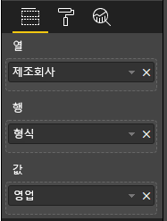

# <a name="add-interactivity-into-visual-by-power-bi-visuals-selections"></a>Power BI 시각적 개체 선택 항목별로 시각적 개체에 대화형 작업 추가

Power BI는 시각적 개체 사이의 두 가지 상호 작용 방법인 선택 및 필터링 기능을 제공합니다. 아래 샘플에서는 한 시각적 개체의 항목을 선택하고 보고서의 다른 시각적 개체에 새 선택 상태를 알리는 방법을 보여줍니다.

`Selection` 개체는 인터페이스에 해당합니다.

```typescript
export interface ISelectionId {
    equals(other: ISelectionId): boolean;
    includes(other: ISelectionId, ignoreHighlight?: boolean): boolean;
    getKey(): string;
    getSelector(): Selector;
    getSelectorsByColumn(): SelectorsByColumn;
    hasIdentity(): boolean;
}
```

## <a name="how-to-use-selectionmanager-to-select-data-points"></a>SelectionManager를 사용하여 데이터 요소를 선택하는 방법

시각적 호스트 개체는 선택 관리자 인스턴스를 만드는 메서드를 제공합니다. 선택 관리자는 선택 항목 선택 및 선택 취소, 상황에 맞는 메뉴 표시, 현재 선택 항목 저장 및 선택 상태 확인을 담당합니다. 또한 선택 관리자에는 이 작업에 해당하는 메서드가 있습니다.

### <a name="create-an-instance-of-the-selection-manager"></a>선택 관리자의 인스턴스를 만듭니다.

선택 관리자를 사용하려면 선택 관리자 인스턴스를 만들어야 합니다. 일반적으로 시각적 개체는 시각적 개체의 `constructor`에서 선택 관리자 인스턴스를 만듭니다.

```typescript
export class Visual implements IVisual {
    private target: HTMLElement;
    private host: IVisualHost;
    private selectionManager: ISelectionManager;
    // ...
    constructor(options: VisualConstructorOptions) {
        this.host = options.host;
        // ...
        this.selectionManager = this.host.createSelectionManager();
    }
    // ...
}
```

### <a name="create-an-instance-of-the-selection-builder"></a>선택 작성기의 인스턴스를 만듭니다.

선택 관리자 인스턴스가 만들어지면 시각적 개체의 각 데이터 요소에 대해 `selections`를 만들어야 합니다. 시각적 호스트 개체는 각 데이터 요소에 대해 선택 항목을 생성하는 `createSelectionIdBuilder` 메서드를 제공합니다. 이 메서드는 `powerbi.visuals.ISelectionIdBuilder` 인터페이스를 사용하여 개체의 인스턴스를 반환합니다.

```typescript
export interface ISelectionIdBuilder {
    withCategory(categoryColumn: DataViewCategoryColumn, index: number): this;
    withSeries(seriesColumn: DataViewValueColumns, valueColumn: DataViewValueColumn | DataViewValueColumnGroup): this;
    withMeasure(measureId: string): this;
    withMatrixNode(matrixNode: DataViewMatrixNode, levels: DataViewHierarchyLevel[]): this;
    withTable(table: DataViewTable, rowIndex: number): this;
    createSelectionId(): ISelectionId;
}
```

이 개체에는 다양한 유형의 데이터 뷰 매핑에 대한 `selections`를 만들 수 있는 메서드가 있습니다.

> [!NOTE]
> `withTable` 및 `withMatrixNode` 메서드는 Power BI 시각적 개체의 API 2.5.0에서 도입되었습니다.
> 테이블 또는 행렬 데이터 뷰 매핑의 선택 항목을 사용해야 하는 경우 API 버전을 2.5.0 이상으로 업데이트해야 합니다.

### <a name="create-selections-for-categorical-data-view-mapping"></a>범주 데이터 뷰 매핑에 대한 선택 항목 만들기

샘플 데이터 세트에 대한 범주 데이터 뷰 매핑에서 선택 항목이 어떻게 표시되는지 검토해 보겠습니다.

| 제조업체 | 형식 | 값 |
| - | - | - |
| Chrysler | 국내 승용차 | 28883 |
| Chrysler | 국내 트럭 | 117131 |
| Chrysler | 수입 승용차 | 0 |
| Chrysler | 수입 트럭 | 6362 |
| Ford | 국내 승용차 | 50032 |
| Ford | 국내 트럭 | 122446 |
| Ford | 수입 승용차 | 0 |
| Ford | 수입 트럭 | 0 |
| GM | 국내 승용차 | 65426 |
| GM | 국내 트럭 | 138122 |
| GM | 수입 승용차 | 197 |
| GM | 수입 트럭 | 0 |
| Honda | 국내 승용차 | 51450 |
| Honda | 국내 트럭 | 46115 |
| Honda | 수입 승용차 | 2932 |
| Honda | 수입 트럭 | 0 |
| Nissan | 국내 승용차 | 51476 |
| Nissan | 국내 트럭 | 47343 |
| Nissan | 수입 승용차 | 5485 |
| Nissan | 수입 트럭 | 1430 |
| Toyota | 국내 승용차 | 55643 |
| Toyota | 국내 트럭 | 61227 |
| Toyota | 수입 승용차 | 20799 |
| Toyota | 수입 트럭 | 23614 |

시각적 개체는 다음과 같은 데이터 뷰 매핑을 사용합니다.

```json
{
    "dataRoles": [
        {
            "displayName": "Columns",
            "name": "columns",
            "kind": "Grouping"
        },
        {
            "displayName": "Rows",
            "name": "rows",
            "kind": "Grouping"
        },
        {
            "displayName": "Values",
            "name": "values",
            "kind": "Measure"
        }
    ],
    "dataViewMappings": [
        {
            "categorical": {
                "categories": {
                    "for": {
                        "in": "columns"
                    }
                },
                "values": {
                    "group": {
                        "by": "rows",
                        "select": [
                            {
                                "for": {
                                    "in": "values"
                                }
                            }
                        ]
                    }
                }
            }
        }
    ]
}
```

이 샘플에서는 `Manufacturer`가 `columns`이고 `Type`이 `rows`입니다. `rows`(`Type`)를 기준으로 값을 그룹화하여 만든 시리즈가 있습니다.

그리고 시각적 개체는 `Manufacturer` 및 `Type`을 기준으로 데이터를 분할할 수 있어야 합니다.

예를 들어 사용자가 `Manufacturer`에서 `Chrysler`를 선택하면 다른 시각적 개체는 다음 데이터를 표시해야 합니다.

| 제조업체 | 형식 | 값 |
| - | - | - |
| **Chrysler** | 국내 승용차 | 28883 |
| **Chrysler** | 국내 트럭 | 117131 |
| **Chrysler** | 수입 승용차 | 0 |
| **Chrysler** | 수입 트럭 | 6362 |

사용자가 `Type`에서 `Import Car`를 선택하면(계열을 기준으로 데이터를 선택) 다른 시각적 개체는 다음 데이터를 표시해야 합니다.

| 제조업체 | 형식 | 값 |
| - | - | - |
| Chrysler | **수입 승용차** | 0 |
| Ford | **수입 승용차** | 0 |
| GM | **수입 승용차** | 197 |
| Honda | **수입 승용차** | 2932 |
| Nissan | **수입 승용차** | 5485 |
| Toyota | **수입 승용차** | 20799 |


시각적 데이터 바구니를 채워야 합니다.



범주(열)로 `Manufacturer`, 계열(행)로 `Type`, 계열에 대한 `Values`로 `Value`가 있습니다.

> [!NOTE]
> 시각적 개체는 데이터 뷰 매핑에 따라 `Values`가 `Rows` 데이터를 기준으로 그룹화될 것으로 예상하므로 `Values`가 계열에 필요합니다.

#### <a name="create-selections-for-categories"></a>범주에 대한 선택 항목 만들기

```typescript
// categories
const categories = dataView.categorical.categories;

// create label for 'Manufacturer' column
const p = document.createElement("p") as HTMLParagraphElement;
p.innerText = categories[0].source.displayName.toString();
this.target.appendChild(p);

// get count of category elements
const categoriesCount = categories[0].values.length;

// iterate all categories to generate selection and create button elements to use selections
for (let categoryIndex = 0; categoryIndex < categoriesCount; categoryIndex++) {
    const categoryValue: powerbi.PrimitiveValue = categories[0].values[categoryIndex];

    const categorySelectionId = this.host.createSelectionIdBuilder()
        .withCategory(categories[0], categoryIndex) // we have only one category (only one `Manufacturer` column)
        .createSelectionId();
    this.dataPoints.push({
        value: categoryValue,
        selection: categorySelectionId
    });
    console.log(categorySelectionId);

    // create button element to apply selection on click
    const button = document.createElement("button") as HTMLButtonElement;
    button.value = categoryValue.toString();
    button.innerText = categoryValue.toString();
    button.addEventListener("click", () => {
        // handle click event to apply correspond selection
        this.selectionManager.select(categorySelectionId);
    });
    this.target.appendChild(button);
}
```

샘플 코드에서는 모든 범주를 반복하는 것을 볼 수 있습니다. 또한 각 반복에서 `createSelectionIdBuilder`를 호출하고 선택 항목 작성기의 `withCategory` 메서드를 호출하여 각 범주에 대해 다음 선택 항목을 만듭니다. `createSelectionId` 메서드는 생성된 `selection` 개체를 반환하는 최종 메서드로 사용됩니다.

`withCategory` 메서드에서는 `category`의 열을 전달하고, 샘플에서는 이것이 `Manufacturer`와 범주 요소의 인덱스입니다.

#### <a name="create-selections-for-series"></a>계열에 대한 선택 항목 만들기

```typescript
// get groupped values for series
const series: powerbi.DataViewValueColumnGroup[] = dataView.categorical.values.grouped();

// create label for 'Type' column
const p2 = document.createElement("p") as HTMLParagraphElement;
p2.innerText = dataView.categorical.values.source.displayName;
this.target.appendChild(p2);

// iterate all series to generate selection and create button elements to use selections
series.forEach( (ser: powerbi.DataViewValueColumnGroup) => {
    // create selection id for series
    const seriesSelectionId = this.host.createSelectionIdBuilder()
        .withSeries(dataView.categorical.values, ser)
        .createSelectionId();

    this.dataPoints.push({
        value: ser.name,
        selection: seriesSelectionId
    });

    // create button element to apply selection on click
    const button = document.createElement("button") as HTMLButtonElement;
    button.value =ser.name.toString();
    button.innerText = ser.name.toString();
    button.addEventListener("click", () => {
        // handle click event to apply correspond selection
        this.selectionManager.select(seriesSelectionId);
    });
    this.target.appendChild(button);
});
```

### <a name="create-selections-for-table-data-view-mapping"></a>테이블 데이터 뷰 매핑에 대한 선택 항목 만들기

테이블 데이터 뷰 매핑 샘플

```json
{
    "dataRoles": [
        {
            "displayName": "Values",
            "name": "values",
            "kind": "GroupingOrMeasure"
        }
    ],
    "dataViewMappings": [
        {
            "table": {
                "rows": {
                    "for": {
                        "in": "values"
                    }
                }
            }
        }
    ]
}
```

테이블 데이터 뷰 매핑의 각 행에 대해 선택 항목을 만들려면 선택 항목 작성기의 `withTable` 메서드를 호출해야 합니다.

```typescript
public update(options: VisualUpdateOptions) {
    const dataView = options.dataViews[0];
    dataView.table.rows.forEach((row: DataViewTableRow, rowIndex: number) => {
        this.target.appendChild(rowDiv);
        const selection: ISelectionId = this.host.createSelectionIdBuilder()
            .withTable(dataView.table, rowIndex)
            .createSelectionId();
    }
}
```

시각적 개체 코드는 테이블의 행을 반복하고 각 행이 `withTable` 테이블 메서드를 호출합니다. `withTable` 메서드의 매개 변수는 테이블 행의 `table` 개체 및 인덱스입니다.

### <a name="create-selections-for-matrix-data-view-mapping"></a>행렬 데이터 뷰 매핑에 대한 선택 항목 만들기

```typescript
public update(options: VisualUpdateOptions) {
    const host = this.host;
    const rowLevels: powerbi.DataViewHierarchyLevel[] = dataView.matrix.rows.levels;
    const columnLevels: powerbi.DataViewHierarchyLevel[] = dataView.matrix.rows.levels;

    // iterate rows hierarchy
    nodeWalker(dataView.matrix.rows.root, rowLevels);
    // iterate columns hierarchy
    nodeWalker(dataView.matrix.columns.root, columnLevels);

    function nodeWalker(node: powerbi.DataViewMatrixNode, levels: powerbi.DataViewHierarchyLevel[]) {
        const nodeSelection = host.createSelectionIdBuilder().withMatrixNode(node, levels);

        if (node.children && node.children.length) {
            node.children.forEach(child => {
                nodeWalker(child, levels);
            });
        }
    }
}
```

샘플에서 `nodeWalker`는 각 노드 및 자식 노드에 대해 재귀적으로 호출합니다.

`nodeWalker`는 각 호출에서 `nodeSelection` 개체를 만듭니다. 그리고 각 `nodeSelection`은 해당 노드의 `selection`을 나타냅니다.

## <a name="select-datapoints-to-slice-other-visuals"></a>데이터 요소를 선택하여 다른 시각적 개체를 조각화

범주 데이터 뷰 매핑 선택 항목의 샘플 코드에서 단추 요소에 대한 클릭 처리기를 만들었습니다. 이 처리기는 선택 항목 관리자의 `select` 메서드를 호출하고 선택 항목 개체를 전달합니다.

```typescript
button.addEventListener("click", () => {
    // handle click event to apply correspond selection
    this.selectionManager.select(categorySelectionId);
});
```

`select` 메서드의 인터페이스는

```typescript
interface ISelectionManager {
    // ...
    select(selectionId: ISelectionId | ISelectionId[], multiSelect?: boolean): IPromise<ISelectionId[]>;
    // ...
}
```

`select`는 선택 항목의 배열을 수락할 수 있다는 것을 알 수 있습니다. 이는 시각적 개체가 여러 데이터 요소를 선택할 수 있음을 의미합니다. 두 번째 매개 변수 `multiSelect`에서 다중 선택을 담당합니다. 값이 true이면 Power BI가 이전 선택 상태를 지우지 않고 현재 선택을 적용합니다. 그렇지 않으면 이전 선택 항목이 다시 설정됩니다.

클릭 이벤트에서 CTRL 단추 상태를 처리하는 `multiSelect`를 사용하는 일반적인 시나리오입니다.

```typescript
button.addEventListener("click", (mouseEvent) => {
    const multiSelect = (mouseEvent as MouseEvent).ctrlKey;
    this.selectionManager.select(seriesSelectionId, multiSelect);
});
```

## <a name="next-steps"></a>다음 단계

* [데이터 요소에 시각적 속성을 바인딩하기 위해 선택 항목을 사용하는 방법 읽기](objects-properties.md#objects-selector)

* [책갈피 전환에서 선택 항목을 처리하는 방법 읽기](bookmarks-support.md#visuals-with-selection)

* [시각적 개체 데이터 요소에 대한 상황에 맞는 메뉴를 추가하는 방법 읽기](context-menu.md)

* [InteractivityUtils를 사용하여 Power BI 시각적 개체에 선택 항목을 추가하는 방법 읽기](utils-interactivity-selections.md)
