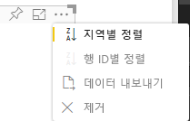

# <a name="sorting-options-for-power-bi-visuals"></a>Power BI 시각적 개체의 정렬 옵션

이 문서에서는 ‘정렬’ 옵션이 Power BI 시각적 개체의 정렬 동작을 지정하는 방법을 설명합니다.  

정렬 기능을 사용하려면 다음 매개 변수 중 하나가 필요합니다.

## <a name="default-sorting"></a>기본 정렬

`default` 옵션은 가장 간단한 형태입니다. ‘DataMappings’ 섹션에 표시된 데이터를 정렬할 수 있습니다. 이 옵션은 사용자가 데이터 매핑을 정렬할 수 있게 하고, 정렬 방향을 지정합니다.

```json
    "sorting": {
        "default": {   }
    }
```



## <a name="implicit-sorting"></a>암시적 정렬

암시적 정렬은 각 데이터 역할의 정렬을 설명하는 배열 매개 변수 `clauses`를 사용한 정렬입니다. `implicit`는 시각적 개체의 사용자가 정렬 순서를 변경할 수 없음을 의미합니다. Power BI의 시각적 개체 메뉴에 정렬 옵션이 표시되지 않습니다. 그러나 Power BI는 지정된 설정에 따라 데이터를 정렬합니다.

`clauses` 매개 변수는 다음 두 개의 매개 변수가 있는 여러 개체를 포함할 수 있습니다.

- `role`: 정렬할 `DataMapping`을 결정합니다.
- `direction`: 정렬 방향을 결정합니다(1 = 오름차순, 2 = 내림차순).

```json
    "sorting": {
        "implicit": {
            "clauses": [
                {
                    "role": "category",
                    "direction": 1
                },
                {
                    "role": "measure",
                    "direction": 2
                }
            ]
        }
    }
```

## <a name="custom-sorting"></a>사용자 지정 정렬

사용자 지정 정렬은 시각적 개체의 코드에서 개발자가 정렬을 관리함을 의미합니다.
