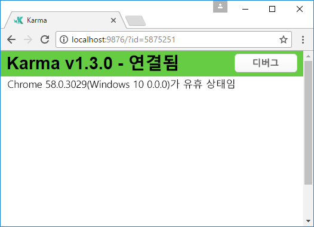
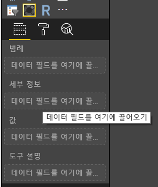
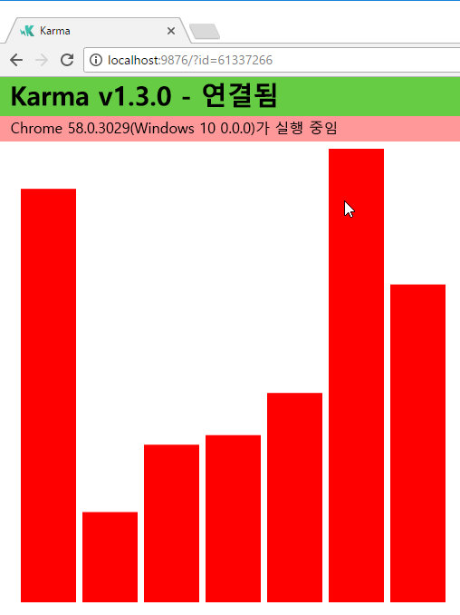
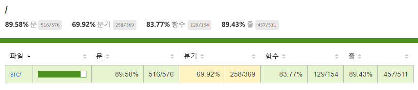
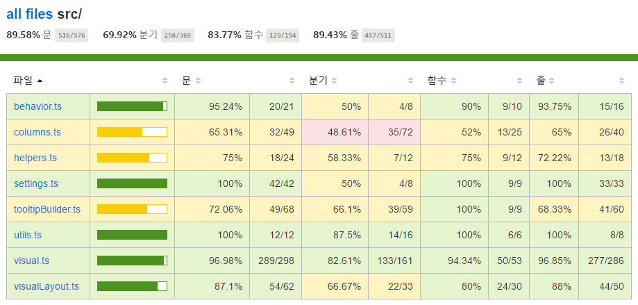

# <a name="tutorial-add-unit-tests-for-power-bi-visual-projects"></a>자습서:  Power BI 시각적 개체 프로젝트의 단위 테스트 추가

이 문서에서는 다음 방법을 포함하여 Power BI 시각적 개체의 단위 테스트를 작성하기 위한 기본 사항을 설명합니다.

* Karma JavaScript Test Runner 테스트 프레임워크, Jasmine을 설정하는 방법
* powerbi-visuals-utils-testutils 패키지를 사용하는 방법
* 모의 및 모조 테스트를 사용하여 Power BI 시각적 개체의 단위 테스트를 간소화하는 방법

## <a name="prerequisites"></a>필수 조건

* 설치된 Power BI 시각적 개체 프로젝트
* 구성된 Node.js 환경

## <a name="install-and-configure-the-karma-javascript-test-runner-and-jasmine"></a>Karma JavaScript Test Runner와 Jasmine 설치 및 구성

*package.json* 파일의 `devDependencies` 섹션에 필요한 라이브러리를 추가합니다.

```json
"@babel/polyfill": "^7.2.5",
"@types/d3": "5.5.0",
"@types/jasmine": "2.5.37",
"@types/jasmine-jquery": "1.5.28",
"@types/jquery": "2.0.41",
"@types/karma": "3.0.0",
"@types/lodash-es": "4.17.1",
"coveralls": "3.0.2",
"istanbul-instrumenter-loader": "^3.0.1",
"jasmine": "2.5.2",
"jasmine-core": "2.5.2",
"jasmine-jquery": "2.1.1",
"jquery": "3.1.1",
"karma": "3.1.1",
"karma-chrome-launcher": "2.2.0",
"karma-coverage": "1.1.2",
"karma-coverage-istanbul-reporter": "^2.0.4",
"karma-jasmine": "2.0.1",
"karma-junit-reporter": "^1.2.0",
"karma-sourcemap-loader": "^0.3.7",
"karma-typescript": "^3.0.13",
"karma-typescript-preprocessor": "0.4.0",
"karma-webpack": "3.0.5",
"puppeteer": "1.17.0",
"style-loader": "0.23.1",
"ts-loader": "5.3.0",
"ts-node": "7.0.1",
"tslint": "^5.12.0",
"webpack": "4.26.0"
```

*package.json*에 대한 자세한 내용은 [npm-package.json](https://docs.npmjs.com/files/package.json)의 설명을 참조하세요.

*package.json* 파일을 저장하고, `package.json` 위치에서 다음 명령을 실행합니다.

```cmd
npm install
```

패키지 관리자가 *package.json*에 추가된 새 패키지를 모두 설치합니다.

단위 테스트를 실행하려면 Test Runner 및 `webpack` config를 구성합니다.

다음 코드는 *test.webpack.config.js* 파일의 샘플입니다.

```typescript
const path = require('path');
const webpack = require("webpack");

module.exports = {
    devtool: 'source-map',
    mode: 'development',
    optimization : {
        concatenateModules: false,
        minimize: false
    },
    module: {
        rules: [
            {
                test: /\.tsx?$/,
                use: 'ts-loader',
                exclude: /node_modules/
            },
            {
                test: /\.json$/,
                loader: 'json-loader'
            },
            {
                test: /\.tsx?$/i,
                enforce: 'post',
                include: /(src)/,
                exclude: /(node_modules|resources\/js\/vendor)/,
                loader: 'istanbul-instrumenter-loader',
                options: { esModules: true }
            },
            {
                test: /\.less$/,
                use: [
                    {
                        loader: 'style-loader'
                    },
                    {
                        loader: 'css-loader'
                    },
                    {
                        loader: 'less-loader',
                        options: {
                            paths: [path.resolve(__dirname, 'node_modules')]
                        }
                    }
                ]
            }
        ]
    },
    externals: {
        "powerbi-visuals-api": '{}'
    },
    resolve: {
        extensions: ['.tsx', '.ts', '.js', '.css']
    },
    output: {
        path: path.resolve(__dirname, ".tmp/test")
    },
    plugins: [
        new webpack.ProvidePlugin({
            'powerbi-visuals-api': null
        })
    ]
};
```

다음 코드는 *karma.conf.ts* 파일의 샘플입니다.

```typescript
"use strict";

const webpackConfig = require("./test.webpack.config.js");
const tsconfig = require("./test.tsconfig.json");
const path = require("path");

const testRecursivePath = "test/visualTest.ts";
const srcOriginalRecursivePath = "src/**/*.ts";
const coverageFolder = "coverage";

process.env.CHROME_BIN = require("puppeteer").executablePath();

import { Config, ConfigOptions } from "karma";

module.exports = (config: Config) => {
    config.set(<ConfigOptions>{
        mode: "development",
        browserNoActivityTimeout: 100000,
        browsers: ["ChromeHeadless"], // or Chrome to use locally installed Chrome browser
        colors: true,
        frameworks: ["jasmine"],
        reporters: [
            "progress",
            "junit",
            "coverage-istanbul"
        ],
        junitReporter: {
            outputDir: path.join(__dirname, coverageFolder),
            outputFile: "TESTS-report.xml",
            useBrowserName: false
        },
        singleRun: true,
        plugins: [
            "karma-coverage",
            "karma-typescript",
            "karma-webpack",
            "karma-jasmine",
            "karma-sourcemap-loader",
            "karma-chrome-launcher",
            "karma-junit-reporter",
            "karma-coverage-istanbul-reporter"
        ],
        files: [
            "node_modules/jquery/dist/jquery.min.js",
            "node_modules/jasmine-jquery/lib/jasmine-jquery.js",
            {
                pattern: './capabilities.json',
                watched: false,
                served: true,
                included: false
            },
            testRecursivePath,
            {
                pattern: srcOriginalRecursivePath,
                included: false,
                served: true
            }
        ],
        preprocessors: {
            [testRecursivePath]: ["webpack", "coverage"]
        },
        typescriptPreprocessor: {
            options: tsconfig.compilerOptions
        },
        coverageIstanbulReporter: {
            reports: ["html", "lcovonly", "text-summary", "cobertura"],
            dir: path.join(__dirname, coverageFolder),
            'report-config': {
                html: {
                    subdir: 'html-report'
                }
            },
            combineBrowserReports: true,
            fixWebpackSourcePaths: true,
            verbose: false
        },
        coverageReporter: {
            dir: path.join(__dirname, coverageFolder),
            reporters: [
                // reporters not supporting the `file` property
                { type: 'html', subdir: 'html-report' },
                { type: 'lcov', subdir: 'lcov' },
                // reporters supporting the `file` property, use `subdir` to directly
                // output them in the `dir` directory
                { type: 'cobertura', subdir: '.', file: 'cobertura-coverage.xml' },
                { type: 'lcovonly', subdir: '.', file: 'report-lcovonly.txt' },
                { type: 'text-summary', subdir: '.', file: 'text-summary.txt' },
            ]
        },
        mime: {
            "text/x-typescript": ["ts", "tsx"]
        },
        webpack: webpackConfig,
        webpackMiddleware: {
            stats: "errors-only"
        }
    });
};
```

필요한 경우, 이 구성을 수정할 수 있습니다.

*karma.conf.js*의 코드에는 다음 변수가 포함되어 있습니다.

* `recursivePathToTests`: 테스트 코드를 찾습니다.

* `srcRecursivePath`: 컴파일 후에 출력 JavaScript 코드를 찾습니다.

* `srcCssRecursivePath`: 스타일이 포함된 LESS 파일을 컴파일한 후에 출력 CSS를 찾습니다.

* `srcOriginalRecursivePath`: 시각적 개체의 원본 코드를 찾습니다.

* `coverageFolder`: 검사 보고서를 만들 위치를 결정합니다.

구성 파일에는 다음 속성이 포함되어 있습니다.

* `singleRun: true`: 테스트가 CI(연속 통합) 시스템에서 실행되거나, 한 번 실행할 수 있습니다. 테스트를 디버그하기 위해 이 설정을 *false*로 변경할 수 있습니다. Karma는 디버깅에 콘솔을 사용할 수 있도록 브라우저를 계속 실행합니다.

* `files: [...]`: 이 배열에서는 브라우저에 로드할 파일을 지정할 수 있습니다. 일반적으로 원본 파일, 테스트 사례, 라이브러리(Jasmine, 테스트 유틸리티)가 있습니다. 필요에 따라 목록에 다른 파일을 추가할 수 있습니다.

* `preprocessors`: 이 섹션에서는 단위 테스트를 실행하기 전에 실행되는 작업을 구성합니다. 이러한 작업은 typescript를 JavaScript로 미리 컴파일하고, 원본 맵 파일을 준비하며, 코드 검사 보고서를 생성합니다. 테스트를 디버그할 때 `coverage`를 사용하지 않도록 설정할 수 있습니다. 검사 시 테스트 검사 코드를 검사하기 위한 추가 코드가 생성되므로 테스트 디버깅이 복잡해집니다.

모든 Karma 구성에 대한 설명은 [Karma 구성 파일](https://karma-runner.github.io/1.0/config/configuration-file.html) 페이지를 참조하세요.

편의상, 테스트 명령을 `scripts`에 추가할 수 있습니다.

```json
{
    "scripts": {
        "pbiviz": "pbiviz",
        "start": "pbiviz start",
        "typings":"node node_modules/typings/dist/bin.js i",
        "lint": "tslint -r \"node_modules/tslint-microsoft-contrib\"  \"+(src|test)/**/*.ts\"",
        "pretest": "pbiviz package --resources --no-minify --no-pbiviz --no-plugin",
        "test": "karma start"
    }
    ...
}
```

이제 단위 테스트 작성을 시작할 준비가 되었습니다.

## <a name="check-the-dom-element-of-the-visual"></a>시각적 개체의 DOM 요소 검사

시각적 개체를 테스트하려면, 먼저 시각적 개체 인스턴스를 만듭니다.

### <a name="create-a-visual-instance-builder"></a>시각적 개체 인스턴스 작성기 만들기

다음 코드를 사용하여 *test* 폴더에 *visualBuilder.ts* 파일을 추가합니다.

```typescript
import {
    VisualBuilderBase
} from "powerbi-visuals-utils-testutils";

import {
    BarChart as VisualClass
} from "../src/visual";

import  powerbi from "powerbi-visuals-api";
import VisualConstructorOptions = powerbi.extensibility.visual.VisualConstructorOptions;

export class BarChartBuilder extends VisualBuilderBase<VisualClass> {
    constructor(width: number, height: number) {
        super(width, height);
    }

    protected build(options: VisualConstructorOptions) {
        return new VisualClass(options);
    }

    public get mainElement() {
        return this.element.children("svg.barChart");
    }
}
```

시각적 개체의 인스턴스를 만들기 위한 `build` 메서드가 있습니다. `mainElement`는 시각적 개체의 “root” DOM(문서 개체 모델) 요소 인스턴스를 반환하는 get 메서드입니다. getter는 선택 사항이지만, 단위 테스트를 보다 쉽게 작성할 수 있게 해줍니다.

이제 시각적 개체 인스턴스 빌드가 있습니다. 테스트 사례를 작성해 보겠습니다. 이 테스트 사례는 시각적 개체를 표시할 때 생성되는 SVG 요소를 검사합니다.

### <a name="create-a-typescript-file-to-write-test-cases"></a>테스트 사례를 작성하기 위한 typescript 파일 만들기

다음 코드를 사용하여 테스트 사례의 *visualTest.ts* 파일을 추가합니다.

```typescript
import powerbi from "powerbi-visuals-api";

import { BarChartBuilder } from "./VisualBuilder";

import {
    BarChart as VisualClass
} from "../src/visual";

import VisualBuilder = powerbi.extensibility.visual.test.BarChartBuilder;

describe("BarChart", () => {
    let visualBuilder: VisualBuilder;
    let dataView: DataView;

    beforeEach(() => {
        visualBuilder = new VisualBuilder(500, 500);
    });

    it("root DOM element is created", () => {
        expect(visualBuilder.mainElement).toBeInDOM();
    });
});
```

다음 몇 가지 메서드가 호출됩니다.

* [`describe`](https://jasmine.github.io/api/2.6/global.html#describe): 테스트 사례를 설명합니다. Jasmine 프레임워크 컨텍스트에서는 일반적으로 도구 모음 또는 사양 그룹을 설명합니다.

* `beforeEach`: [`describe`](https://jasmine.github.io/api/2.6/global.html#beforeEach) 메서드에서 정의된 각 `it` 메서드 호출 전에 호출됩니다.

* [`it`](https://jasmine.github.io/api/2.6/global.html#it): 단일 사양을 정의합니다. `it` 메서드에는 하나 이상의 `expectations`가 포함되어야 합니다.

* [`expect`](https://jasmine.github.io/api/2.6/global.html#expect): 사양의 기대치를 만듭니다. 모든 기대치를 오류 없이 통과하면 사양이 성공합니다.

* `toBeInDOM`: ‘선택기’ 메서드 중 하나입니다. 선택기에 대한 자세한 내용은 [Jasmine Namespace: matchers](https://jasmine.github.io/api/2.6/matchers.html)(Jasmine 네임스페이스: 선택기)를 참조하세요.

Jasmine에 대한 자세한 내용은 [Jasmine 프레임워크 문서](https://jasmine.github.io/) 페이지를 참조하세요.

### <a name="launch-unit-tests"></a>단위 테스트 시작

이 테스트는 시각적 개체의 루트 SVG 요소가 생성되었는지 확인합니다. 단위 테스트를 실행하려면 명령줄 도구에서 다음 명령을 입력합니다.

```cmd
npm run test
```

`karma.js`가 Chrome 브라우저에서 테스트 사례를 실행합니다.



> [!NOTE]
> Google Chrome을 로컬에 설치해야 합니다.

명령줄 창에 다음 출력이 표시됩니다.

```cmd
> karma start

23 05 2017 12:24:26.842:WARN [watcher]: Pattern "E:/WORKSPACE/PowerBI/PowerBI-visuals-sampleBarChart/data/*.csv" does not match any file.
23 05 2017 12:24:30.836:WARN [karma]: No captured browser, open http://localhost:9876/
23 05 2017 12:24:30.849:INFO [karma]: Karma v1.3.0 server started at http://localhost:9876/
23 05 2017 12:24:30.850:INFO [launcher]: Launching browser Chrome with unlimited concurrency
23 05 2017 12:24:31.059:INFO [launcher]: Starting browser Chrome
23 05 2017 12:24:33.160:INFO [Chrome 58.0.3029 (Windows 10 0.0.0)]: Connected on socket /#2meR6hjXFmsE_fjiAAAA with id 5875251
Chrome 58.0.3029 (Windows 10 0.0.0): Executed 1 of 1 SUCCESS (0.194 secs / 0.011 secs)

=============================== Coverage summary ===============================
Statements   : 27.43% ( 65/237 )
Branches     : 19.84% ( 25/126 )
Functions    : 43.86% ( 25/57 )
Lines        : 20.85% ( 44/211 )
================================================================================
```

### <a name="how-to-add-static-data-for-unit-tests"></a>단위 테스트의 정적 데이터를 추가하는 방법

다음 코드를 사용하여 *test* 폴더에 *visualData.ts* 파일을 만듭니다.

```typescript
import powerbi from "powerbi-visuals-api";
import DataView = powerbi.DataView;

import {
    testDataViewBuilder,
    getRandomNumbers
} from "powerbi-visuals-utils-testutils";

export class SampleBarChartDataBuilder extends TestDataViewBuilder {
    public static CategoryColumn: string = "category";
    public static MeasureColumn: string = "measure";

    public constructor() {
        super();
        ...
    }

    public getDataView(columnNames?: string[]): DataView {
        let dateView: any = this.createCategoricalDataViewBuilder([
            ...
        ],
        [
            ...
        ], columnNames).build();

        // there's client side computed maxValue
        let maxLocal = 0;
        this.valuesMeasure.forEach((item) => {
                if (item > maxLocal) {
                    maxLocal = item;
                }
        });
        (<any>dataView).categorical.values[0].maxLocal = maxLocal;
    }
}
```

`SampleBarChartDataBuilder` 클래스는 `TestDataViewBuilder`를 확장하고, 추상 메서드 `getDataView`를 구현합니다.

데이터 필드 버킷에 데이터를 넣으면 Power BI는 해당 데이터를 기반으로 하는 범주 `dataview` 개체를 생성합니다.



단위 테스트에는 데이터를 재현할 Power BI 핵심 함수가 없습니다. 그러나 정적 데이터를 범주 `dataview`에 매핑해야 합니다. `TestDataViewBuilder` 클래스가 매핑 작업에 도움이 될 수 있습니다.

데이터 뷰 매핑에 대한 자세한 내용은 [DataViewMappings](https://github.com/Microsoft/PowerBI-visuals/blob/master/Capabilities/DataViewMappings.md)를 참조하세요.

`getDataView` 메서드에서 데이터를 사용하여 `createCategoricalDataViewBuilder` 메서드를 호출합니다.

`sampleBarChart` 시각적 개체의 [capabilities.json](https://github.com/Microsoft/PowerBI-visuals-sampleBarChart/blob/master/capabilities.json#L2) 파일에는 dataRoles 및 dataViewMapping 개체가 있습니다.

```json
"dataRoles": [
    {
        "displayName": "Category Data",
        "name": "category",
        "kind": "Grouping"
    },
    {
        "displayName": "Measure Data",
        "name": "measure",
        "kind": "Measure"
    }
],
"dataViewMappings": [
    {
        "conditions": [
            {
                "category": {
                    "max": 1
                },
                "measure": {
                    "max": 1
                }
            }
        ],
        "categorical": {
            "categories": {
                "for": {
                    "in": "category"
                }
            },
            "values": {
                "select": [
                    {
                        "bind": {
                            "to": "measure"
                        }
                    }
                ]
            }
        }
    }
],
```

동일한 매핑을 생성하려면 `createCategoricalDataViewBuilder` 메서드에 다음 매개 변수를 설정해야 합니다.

```typescript
([
    {
        source: {
            displayName: "Category",
            queryName: SampleBarChartData.ColumnCategory,
            type: ValueType.fromDescriptor({ text: true }),
            roles: {
                Category: true
            },
        },
        values: this.valuesCategory
    }
],
[
    {
        source: {
            displayName: "Measure",
            isMeasure: true,
            queryName: SampleBarChartData.MeasureColumn,
            type: ValueType.fromDescriptor({ numeric: true }),
            roles: {
                Measure: true
            },
        },
        values: this.valuesMeasure
    },
], columnNames)
```

여기서 `this.valuesCategory`는 범주 배열입니다.

```ts
public valuesCategory: string[] = ["Monday", "Tuesday", "Wednesday", "Thursday", "Friday", "Saturday", "Sunday"];
```

`this.valuesMeasure`는 각 범주의 측정값 배열입니다.

```ts
public valuesMeasure: number[] = [742731.43, 162066.43, 283085.78, 300263.49, 376074.57, 814724.34, 570921.34];
```

이제 단위 테스트에서 `SampleBarChartDataBuilder` 클래스를 사용할 수 있습니다.

`ValueType` 클래스는 powerbi-visuals-utils-testutils 패키지에 정의되어 있습니다. 또한 `createCategoricalDataViewBuilder` 메서드에는 `lodash` 라이브러리가 필요합니다.

종속성에 이러한 패키지를 추가합니다.

`package.json`의 `devDependencies` 섹션에 다음을 추가합니다.

```json
"lodash-es": "4.17.1",
"powerbi-visuals-utils-testutils": "2.2.0"
```

다음을 호출합니다.

```cmd
npm install
```

`lodash-es` 라이브러리가 설치됩니다.

이제 단위 테스트를 다시 실행할 수 있습니다. 다음 출력이 표시됩니다.

```cmd
> karma start

23 05 2017 16:19:54.318:WARN [watcher]: Pattern "E:/WORKSPACE/PowerBI/PowerBI-visuals-sampleBarChart/data/*.csv" does not match any file.
23 05 2017 16:19:58.333:WARN [karma]: No captured browser, open http://localhost:9876/
23 05 2017 16:19:58.346:INFO [karma]: Karma v1.3.0 server started at http://localhost:9876/
23 05 2017 16:19:58.346:INFO [launcher]: Launching browser Chrome with unlimited concurrency
23 05 2017 16:19:58.394:INFO [launcher]: Starting browser Chrome
23 05 2017 16:19:59.873:INFO [Chrome 58.0.3029 (Windows 10 0.0.0)]: Connected on socket /#NcNTAGH9hWfGMCuEAAAA with id 3551106
Chrome 58.0.3029 (Windows 10 0.0.0): Executed 1 of 1 SUCCESS (1.266 secs / 1.052 secs)

=============================== Coverage summary ===============================
Statements   : 56.72% ( 135/238 )
Branches     : 32.54% ( 41/126 )
Functions    : 66.67% ( 38/57 )
Lines        : 52.83% ( 112/212 )
================================================================================
```

시각적 개체가 다음과 같이 Chrome 브라우저에서 열립니다.



요약을 통해 검사가 증가한 것을 알 수 있습니다. 현재 코드 검사에 대한 자세한 내용을 보려면 `coverage\index.html`을 엽니다.



또는 `src` 폴더의 범위를 확인합니다.



파일 범위에서 원본 코드를 살펴볼 수 있습니다. `Coverage` 유틸리티는 단위 테스트 중 특정 코드가 실행되지 않을 경우 해당 행을 빨간색으로 강조 표시합니다.


> [!IMPORTANT]
> 코드 검사가 시각적 개체의 적절한 기능 검사를 의미하는 것은 아닙니다. 하나의 간단한 단위 테스트가 `src\visual.ts` 검사의 96% 이상을 제공합니다.

## <a name="next-steps"></a>다음 단계

시각적 개체가 준비되면 게시를 위해 제출할 수 있습니다. 자세한 내용은 [AppSource에 Power BI 시각적 개체 게시](../office-store.md)를 참조하세요.
