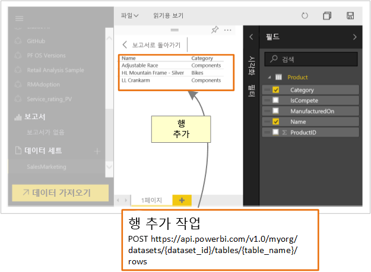

# <a name="step-5-add-rows-to-a-power-bi-table"></a>5단계: Power BI 테이블에 행 추가

이 문서는 [데이터 세트에 데이터를 푸시](walkthrough-push-data.md)하는 단계별 연습의 일부입니다.

데이터 세트에 데이터 푸시의 **4단계**인 [Power BI 테이블에 행을 추가할 데이터 세트 가져오기](walkthrough-push-data-get-datasets.md)에서는 [데이터 세트 가져오기](https://docs.microsoft.com/rest/api/power-bi/datasets/getdatasets) 작업 및 Newtonsoft.Json을 사용하여 데이터 세트 ID를 가져왔습니다. 이 단계에서는 [PostRows](https://docs.microsoft.com/rest/api/power-bi/pushdatasets/datasets_postrows) 작업에 데이터 세트 ID를 사용하여 **Power BI** 데이터 세트에 행을 추가합니다. 

[PostRows](https://docs.microsoft.com/rest/api/power-bi/pushdatasets/datasets_postrows) 작업을 호출하면 데이터 세트에 행이 추가됩니다.



Power BI API를 사용하여 데이터 세트에 행을 추가하는 방법은 다음과 같습니다.

## <a name="add-rows-to-a-power-bi-table"></a>Power BI 테이블에 행 추가

> [!NOTE]
> 시작하기 전에 [데이터 세트에 데이터 푸시](walkthrough-push-data.md)의 이전 단계를 수행해야 합니다.

1. 2단계: 데이터 푸시 연습, [인증 액세스 토큰 가져오기](walkthrough-push-data-get-token.md)에서 만든 콘솔 애플리케이션 프로젝트에 아래 코드를 추가합니다.
2. 콘솔 앱을 실행하고 Power BI 계정에 로그인합니다. **추가된 행** 이 콘솔 창에 표시됩니다. Power BI에 로그인하여 데이터 세트에 추가된 행을 볼 수도 있습니다.

**데이터 세트에 데이터 푸시 샘플**

Program.cs에 이 코드를 추가합니다.

* static void Main(string[] args)에서:
  
  ```csharp
   static void Main(string[] args)
   {
  
       //Get an authentication access token
       token = GetToken();
  
       //Create a dataset in Power BI
       CreateDataset();
  
       //Get a dataset to add rows into a Power BI table
       string datasetId = GetDataset();
  
       //Add rows to a Power BI table
       AddRows(datasetId, "Product");
   }

  ```
* AddRows() 메서드 추가:

```csharp
    #region Add rows to a Power BI table
    private static void AddRows(string datasetId, string tableName)
    {
        string powerBIApiAddRowsUrl = String.Format("https://api.powerbi.com/v1.0/myorg/datasets/{0}/tables/{1}/rows", datasetId, tableName);

        //POST web request to add rows.
        //To add rows to a dataset in a group, use the Groups uri: https://api.powerbi.com/v1.0/myorg/groups/{group_id}/datasets/{dataset_id}/tables/{table_name}/rows
        //Change request method to "POST"
        HttpWebRequest request = System.Net.WebRequest.Create(powerBIApiAddRowsUrl) as System.Net.HttpWebRequest;
        request.KeepAlive = true;
        request.Method = "POST";
        request.ContentLength = 0;
        request.ContentType = "application/json";

        //Add token to the request header
        request.Headers.Add("Authorization", String.Format("Bearer {0}", token));

        //JSON content for product row
        string rowsJson = "{\"rows\":" +
            "[{\"ProductID\":1,\"Name\":\"Adjustable Race\",\"Category\":\"Components\",\"IsCompete\":true,\"ManufacturedOn\":\"07/30/2014\"}," +
            "{\"ProductID\":2,\"Name\":\"LL Crankarm\",\"Category\":\"Components\",\"IsCompete\":true,\"ManufacturedOn\":\"07/30/2014\"}," +
            "{\"ProductID\":3,\"Name\":\"HL Mountain Frame - Silver\",\"Category\":\"Bikes\",\"IsCompete\":true,\"ManufacturedOn\":\"07/30/2014\"}]}";

        //POST web request
        byte[] byteArray = System.Text.Encoding.UTF8.GetBytes(rowsJson);
        request.ContentLength = byteArray.Length;

        //Write JSON byte[] into a Stream
        using (Stream writer = request.GetRequestStream())
        {
            writer.Write(byteArray, 0, byteArray.Length);

            var response = (HttpWebResponse)request.GetResponse();

            Console.WriteLine("Rows Added");

            Console.ReadLine();
        }
    }

    #endregion
```

다음은 [전체 코드 목록](#code)입니다.

<a name="code"/>

## <a name="complete-code-listing"></a>전체 코드 목록

```csharp
    using System;
    using Microsoft.IdentityModel.Clients.ActiveDirectory;
    using System.Net;
    using System.IO;
    using Newtonsoft.Json;

    namespace walkthrough_push_data
    {
        class Program
        {
            private static string token = string.Empty;

            static void Main(string[] args)
            {

                //Get an authentication access token
                token = GetToken();

                //Create a dataset in Power BI
                CreateDataset();

                //Get a dataset to add rows into a Power BI table
                string datasetId = GetDataset();

                //Add rows to a Power BI table
                AddRows(datasetId, "Product");

            }

            #region Get an authentication access token
            private static string GetToken()
            {
                // TODO: Install-Package Microsoft.IdentityModel.Clients.ActiveDirectory -Version 2.21.301221612
                // and add using Microsoft.IdentityModel.Clients.ActiveDirectory

                //The client id that Azure AD created when you registered your client app.
                string clientID = "{Client_ID}";

                //RedirectUri you used when you register your app.
                //For a client app, a redirect uri gives Azure AD more details on the application that it will authenticate.
                // You can use this redirect uri for your client app
                string redirectUri = "https://login.live.com/oauth20_desktop.srf";

                //Resource Uri for Power BI API
                string resourceUri = "https://analysis.windows.net/powerbi/api";

                //OAuth2 authority Uri
                string authorityUri = "https://login.microsoftonline.net/common/";

                //Get access token:
                // To call a Power BI REST operation, create an instance of AuthenticationContext and call AcquireToken
                // AuthenticationContext is part of the Active Directory Authentication Library NuGet package
                // To install the Active Directory Authentication Library NuGet package in Visual Studio,
                //  run "Install-Package Microsoft.IdentityModel.Clients.ActiveDirectory" from the nuget Package Manager Console.

                // AcquireToken will acquire an Azure access token
                // Call AcquireToken to get an Azure token from Azure Active Directory token issuance endpoint
                AuthenticationContext authContext = new AuthenticationContext(authorityUri);
                string token = authContext.AcquireToken(resourceUri, clientID, new Uri(redirectUri)).AccessToken;

                Console.WriteLine(token);
                Console.ReadLine();

                return token;
            }

            #endregion

            #region Create a dataset in a Power BI
            private static void CreateDataset()
            {
                //TODO: Add using System.Net and using System.IO

                string powerBIDatasetsApiUrl = "https://api.powerbi.com/v1.0/myorg/datasets";
                //POST web request to create a dataset.
                //To create a Dataset in a group, use the Groups uri: https://api.PowerBI.com/v1.0/myorg/groups/{group_id}/datasets
                HttpWebRequest request = System.Net.WebRequest.Create(powerBIDatasetsApiUrl) as System.Net.HttpWebRequest;
                request.KeepAlive = true;
                request.Method = "POST";
                request.ContentLength = 0;
                request.ContentType = "application/json";

                //Add token to the request header
                request.Headers.Add("Authorization", String.Format("Bearer {0}", token));

                //Create dataset JSON for POST request
                string datasetJson = "{\"name\": \"SalesMarketing\", \"tables\": " +
                    "[{\"name\": \"Product\", \"columns\": " +
                    "[{ \"name\": \"ProductID\", \"dataType\": \"Int64\"}, " +
                    "{ \"name\": \"Name\", \"dataType\": \"string\"}, " +
                    "{ \"name\": \"Category\", \"dataType\": \"string\"}," +
                    "{ \"name\": \"IsCompete\", \"dataType\": \"bool\"}," +
                    "{ \"name\": \"ManufacturedOn\", \"dataType\": \"DateTime\"}" +
                    "]}]}";

                //POST web request
                byte[] byteArray = System.Text.Encoding.UTF8.GetBytes(datasetJson);
                request.ContentLength = byteArray.Length;

                //Write JSON byte[] into a Stream
                using (Stream writer = request.GetRequestStream())
                {
                    writer.Write(byteArray, 0, byteArray.Length);

                    var response = (HttpWebResponse)request.GetResponse();

                    Console.WriteLine(string.Format("Dataset {0}", response.StatusCode.ToString()));

                    Console.ReadLine();
                }
            }
            #endregion

            #region Get a dataset to add rows into a Power BI table
            private static string GetDataset()
            {
                string powerBIDatasetsApiUrl = "https://api.powerbi.com/v1.0/myorg/datasets";
                //POST web request to create a dataset.
                //To create a Dataset in a group, use the Groups uri: https://api.PowerBI.com/v1.0/myorg/groups/{group_id}/datasets
                HttpWebRequest request = System.Net.WebRequest.Create(powerBIDatasetsApiUrl) as System.Net.HttpWebRequest;
                request.KeepAlive = true;
                request.Method = "GET";
                request.ContentLength = 0;
                request.ContentType = "application/json";

                //Add token to the request header
                request.Headers.Add("Authorization", String.Format("Bearer {0}", token));

                string datasetId = string.Empty;
                //Get HttpWebResponse from GET request
                using (HttpWebResponse httpResponse = request.GetResponse() as System.Net.HttpWebResponse)
                {
                    //Get StreamReader that holds the response stream
                    using (StreamReader reader = new System.IO.StreamReader(httpResponse.GetResponseStream()))
                    {
                        string responseContent = reader.ReadToEnd();

                        //TODO: Install NuGet Newtonsoft.Json package: Install-Package Newtonsoft.Json
                        //and add using Newtonsoft.Json
                        var results = JsonConvert.DeserializeObject<dynamic>(responseContent);

                        //Get the first id
                        datasetId = results["value"][0]["id"];

                        Console.WriteLine(String.Format("Dataset ID: {0}", datasetId));
                        Console.ReadLine();

                        return datasetId;
                    }
                }
            }
            #endregion

            #region Add rows to a Power BI table
            private static void AddRows(string datasetId, string tableName)
            {
                string powerBIApiAddRowsUrl = String.Format("https://api.powerbi.com/v1.0/myorg/datasets/{0}/tables/{1}/rows", datasetId, tableName);

                //POST web request to add rows.
                //To add rows to a dataset in a group, use the Groups uri: https://api.powerbi.com/v1.0/myorg/groups/{group_id}/datasets/{dataset_id}/tables/{table_name}/rows
                //Change request method to "POST"
                HttpWebRequest request = System.Net.WebRequest.Create(powerBIApiAddRowsUrl) as System.Net.HttpWebRequest;
                request.KeepAlive = true;
                request.Method = "POST";
                request.ContentLength = 0;
                request.ContentType = "application/json";

                //Add token to the request header
                request.Headers.Add("Authorization", String.Format("Bearer {0}", token));

                //JSON content for product row
                string rowsJson = "{\"rows\":" +
                    "[{\"ProductID\":1,\"Name\":\"Adjustable Race\",\"Category\":\"Components\",\"IsCompete\":true,\"ManufacturedOn\":\"07/30/2014\"}," +
                    "{\"ProductID\":2,\"Name\":\"LL Crankarm\",\"Category\":\"Components\",\"IsCompete\":true,\"ManufacturedOn\":\"07/30/2014\"}," +
                    "{\"ProductID\":3,\"Name\":\"HL Mountain Frame - Silver\",\"Category\":\"Bikes\",\"IsCompete\":true,\"ManufacturedOn\":\"07/30/2014\"}]}";

                //POST web request
                byte[] byteArray = System.Text.Encoding.UTF8.GetBytes(rowsJson);
                request.ContentLength = byteArray.Length;

                //Write JSON byte[] into a Stream
                using (Stream writer = request.GetRequestStream())
                {
                    writer.Write(byteArray, 0, byteArray.Length);

                    var response = (HttpWebResponse)request.GetResponse();

                    Console.WriteLine("Rows Added");

                    Console.ReadLine();
                }
            }

            #endregion
        }
    }
```

위의 코드에서 **_//첫 번째 ID를 가져오도록_** 지정했지만 올바른 방법은 이름으로 데이터 세트를 검색하는 것입니다.

## <a name="next-steps"></a>다음 단계
[Power BI 대시보드에 데이터 푸시](walkthrough-push-data.md)  
[Power BI REST API 개요](overview-of-power-bi-rest-api.md)  
[Power BI REST API 참조](https://docs.microsoft.com/rest/api/power-bi/)  
궁금한 점이 더 있나요? [Power BI 커뮤니티를 이용하세요.](http://community.powerbi.com/)