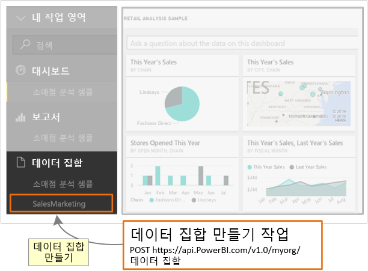

# <a name="step-3-create-a-dataset-in-power-bi"></a>3단계: Power BI에서 데이터 집합 만들기
이 문서는 [데이터 집합에 데이터를 푸시](walkthrough-push-data.md)하는 단계별 연습의 일부입니다.

데이터 집합에 데이터 푸시의 **2단계**인 [인증 액세스 토큰 가져오기](walkthrough-push-data-get-token.md)에서 **Azure AD**에 인증한 토큰을 가져왔습니다. 이 단계에서는 이 토큰을 사용하여 [데이터 집합 만들기](https://msdn.microsoft.com/library/mt203562.aspx) 작업을 호출합니다.

REST 리소스를 호출하려면 리소스를 찾는 URL을 사용하여 데이터 집합을 설명하는 JSON(JavaScript Object Notation) 문자열을 Power BI 서비스 리소스에 보냅니다. REST 리소스는 작업할 Power BI 서비스 부분을 식별합니다. 데이터 집합에 데이터를 푸시하려면 대상 리소스는 **데이터 집합**입니다. 데이터 집합을 식별하는 URL은 https://api.PowerBI.com/v1.0/myorg/datasets입니다. 그룹 내에서 데이터를 푸시하는 경우 URL은 https://api.PowerBI.com/v1.0/myorg/groups/{group_id}/datasets입니다.

Power BI REST 작업을 인증하려면 [인증 액세스 토큰 가져오기](walkthrough-push-data-get-token.md)에서 가져온 토큰을 요청 헤더에 추가합니다.

[데이터 집합 만들기](https://msdn.microsoft.com/library/mt203562.aspx) 작업을 호출하면 새 데이터 집합이 만들어집니다. Power BI REST API를 사용하는 방법에 대한 예제는 [APIARY의 Power BI REST API](http://docs.powerbi.apiary.io/)를 참조합니다.



Power BI에서 데이터 집합을 만드는 방법은 다음과 같습니다.

## <a name="create-a-dataset-in-power-bi"></a>Power BI에서 데이터 집합 만들기
> [!NOTE]
> 시작하기 전에 [데이터 집합에 데이터 푸시](walkthrough-push-data.md)의 이전 단계를 수행해야 합니다.
> 
> 

1. [2단계 - 인증 액세스 토큰 가져오기](walkthrough-push-data-get-token.md)에서 만든 콘솔 응용 프로그램 프로젝트에서 **using System.Net;** 및 **using System.IO;**를 Program.cs에 추가합니다.
2. Program.cs에서 아래 코드를 추가합니다.
3. 콘솔 앱을 실행하고 Power BI 계정에 로그인합니다. **만든 데이터 집합** 이 콘솔 창에 표시됩니다. Power BI에 로그인하여 새 데이터 집합을 볼 수도 있습니다.

**데이터 집합에 데이터 푸시 샘플**

Program.cs에 이 코드를 추가합니다.

* static void Main(string[] args)에서:
  
    ```
    static void Main(string[] args)
    {
        //Get an authentication access token
        token = GetToken();
  
        //Create a dataset in Power BI
        CreateDataset();
    }
    ```
* CreateDataset() 메서드 추가:
  
    ```
    #region Create a dataset in Power BI
    private static void CreateDataset()
    {
        //TODO: Add using System.Net and using System.IO
  
        string powerBIDatasetsApiUrl = "https://api.powerbi.com/v1.0/myorg/datasets";
        //POST web request to create a dataset.
        //To create a Dataset in a group, use the Groups uri: https://api.PowerBI.com/v1.0/myorg/groups/{group_id}/datasets
        HttpWebRequest request = System.Net.WebRequest.Create(powerBIDatasetsApiUrl) as System.Net.HttpWebRequest;
        request.KeepAlive = true;
        request.Method = "POST";
        request.ContentLength = 0;
        request.ContentType = "application/json";
  
        //Add token to the request header
        request.Headers.Add("Authorization", String.Format("Bearer {0}", token));
  
        //Create dataset JSON for POST request
        string datasetJson = "{\"name\": \"SalesMarketing\", \"tables\": " +
            "[{\"name\": \"Product\", \"columns\": " +
            "[{ \"name\": \"ProductID\", \"dataType\": \"Int64\"}, " +
            "{ \"name\": \"Name\", \"dataType\": \"string\"}, " +
            "{ \"name\": \"Category\", \"dataType\": \"string\"}," +
            "{ \"name\": \"IsCompete\", \"dataType\": \"bool\"}," +
            "{ \"name\": \"ManufacturedOn\", \"dataType\": \"DateTime\"}" +
            "]}]}";
  
        //POST web request
        byte[] byteArray = System.Text.Encoding.UTF8.GetBytes(datasetJson);
        request.ContentLength = byteArray.Length;
  
        //Write JSON byte[] into a Stream
        using (Stream writer = request.GetRequestStream())
        {
            writer.Write(byteArray, 0, byteArray.Length);
  
            var response = (HttpWebResponse)request.GetResponse();
  
            Console.WriteLine(string.Format("Dataset {0}", response.StatusCode.ToString()));
  
            Console.ReadLine();
        }
    }
    #endregion
    ```

다음 단계에서는 [Power BI 테이블에 행을 추가할 데이터 집합을 가져오는](walkthrough-push-data-get-datasets.md) 방법을 보여 줍니다.

다음은 [전체 코드 목록](#code)입니다.

<a name="code"/>

## <a name="complete-code-listing"></a>전체 코드 목록
    using System;
    using Microsoft.IdentityModel.Clients.ActiveDirectory;
    using System.Net;
    using System.IO;

    namespace walkthrough_push_data
    {
        class Program
        {
            private static string token = string.Empty;

            static void Main(string[] args)
            {

                //Get an authentication access token
                token = GetToken();

                //Create a dataset in Power BI
                CreateDataset();

            }

            #region Get an authentication access token
            private static string GetToken()
            {
                // TODO: Install-Package Microsoft.IdentityModel.Clients.ActiveDirectory -Version 2.21.301221612
                // and add using Microsoft.IdentityModel.Clients.ActiveDirectory

                //The client id that Azure AD created when you registered your client app.
                string clientID = "{Client_ID}";

                //RedirectUri you used when you register your app.
                //For a client app, a redirect uri gives Azure AD more details on the application that it will authenticate.
                // You can use this redirect uri for your client app
                string redirectUri = "https://login.live.com/oauth20_desktop.srf";

                //Resource Uri for Power BI API
                string resourceUri = "https://analysis.windows.net/powerbi/api";

                //OAuth2 authority Uri
                string authorityUri = "https://login.windows.net/common/oauth2/authorize";

                //Get access token:
                // To call a Power BI REST operation, create an instance of AuthenticationContext and call AcquireToken
                // AuthenticationContext is part of the Active Directory Authentication Library NuGet package
                // To install the Active Directory Authentication Library NuGet package in Visual Studio,
                //  run "Install-Package Microsoft.IdentityModel.Clients.ActiveDirectory" from the nuget Package Manager Console.

                // AcquireToken will acquire an Azure access token
                // Call AcquireToken to get an Azure token from Azure Active Directory token issuance endpoint
                AuthenticationContext authContext = new AuthenticationContext(authorityUri);
                string token = authContext.AcquireToken(resourceUri, clientID, new Uri(redirectUri)).AccessToken;

                Console.WriteLine(token);
                Console.ReadLine();

                return token;
            }

            #endregion


            #region Create a dataset in Power BI
            private static void CreateDataset()
            {
                //TODO: Add using System.Net and using System.IO

                string powerBIDatasetsApiUrl = "https://api.powerbi.com/v1.0/myorg/datasets";
                //POST web request to create a dataset.
                //To create a Dataset in a group, use the Groups uri: https://api.PowerBI.com/v1.0/myorg/groups/{group_id}/datasets
                HttpWebRequest request = System.Net.WebRequest.Create(powerBIDatasetsApiUrl) as System.Net.HttpWebRequest;
                request.KeepAlive = true;
                request.Method = "POST";
                request.ContentLength = 0;
                request.ContentType = "application/json";

                //Add token to the request header
                request.Headers.Add("Authorization", String.Format("Bearer {0}", token));

                //Create dataset JSON for POST request
                string datasetJson = "{\"name\": \"SalesMarketing\", \"tables\": " +
                    "[{\"name\": \"Product\", \"columns\": " +
                    "[{ \"name\": \"ProductID\", \"dataType\": \"Int64\"}, " +
                    "{ \"name\": \"Name\", \"dataType\": \"string\"}, " +
                    "{ \"name\": \"Category\", \"dataType\": \"string\"}," +
                    "{ \"name\": \"IsCompete\", \"dataType\": \"bool\"}," +
                    "{ \"name\": \"ManufacturedOn\", \"dataType\": \"DateTime\"}" +
                    "]}]}";

                //POST web request
                byte[] byteArray = System.Text.Encoding.UTF8.GetBytes(datasetJson);
                request.ContentLength = byteArray.Length;

                //Write JSON byte[] into a Stream
                using (Stream writer = request.GetRequestStream())
                {
                    writer.Write(byteArray, 0, byteArray.Length);

                    var response = (HttpWebResponse)request.GetResponse();

                    Console.WriteLine(string.Format("Dataset {0}", response.StatusCode.ToString()));

                    Console.ReadLine();
                }
            }
            #endregion
        }
    }


[다음 단계 >](walkthrough-push-data-get-datasets.md)

## <a name="next-steps"></a>다음 단계
[Power BI 테이블에 행을 추가할 데이터 집합 가져오기](walkthrough-push-data-get-datasets.md)  
[인증 액세스 토큰 가져오기](walkthrough-push-data-get-token.md)  
[데이터 집합 만들기](https://msdn.microsoft.com/library/mt203562.aspx)  
[Power BI 대시보드에 데이터 푸시](walkthrough-push-data.md)  
[Power BI REST API 개요](overview-of-power-bi-rest-api.md)  
[Power BI REST API 참조](https://msdn.microsoft.com/library/mt147898.aspx)  
[APIARY의 Power BI REST API](http://docs.powerbi.apiary.io/)  

궁금한 점이 더 있나요? [Power BI 커뮤니티를 이용하세요.](http://community.powerbi.com/)

