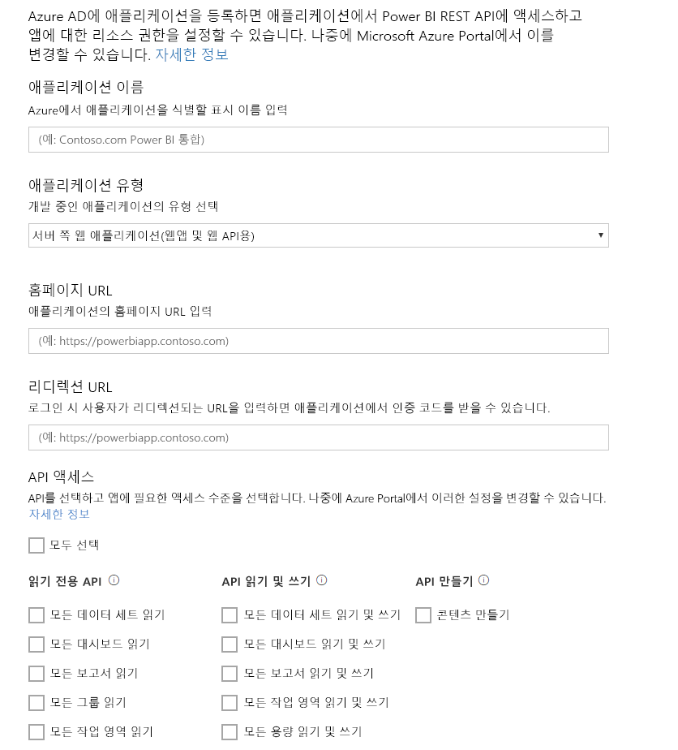

# 1단계: Azure AD에 앱 등록
이 문서는 [데이터 세트에 데이터를 푸시](walkthrough-push-data.md)하는 단계별 연습의 일부입니다.

Power BI 데이터 세트에 데이터를 푸시하는 첫 번째 단계는 Azure AD에 앱을 등록하는 것입니다. 먼저 이렇게 해야만 Azure AD에서 앱을 식별하는 **클라이언트 ID** 를 얻을 수 있습니다. **클라이언트 ID**가 없으면 Azure AD에서 앱을 인증할 수 없습니다.

> **참고**: Power BI에 앱을 등록하기 전에, [Power BI에 등록](create-an-azure-active-directory-tenant.md)해야 합니다.
> 
> 

Azure AD에 앱을 등록하는 단계는 다음과 같습니다.

## Azure AD에 앱 등록
1. dev.powerbi.com/apps로 이동합니다.
2. **Sign in with your existing account(기존 계정으로 로그인)** 을 클릭하고 Power BI 계정에 로그인합니다.
3. **앱 이름**을 "Sample push data app"과 같이 입력합니다.
4. **앱 유형**에서 **네이티브 앱**을 선택합니다.
5. **https://login.live.com/oauth20_desktop.srf** 같은 **URL 리디렉션**을 입력합니다. **네이티브 클라이언트 앱**의 경우 리디렉션 URI는 인증할 특정 응용 프로그램에 대한 더 자세한 정보를 **Azure AD** 에 제공합니다. 클라이언트 앱의 표준 URI는 https://login.live.com/oauth20_desktop.srf입니다.
6. **액세스할 API 선택**에서 **모든 데이터 집합 읽기 및 쓰기**를 선택합니다. 모든 Power BI 앱 사용 권한은 [Power BI 사용 권한](power-bi-permissions.md)을 참조하세요.
7. **앱 등록**을 클릭하고 생성된 **클라이언트 ID** 를 저장합니다. **클라이언트 ID** 는 Azure AD의 앱을 식별합니다.

**Power BI에 응용 프로그램 등록** 페이지가 다음과 같이 표시됩니다.

다음 단계에서는 [인증 액세스 토큰을 가져오는](walkthrough-push-data-get-token.md) 방법을 보여 줍니다.

[다음 단계 >](walkthrough-push-data-get-token.md)

## 다음 단계
[Power BI에 등록](create-an-azure-active-directory-tenant.md)  
[인증 액세스 토큰 가져오기](walkthrough-push-data-get-token.md)  
[연습: 데이터 집합에 데이터 푸시](walkthrough-push-data.md)  
[응용 프로그램 등록](register-app.md)  
[Power BI REST API 개요](overview-of-power-bi-rest-api.md)  

궁금한 점이 더 있나요? [Power BI 커뮤니티에 질문합니다.](http://community.powerbi.com/)

