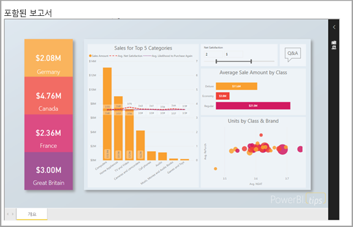
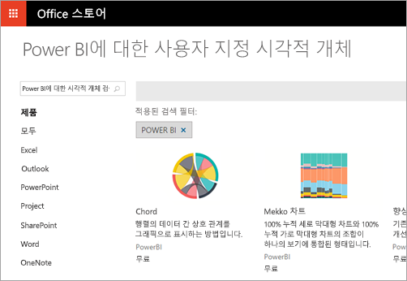

# 개발자는 Power BI로 무엇을 할 수 있나요?

개발자는 Power BI 콘텐츠를 애플리케이션에 포함할 수 있는 다양한 옵션을 사용할 수 있습니다. 개발자는 **Power BI에 포함**, **사용자 지정 시각적 개체**, **Power BI에 데이터 푸시** 등의 옵션을 사용할 수 있습니다.

## Power BI 콘텐츠 포함

Power BI 서비스(SaaS) 및 Azure의 Power BI Embedded(PaaS)에는 대시보드 및 보고서 포함을 위한 API가 있습니다. 이 기능은 콘텐츠 포함 시 대시보드, 게이트웨이, 앱 작업 영역 등의 최신 Power BI 기능에 액세스할 수 있음을 의미합니다.

[포함 설정 도구](https://aka.ms/embedsetup)를 통해 신속하게 시작하고 샘플 애플리케이션을 다운로드할 수 있습니다.

사용자에게 적합한 솔루션을 선택합니다.

* [고객에 대한 콘텐츠를 포함하면](embedding.md#embedding-for-your-customers) Power BI에 대한 계정이 없는 사용자에게 대시보드 및 보고서를 포함하는 기능을 제공합니다. [고객에 대한 콘텐츠 포함](https://aka.ms/embedsetup/AppOwnsData) 솔루션을 실행합니다.

* [조직에 대한 콘텐츠를 포함하면](embedding.md#embedding-for-your-organization) Power BI 서비스를 확장할 수 있습니다. [조직에 대한 콘텐츠 포함](https://aka.ms/embedsetup/UserOwnsData) 솔루션을 실행합니다.

Power BI에 포함하는 방법에 대한 자세한 내용은 [Power BI에 포함](embedding.md)을 참조하세요.

## 사용자 지정 시각적 개체 개발

Power BI로 사용자 지정 시각적 개체를 사용하여 사용자 또는 사용자 회사에 맞는 고유한 유형의 시각적 개체를 만들 수 있습니다. 이러한 사용자 지정 시각적 개체는 개발자가 만드는 경우가 많습니다. Power BI에 포함된 다양한 시각적 개체가 요구를 충족하지 않을 때 빌드됩니다.

사용자 지정 시각적 개체를 사용하면 Power BI 보고서 내에서 사용할 고유한 시각적 개체를 만들 수 있습니다. 사용자 지정 시각적 개체는 JavaScript의 상위 집합인 TypeScript로 작성됩니다. TypeScript는 일부 고급 기능과 ES6/ES7 기능에 대한 초기 액세스를 지원합니다. 시각적 개체 스타일 지정은 CSS(Cascading Styles Sheet)로 처리됩니다. 편의상 중첩, 변수, 조건, 루프 등 몇 가지 고급 기능을 지원하는 Less 사전 컴파일러를 사용합니다. 이러한 기능을 사용하지 않으려면 더 작은 파일로 일반 CSS를 작성할 수 있습니다.

사용자 지정 시각적 개체 개발에 대한 학습을 시작하려면 [Power BI 사용자 지정 시각적 개체 개발](visuals/custom-visual-develop-tutorial.md)을 참조하세요.

## API 자동화 사용

Power BI는 대화형 대시보드를 표시하며 다양한 데이터 원본에서 실시간으로 만들어지고 업데이트됩니다. REST 호출을 지원하는 프로그래밍 언어를 사용하여 실시간으로 Power BI 대시보드와 통합되는 앱을 만들 수 있습니다. Power BI 타일 및 보고서를 앱에 통합할 수도 있습니다.

개발자는 대화형 보고서 및 대시보드에서 사용될 수 있는 자체 데이터 시각화를 빌드할 수도 있습니다.

Power BI API로 수행할 수 있는 작업을 보려면 [개발자는 Power BI API로 무엇을 할 수 있나요?](overview-of-power-bi-rest-api.md)를 참조하세요.

## 다음 단계

[Power BI에 포함](embedding.md)  

[Power BI 사용자 지정 시각적 개체 개발](https://microsoft.github.io/PowerBI-visuals/docs/step-by-step-lab/developing-a-power-bi-custom-visual/)

[개발자는 Power BI API로 무엇을 할 수 있나요?](overview-of-power-bi-rest-api.md)

[Power BI 개발자 센터](https://powerbi.microsoft.com/developers/)
