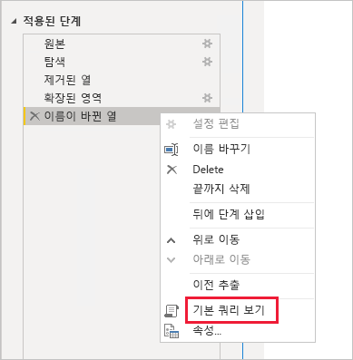
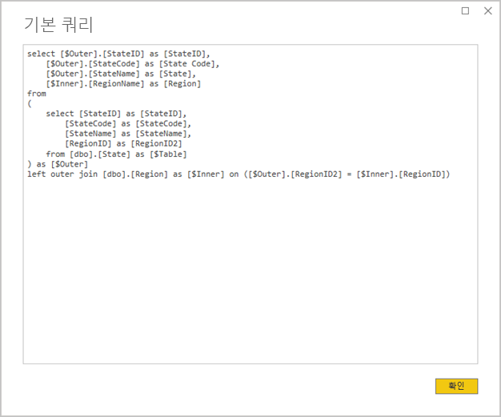
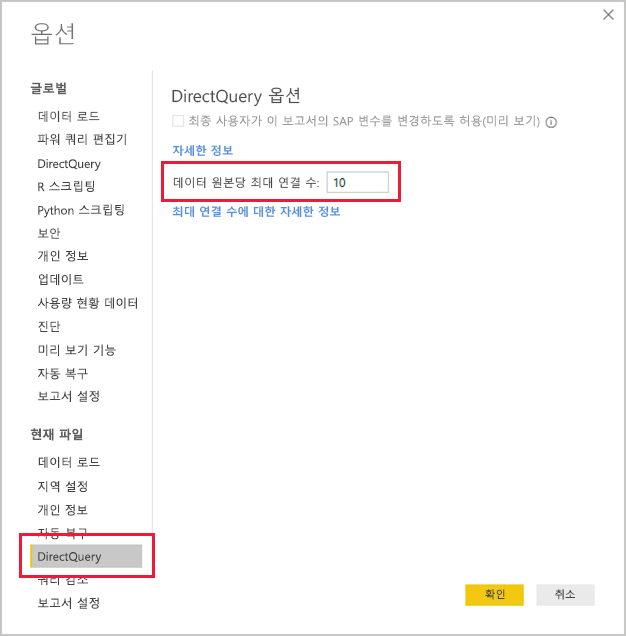
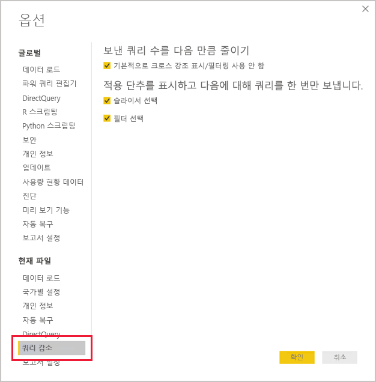
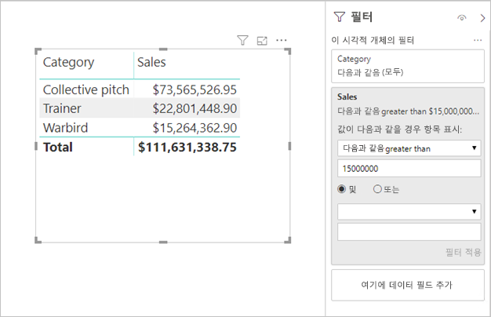

# <a name="directquery-model-guidance-in-power-bi-desktop"></a>Power BI Desktop의 DirectQuery 모델 지침

이 문서는 Power BI Desktop 또는 Power BI 서비스를 사용하여 Power BI DirectQuery 모델을 개발하는 데이터 모델러를 대상으로 합니다. DirectQuery 사용 사례, 제한 사항 및 지침을 설명합니다. 특히, 지침은 DirectQuery가 모델에 적합한 모드인지 여부를 확인하고 DirectQuery 모델을 기준으로 보고서의 성능을 개선하도록 작성되었습니다. 이 문서의 내용은 Power BI 서비스 또는 Power BI Report Server에 호스트된 DirectQuery 모델에 적용됩니다.

이 문서는 DirectQuery 모델 디자인을 자세히 설명하기 위한 것이 아닙니다. 소개는 [Power BI Desktop의 DirectQuery 모델](../desktop-directquery-about.md) 문서를 참조하세요. 자세한 내용은 [SQL Server 2016 Analysis Services의 DirectQuery](https://download.microsoft.com/download/F/6/F/F6FBC1FC-F956-49A1-80CD-2941C3B6E417/DirectQuery%20in%20Analysis%20Services%20-%20Whitepaper.pdf) 백서를 직접 참조하세요. 이 백서는 SQL Server Analysis Services에서 DirectQuery를 사용하는 방법을 설명합니다. 그러나 대부분의 내용은 Power BI DirectQuery 모델에도 적용됩니다.

이 문서에서는 복합 모델을 직접 다루지 않습니다. 복합 모델은 하나 이상의 DirectQuery 원본으로 구성됩니다. 이 문서에서 설명하는 지침은 최소한 부분적으로라도 복합 모델 디자인과 관련이 있습니다. 그러나 가져오기 테이블과 DirectQuery 테이블을 함께 사용할 경우의 의미는 이 문서에서 설명하지 않습니다. 자세한 내용은 [Power BI Desktop에서 복합 모델 사용](../desktop-composite-models.md)을 참조하세요.

DirectQuery 모델은 Power BI 환경(Power BI 서비스 또는 Power BI Report Server)과 기본 데이터 원본에 다른 워크로드를 적용한다는 것을 이해해야 합니다. DirectQuery가 적절한 디자인 방법인 것으로 확인되면 프로젝트에서 적절한 참여자를 구성하는 것이 좋습니다. 성공적인 DirectQuery 모델 배포는 IT 전문가 팀의 긴밀한 협력을 통해 이루어지는 경우가 많습니다. 팀은 일반적으로 모델 개발자와 원본 데이터베이스 관리자로 구성됩니다. 데이터 설계자와 데이터 웨어하우스 및 ETL 개발자를 포함할 수도 있습니다. 최상의 성능 결과를 얻으려면 대체로 데이터 원본에 직접 최적화를 적용해야 합니다.

## <a name="design-in-power-bi-desktop"></a>Power BI Desktop에서 디자인

Power BI Desktop을 사용하지 않고 Azure SQL Data Warehouse 및 Azure HDInsight Spark 데이터 원본에 직접 연결할 수 있습니다. Power BI 서비스에서 “데이터 가져오기”를 수행하고 데이터베이스 타일을 선택하면 됩니다. 자세한 내용은 [DirectQuery를 사용한 Azure SQL Data Warehouse](../service-azure-sql-data-warehouse-with-direct-connect.md)를 참조하세요.

직접 연결은 편리하지만, 이 방법을 사용하지 않는 것이 좋습니다. 주요 이유는 기본 데이터 원본 스키마가 변경될 경우 모델 구조를 새로 고칠 수 없기 때문입니다.

Power BI Desktop을 사용하여 모든 DirectQuery 모델을 만들고 관리하는 것이 좋습니다. 이 방법을 사용하면 계층 구조, 계산 열, 측정값 등의 지원되는 기능 사용을 포함하여 필요한 모델 정의를 완전히 제어할 수 있습니다. 기본 데이터 원본 스키마가 변경될 경우 모델 디자인을 수정할 수도 있습니다.

## <a name="optimize-data-source-performance"></a>데이터 원본 성능 최적화

다음 글머리 기호 목록에 설명된 여러 가지 방법으로 관계형 데이터베이스 원본을 최적화할 수 있습니다.

> [!NOTE]
> 일부 모델러는 관계형 데이터베이스를 최적화할 수 있는 권한이나 기술이 없다는 것을 알고 있습니다. DirectQuery 모델에 맞게 데이터를 준비하는 것이 좋지만, 원본 데이터베이스를 수정하지 않고도 모델 디자인에서 일부 최적화를 수행할 수 있습니다. 그러나 최상의 최적화 결과를 얻으려면 원본 데이터베이스에 최적화를 적용해야 하는 경우가 많습니다.

- **데이터 무결성이 완전한지 확인:** 차원 유형 테이블에 팩트 유형 테이블로 매핑되는 고유 값(차원 키) 열이 있어야 합니다. 또한 팩트 유형 차원 열에 유효한 차원 키 값이 포함되어야 합니다. 그러면 관계의 양쪽 값이 일치하는 보다 효율적인 모델 관계를 구성할 수 있습니다. 원본 데이터에 무결성이 없는 경우, 데이터를 효과적으로 복구하기 위해 “알 수 없음” 차원 레코드를 추가하는 것이 좋습니다. 예를 들어 **Product** 테이블에 알 수 없는 제품을 나타내는 행을 추가하고 -1과 같은 범위 밖의 키를 할당할 수 있습니다. **Sales** 테이블의 행에서 제품 키 값이 누락된 경우 -1로 대체합니다. 그러면 모든 **Sales** 제품 키 값에 해당하는 행이 **Product** 테이블에 있습니다.
- **인덱스 추가:** 테이블이나 뷰에 적절한 인덱스를 정의하여 필요한 보고서 시각적 개체 필터링 및 그룹화에 효율적인 데이터 검색을 지원합니다. SQL Server, Azure SQL Database 또는 Azure SQL Data Warehouse 원본의 경우, 인덱스 디자인 지침에 대한 유용한 정보는 [SQL Server 인덱스 아키텍처 및 디자인 가이드](/sql/relational-databases/sql-server-index-design-guide?view=sql-server-2017)를 참조하세요. SQL Server 또는 Azure SQL Database 휘발성 원본의 경우 [실시간 운영 분석을 위해 Columnstore 시작](/sql/relational-databases/indexes/get-started-with-columnstore-for-real-time-operational-analytics?view=sql-server-2017)을 참조하세요.
- **분산 테이블 디자인:** MPP(대규모 병렬 처리) 아키텍처를 활용하는 Azure SQL Data Warehouse 원본의 경우, 큰 팩트 유형 테이블을 해시 분산 차원 유형 테이블로 구성하여 모든 컴퓨팅 노드에 복제하는 것이 좋습니다. 자세한 내용은 [Azure SQL Data Warehouse의 분산 테이블 디자인 지침](/azure/sql-data-warehouse/sql-data-warehouse-tables-distribute#what-is-a-distributed-table)을 참조하세요.
- **필요한 데이터 변환이 구체화되었는지 확인:** SQL Server 관계형 데이터베이스 원본 및 기타 관계형 데이터베이스 원본의 경우 테이블에 계산 열을 추가할 수 있습니다. 이러한 열은 **Quantity**에 **UnitPrice** 곱하기 등의 식을 기반으로 합니다. 계산 열은 지속(구체화) 가능하며, 일반 열과 같이 인덱싱할 수 있는 경우도 있습니다. 자세한 내용은 [계산 열의 인덱스](/sql/relational-databases/indexes/indexes-on-computed-columns?view=sql-server-2017)를 참조하세요.

    팩트 테이블 데이터를 상위 수준에서 미리 집계할 수 있는 인덱싱된 뷰도 고려합니다. 예를 들어 **Sales** 테이블이 주문 라인 수준의 데이터를 저장하는 경우, 이 데이터를 요약하는 뷰를 만들 수 있습니다. 뷰는 **Sales** 테이블 데이터를 날짜(월 수준), 고객, 제품별로 그룹화하고 매출, 수량 등의 측정값을 요약하는 SELECT 문을 기반으로 할 수 있습니다. 그런 다음, 뷰를 인덱싱할 수 있습니다. SQL Server 또는 Azure SQL Database 원본의 경우 [인덱싱된 뷰 만들기](/sql/relational-databases/views/create-indexed-views?view=sql-server-2017)를 참조하세요.
- **날짜 테이블 구체화:** 일반적인 모델링 요구 사항으로, 시간 기반 필터링을 지원하기 위해 날짜 테이블을 추가해야 합니다. 조직에서 알려진 시간 기반 필터를 지원하려면 원본 데이터베이스에 테이블을 만들고 팩트 테이블 날짜를 포함하는 날짜 범위와 함께 로드되도록 합니다. 또한 연도, 분기, 월, 주 등의 유용한 기간 열이 포함되어야 합니다.

## <a name="optimize-model-design"></a>모델 디자인 최적화

다음 글머리 기호 목록에 설명된 여러 가지 방법으로 DirectQuery 모델을 최적화할 수 있습니다.

- **파워 쿼리의 복잡한 쿼리 방지:** 파워 쿼리의 쿼리에서 변환을 적용할 필요가 없도록 하여 효율적인 모델 디자인을 구현할 수 있습니다. 즉, 각 쿼리가 단일 관계형 데이터베이스 원본 테이블 또는 뷰에 매핑됩니다. **기본 쿼리 보기** 옵션을 선택하면 파워 쿼리 적용 단계의 실제 SQL 쿼리 문 표현을 미리 볼 수 있습니다.

    
    
    

- **계산 열 사용 및 데이터 형식 변경 내용 검사:** DirectQuery 모델은 데이터 형식을 변환하는 파워 쿼리 단계와 계산을 추가할 수 있도록 지원합니다. 그러나 가능한 경우 관계형 데이터베이스 원본에서 변환 결과를 구체화하면 성능이 개선됩니다.
- **파워 쿼리 상대 날짜 필터링 사용 안 함:** 파워 쿼리의 쿼리에서 상대 날짜 필터링을 정의할 수 있습니다. 예를 들어 작년에 생성된 판매 주문을 검색합니다(오늘 날짜 기준). 이 유형의 필터는 다음과 같이 비효율적인 기본 쿼리로 변환됩니다.

    ```SQL
    …
    from [dbo].[Sales] as [_]
    where [_].[OrderDate] >= convert(datetime2, '2018-01-01 00:00:00') and [_].[OrderDate] < convert(datetime2, '2019-01-01 00:00:00'))  
    ```
    
    더 나은 디자인 방법은 날짜 테이블에 상대 시간 열을 포함하는 것입니다. 이러한 열에는 현재 날짜를 기준으로 오프셋 값이 저장됩니다. 예를 들어 **RelativeYear** 열에서 값 0은 올해, -1은 작년 등을 나타냅니다. **RelativeYear** 열은 날짜 테이블에 구체화하는 것이 좋습니다. 덜 효율적이긴 하지만, [TODAY](/dax/today-function-dax) 및 [DATE](/dax/date-function-dax) DAX 함수를 사용한 식을 기반으로 하여 모델 계산 열로 추가할 수도 있습니다.

- **측정값을 단순하게 유지:** 적어도 초기에는 측정값을 단순 집계로 제한하는 것이 좋습니다. 집계 함수로는 SUM, COUNT, MIN, MAX, AVERAGE 등이 있습니다. 그런 다음, 측정값의 응답이 충분히 빠르면 더 복잡한 측정값으로 실험해 볼 수 있지만 각 측정값의 성능에 유의해야 합니다. [CALCULATE](/dax/calculate-function-dax) DAX 함수를 사용하여 필터 컨텍스트를 조작하는 정교한 측정값 식을 생성할 수 있지만, 이러한 식은 성능이 낮고 비용이 많이 드는 기본 쿼리를 생성할 수 있습니다.
- **계산 열에 관계 적용 안 함:** 모델 관계는 한 테이블의 단일 열을 다른 테이블의 단일 열에만 연결할 수 있습니다. 그러나 여러 열을 사용해서 테이블을 연결해야 하는 경우도 있습니다. 예를 들어 **Sales** 및 **Geography** 테이블은 **Country** 및 **City**라는 두 개의 열로 연결됩니다. 테이블 간에 관계를 만들려면 단일 열이 필요하며, **Geography** 테이블에서 해당 열의 값이 고유해야 합니다. 국가 및 도시와 하이픈 구분 기호를 연결하면 이 결과를 얻을 수 있습니다.

    결합된 열은 파워 쿼리 사용자 지정 열을 사용해서 만들거나, 모델에서 계산 열로 만들 수 있습니다. 그러나 계산 식이 원본 쿼리에 포함되기 때문에 이 방법은 피해야 합니다. 비효율적일 뿐만 아니라 일반적으로 인덱스 사용이 불가능해집니다. 대신, 관계형 데이터베이스 원본에 구체화된 열을 추가하고 이 열을 인덱싱합니다. 관계형 데이터 웨어하우스 디자인의 일반적인 방법으로, 차원 유형 테이블에 서로게이트 키 열을 추가할 수도 있습니다.
    
    이 지침에는 한 가지 예외가 있으며, [COMBINEVALUES](/dax/combinevalues-function-dax) DAX 함수 사용과 관련이 있습니다. 이 함수의 목적은 다중 열 모델 관계를 지원하는 것입니다. 관계에서 사용되는 식을 생성하는 대신, 다중 열 SQL 조인 조건자를 생성합니다.
- **“고유 식별자” 열에 관계 적용 안 함:** Power BI에서는 고유 식별자(GUID) 데이터 형식을 기본적으로 지원하지 않습니다. 이 형식의 열 간에 관계를 정의하는 경우, Power BI는 캐스트 포함 조인을 사용하여 원본 쿼리를 생성합니다. 이러한 쿼리 시간 데이터 변환은 일반적으로 성능 저하를 초래합니다. 이 경우가 최적화될 때까지 유일한 해결 방법은 기본 데이터베이스에서 다른 데이터 형식의 열을 구체화하는 것입니다.
- **관계의 ‘일’ 쪽 열 숨기기:** 관계의 ‘일’ 쪽 열을 숨겨야 합니다. 일반적으로 차원 유형 테이블의 기본 키 열입니다. 숨겨진 경우 **필드** 창에 제공되지 않으므로, 시각적 개체를 구성하는 데 사용할 수 없습니다. 열 값을 기준으로 보고서를 그룹화하거나 필터링하는 것이 유용한 경우 ‘다’ 쪽 열은 계속 표시될 수 있습니다. 예를 들어 **Sales** 및 **Product** 테이블 간에 관계가 있는 모델을 가정해 봅시다. 관계 열에는 제품 SKU(Stock Keeping Unit) 값이 포함되어 있습니다. 시각적 개체에 제품 SKU를 추가해야 하는 경우 **Sales** 테이블에만 표시되어야 합니다. 이 열을 사용하여 시각적 개체에서 필터링 또는 그룹화하면 Power BI는 **Sales** 및 **Product** 테이블을 조인할 필요가 없는 쿼리를 생성합니다.
- **관계를 설정하여 무결성 적용:** DirectQuery 관계의 **참조 무결성 가정** 속성은 Power BI에서 외부 조인이 아닌 내부 조인을 사용하여 원본 쿼리를 생성할지 여부를 결정합니다. 이렇게 하면 일반적으로 쿼리 성능이 향상되지만 관계형 데이터베이스 원본의 세부 정보에 따라 달라집니다. 자세한 내용은 [Power BI Desktop의 참조 무결성 설정 가정](../desktop-assume-referential-integrity.md)을 참조하세요.
- **양방향 관계 필터링 사용 안 함:** 양방향 관계 필터링을 사용하면 성능이 낮은 쿼리 문이 생성될 수 있습니다. 이 관계 기능은 필요한 경우에만 사용해야 하며, 일반적으로 브리징 테이블에서 다대다 관계를 구현하는 경우입니다. 자세한 내용은 [Power BI Desktop의 다대다 카디널리티를 사용한 관계](../desktop-many-to-many-relationships.md)를 참조하세요.
- **병렬 쿼리 제한:** 각 기본 데이터 원본에 대해 DirectQuery가 여는 최대 연결 수를 설정할 수 있습니다. 이 설정은 데이터 원본에 동시에 보내는 쿼리 수를 제어합니다.

    
    
    이 설정은 모델에 DirectQuery 원본이 하나 이상 있는 경우에만 활성화됩니다. 이 값은 모든 DirectQuery 원본과 모델에 새로 추가된 DirectQuery 원본에 적용됩니다.

    **데이터 원본당 최대 연결 수** 값을 늘리면 지정된 최대 개수까지 더 많은 쿼리를 기본 데이터 원본으로 보낼 수 있으므로, 단일 페이지에 많은 시각적 개체가 있거나 많은 사용자가 동시에 보고서에 액세스할 때 유용합니다. 최대 연결 수에 도달하면 추가 쿼리는 연결을 사용할 수 있게 될 때까지 대기합니다. 이 한도를 늘리면 기본 데이터 원본의 부하가 증가하므로, 설정 시 전반적인 성능 향상이 보장되지 않습니다.
    
    Power BI에 모델을 게시할 때 기본 데이터 원본으로 전송되는 최대 동시 쿼리 수는 환경에 따라 달라집니다. Power BI, Power BI Premium, Power BI Report Server 등의 환경에 따라 각기 다른 처리량 제약 조건이 적용될 수 있습니다. Power BI Premium 용량 리소스 제한 사항에 대한 자세한 내용은 [Power BI Premium 용량 배포 및 관리](https://docs.microsoft.com/power-bi/whitepaper-powerbi-premium-deployment#premium-capacities)를 참조하세요.

## <a name="optimize-report-designs"></a>보고서 디자인 최적화

다음 글머리 기호 목록에 설명된 여러 가지 방법으로 DirectQuery 데이터 세트 기반의 보고서를 최적화할 수 있습니다.

- **쿼리 감소 기술 사용:** Power BI Desktop _‘옵션 및 설정’_ 에는 쿼리 감소 페이지가 있습니다. 이 페이지에는 세 가지 유용한 옵션이 있습니다. 상호 작용을 편집하여 재정의할 수 있긴 하지만, 기본적으로 교차 강조 표시 및 교차 필터링을 사용하지 않도록 설정할 수 있습니다. 슬라이서 및 필터에 적용 단추를 표시하는 것도 가능합니다. 슬라이서 또는 필터 옵션은 보고서 사용자가 단추를 클릭해야 적용됩니다. 필요한 경우, 보고서를 처음 만들 때 해당 옵션을 사용하도록 설정하는 것이 좋습니다.

    
    
- **필터를 먼저 적용:** 보고서를 처음 디자인할 때 보고서, 페이지 또는 시각적 개체 수준에서 해당 필터를 적용한 후에 필드를 시각적 개체 필드로 매핑하는 것이 좋습니다. 예를 들어 **Country** 및 **Sales** 측정값에서 끌어 특정 연도를 기준으로 필터링하는 대신, **Year** 필드에 필터를 먼저 적용합니다. 시각적 개체를 작성하는 각 단계에서 쿼리를 보내기 때문이며, 첫 번째 쿼리가 완료되기 전에 다른 변경 작업을 수행할 수는 있지만 기본 데이터 원본에 불필요한 부하가 발생할 수 있습니다. 필터를 일찍 적용하면 일반적으로 이러한 중간 쿼리의 비용이 감소하며 속도가 빨라집니다. 또한 필터를 일찍 적용하지 못하면 위에서 설명한 대로 100만 개 행 한도를 초과할 수 있습니다.
- **페이지의 시각적 개체 수 제한:** 보고서 페이지가 열리고 페이지 필터를 적용하면 페이지의 모든 시각적 개체가 새로 고쳐집니다. 그러나 위에서 설명한 대로 Power BI 환경과 **데이터 원본당 최대 연결 수** 모델 설정에서 적용되는, 병렬로 보낼 수 있는 쿼리 수에 대한 한도가 있습니다. 따라서 페이지 시각적 개체 수가 늘어나면 직렬 방식으로 새로 고쳐질 가능성이 높아집니다. 이로 인해 전체 페이지를 새로 고치는 데 걸리는 시간이 늘어나고, 시각적 개체가 휘발성 데이터 원본에 대해 일관성이 없는 결과를 표시할 가능성이 증가합니다. 이런 이유로, 페이지의 시각적 개체 수를 제한하고 더 단순한 페이지를 사용하는 것이 좋습니다. 여러 개의 카드 시각적 개체를 하나의 다중 행 카드 시각적 개체로 바꾸면 비슷한 페이지 레이아웃을 얻을 수 있습니다.
- **시각적 개체 간의 상호 작용 해제:** 교차 강조 표시 및 교차 필터링 상호 작용을 사용하려면 쿼리를 기본 원본으로 제출해야 합니다. 이러한 상호 작용이 필요하지 않으면, 사용자 선택에 응답하는 데 걸리는 시간이 길어질 경우 해제하는 것이 좋습니다. 이 상호 작용은 전체 보고서(쿼리 감소 옵션에 대해 위에서 설명한 것처럼)에 대해 해제하거나 사례별로 해제할 수 있습니다. 자세한 내용은 [Power BI 보고서에서 시각적 개체가 서로 교차 필터링되는 방식](../consumer/end-user-interactions.md)을 참조하세요.

위의 최적화 기술 목록 외에도 다음과 같은 각 보고 기능으로 인해 성능 문제가 발생할 수 있습니다.

- **측정값 필터:** 측정값(또는 열 집계)이 포함된 시각적 개체의 측정값에 필터가 적용되어 있을 수 있습니다. 예를 들어 아래 시각적 개체는 매출이 $1500만보다 큰 범주에 대해서만 **범주**별 **매출**을 보여 줍니다.

    
    
    
    이 경우 두 개의 쿼리가 기본 원본으로 전송될 수 있습니다.
    
    - 첫 번째 쿼리는 조건(매출 > $1500만)을 충족하는 범주를 검색합니다.
    - 두 번째 쿼리는 WHERE 절의 조건을 충족하는 범주를 추가하여 시각적 개체에 필요한 데이터를 검색합니다.
    
    이 예제와 같이 일반적으로 수백 또는 수천 개의 범주가 있는 경우에만 정상적으로 수행됩니다. 하지만 범주 수가 훨씬 더 많으면 성능이 저하될 수 있습니다. 실제로 앞에서 설명한 100만 개 행 한도로 인해 조건을 충족하는 범주가 100만 개보다 많을 경우 쿼리가 실패합니다.
- **TopN 필터:** 고급 필터는 측정값으로 순위가 지정된 상위(또는 하위) N개 값만 필터링하도록 정의할 수 있습니다. 예를 들어 위의 시각적 개체에서는 상위 5개 범주만 표시됩니다. 측정값 필터와 마찬가지로, 이 경우에도 두 개의 쿼리가 기본 데이터 원본으로 전송됩니다. 그러나 첫 번째 쿼리가 기본 원본의 모든 범주를 반환한 다음, 반환된 결과에 따라 상위 N개가 결정됩니다. 관련된 열의 카디널리티에 따라 성능 문제(또는 100만 개 행 제한으로 인한 쿼리 실패)가 발생할 수 있습니다.
- **중앙값:** 일반적으로 모든 집계(Sum, Count Distinct 등)는 기본 원본으로 푸시됩니다. 그러나 중앙값의 경우에는 그렇지 않습니다. 이 집계는 일반적으로 기본 원본에서 지원되지 않기 때문입니다. 이러한 경우 기본 원본에서 세부 정보 데이터가 검색되고, Power BI는 반환된 결과에서 중앙값을 계산합니다. 비교적 적은 수의 결과로 중앙값을 계산할 때는 이 작업이 적절하지만, 카디널리티가 큰 경우 성능 문제(또는 100만 개 행 한도로 인한 쿼리 실패)가 발생합니다. 예를 들어 국가 인구 중앙값은 적절할 수 있지만, 판매 가격 중앙값은 적절하지 않을 수 있습니다.
- **다중 선택 슬라이서:** 슬라이서와 필터에 다중 선택을 허용하면 성능 문제가 발생할 수 있습니다. 사용자가 추가 슬라이서 항목을 선택하는 경우(예: 관심 제품을 10개까지 작성), 새 항목을 선택할 때마다 새 쿼리가 기본 원본으로 전송되기 때문입니다. 쿼리가 완료되기 전에 사용자가 다음 항목을 선택할 수 있지만 이렇게 하면 기본 원본에서 추가 부하가 발생합니다. 위의 쿼리 감소 기술에서 설명한 대로 적용 단추를 표시하면 이러한 상황을 방지할 수 있습니다.
- **보이는 값 합계:** 기본적으로 테이블 및 메트릭은 총계와 소계를 표시합니다. 대부분의 경우 합계 값을 얻으려면 기본 원본에 추가 쿼리를 보내야 합니다. Count Distinct 또는 Median 집계를 사용할 때마다 적용되며, SAP HANA 또는 SAP Business Warehouse를 통해 DirectQuery를 사용하는 모든 경우에도 적용됩니다. 필요하지 않은 경우 서식 창을 사용하여 합계를 해제해야 합니다.

## <a name="convert-to-a-composite-model"></a>복합 모델로 변환

모델 테이블의 스토리지 모드를 구성하여 가져오기 및 DirectQuery 모델의 이점을 단일 모델에 결합할 수 있습니다. 테이블 스토리지 모드는 가져오기, DirectQuery 또는 둘 다(이중이라고 함)일 수 있습니다. 모델에 서로 다른 스토리지 모드의 테이블이 포함되어 있는 경우를 복합 모델이라고 합니다. 자세한 내용은 [Power BI Desktop에서 복합 모델 사용](../desktop-composite-models.md)을 참조하세요.

DirectQuery 모델을 복합 모델로 변환하여 수행할 수 있는 여러 기능 및 성능 개선 사항이 있습니다. 복합 모델은 둘 이상의 DirectQuery 원본을 통합할 수 있으며, 집계도 포함할 수 있습니다. DirectQuery 테이블에 집계 테이블을 추가하여 테이블의 요약 표현을 가져올 수 있습니다. 시각적 개체가 상위 수준 집계를 쿼리하는 경우 성능이 훨씬 향상될 수 있습니다. 자세한 내용은 [Power BI Desktop의 집계](../desktop-aggregations.md)를 참조하세요.

## <a name="educate-users"></a>사용자 교육

DirectQuery 데이터 세트 기반의 보고서를 효율적으로 사용하는 방법에 대해 사용자를 교육하는 것이 중요합니다. 보고서 작성자는 [보고서 디자인 최적화](#optimize-report-designs section)에 설명된 내용을 학습해야 합니다.

DirectQuery 데이터 세트를 기반으로 하는 보고서에 대해 보고서 사용자를 교육하는 것이 좋습니다. 이 문서에서 설명하는 관련 제한 사항을 포함하여 일반적인 데이터 아키텍처를 이해하는 것도 도움이 될 수 있습니다. 새로 고침 응답 및 대화형 필터링이 때때로 느려질 수 있다는 것을 알립니다. 보고서 사용자가 성능 저하 발생 이유를 이해하면 보고서와 데이터에 대한 신뢰를 잃을 가능성이 줄어듭니다.

휘발성 데이터 원본에 대한 보고서를 제공하는 경우, 새로 고침 단추 사용에 대해 보고서 사용자를 교육해야 합니다. 일관성 없는 결과가 표시될 수 있으며, 보고서를 새로 고치면 보고서 페이지의 불일치를 해결할 수 있다는 것도 알립니다.

## <a name="next-steps"></a>다음 단계

DirectQuery에 대한 자세한 내용은 다음 리소스를 참조하세요.

- [Power BI Desktop의 DirectQuery 모델](../desktop-directquery-about.md)
- [Power BI Desktop에서 DirectQuery 사용](../desktop-use-directquery.md)
- [Power BI Desktop의 DirectQuery 모델 문제 해결](../desktop-directquery-troubleshoot.md)
- 궁금한 점이 더 있나요? [Power BI 커뮤니티에 질문합니다.](https://community.powerbi.com/)
