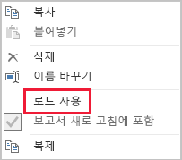

# 가져오기 모델링을 위한 데이터 축소 방법

이 문서에서는 가져오기 모델을 개발하는 Power BI Desktop 데이터 모델러를 대상으로 합니다. 가져오기 모델로 로드되는 데이터를 줄이는 데 도움이 되는 다양한 방법을 설명합니다.

가져오기 모델은 VertiPaq 스토리지 엔진이 압축 및 최적화하여 디스크에 저장한 데이터와 함께 로드됩니다. 원본 데이터가 메모리에 로드될 때 10배 압축될 수 있으므로, 10GB의 원본 데이터가 약 1GB 크기로 압축된다고 예상할 수 있습니다. 또한 디스크에 저장하는 경우 추가로 20% 축소할 수 있습니다.

VertiPaq 스토리지 엔진의 효율성에도 불구하고, 모델에 로드되는 데이터를 최소화하는 것이 중요합니다. 이 작업은 큰 모델이나 시간이 지남에 따라 커질 것으로 예상되는 모델의 경우 특히 중요합니다. 네 가지 타당한 이유는 다음과 같습니다.

- 큰 모델 크기가 해당 용량에서 지원되지 않을 수 있습니다. 프리미엄 용량은 최대 13GB 크기의 모델을 호스트할 수 있는 반면, 공유 용량은 최대 1GB 크기의 모델을 호스트할 수 있습니다. 자세한 내용은 [큰 데이터 세트를 위한 Power BI Premium 지원](../service-premium-large-datasets.md) 문서를 참조하세요.
- 모델 크기가 작으면 특정 메모리에서 용량 리소스 경합이 감소합니다. 따라서 더 많은 모델을 더 오랜 기간 동안 동시에 로드할 수 있으므로 제거 비율이 낮아집니다. 자세한 내용은 [Power BI Premium 배포](../whitepaper-powerbi-premium-deployment.md) 백서의 [용량의 작동 방식](../whitepaper-powerbi-premium-deployment.md#how-capacities-function) 항목을 참조하세요
- 모델이 작으면 데이터 새로 고침이 빨라지므로 보고 대기 시간이 단축되고, 데이터 세트 새로 고침 처리량이 증가하며, 원본 시스템 및 용량 리소스의 부담이 감소합니다.
- 테이블 행 수가 적을수록 계산 평가가 빨라지므로 전반적인 쿼리 성능이 향상됩니다.

이 문서에서는 8가지 데이터 축소 방법을 설명합니다. 내용은 다음과 같습니다.

- [불필요한 열 제거](#remove-unnecessary-columns)
- [불필요한 행 제거](#remove-unnecessary-rows)
- [그룹화 방법 및 요약](#group-by-and-summarize)
- [열 데이터 형식 최적화](#optimize-column-data-types)
- [사용자 지정 열의 기본 설정](#preference-for-custom-columns)
- [파워 쿼리의 쿼리 로드 사용 안 함](#disable-power-query-query-load)
- [자동 날짜/시간 사용 안 함](#disable-auto-datetime)
- [혼합 모드로 전환](#switch-to-mixed-mode)

## 불필요한 열 제거

모델 테이블 열은 다음 두 가지 주요 목적으로 사용됩니다.

- **보고** - 모델 데이터를 적절하게 필터링, 그룹화 및 요약하는 보고서 디자인을 구현합니다.
- **모델 구조** - 모델 관계, 모델 계산, 보안 역할 및 데이터 색 서식을 지원합니다.

이러한 목적으로 사용되지 않는 열은 제거할 수 있습니다. 열을 제거하는 것을 _열 필터링_이라고 합니다.

알려진 보고 요구 사항에 따라 정확히 올바른 개수의 열을 사용하여 모델을 디자인하는 것이 좋습니다. 물론, 이러한 요구 사항은 시간에 따라 변경될 수 있지만 나중에 열을 제거하는 것보다 나중에 열을 추가하는 것이 더 간편합니다. 열을 제거하면 보고서 또는 모델 구조가 손상될 수 있습니다.

## 불필요한 행 제거

모델 테이블은 최대한 적은 개수의 행으로 로드되어야 합니다. 이렇게 하려면 엔터티별 또는 시간별 필터링의 두 가지 이유로 필터링된 행 집합을 모델 테이블로 로드합니다. 행을 제거하는 것을 _행 필터링_이라고 합니다.

**엔터티별 필터링**은 원본 데이터의 하위 집합을 모델에 로드합니다. 예를 들어 모든 판매 지역의 판매 팩트를 로드하는 대신 단일 지역의 팩트만 로드합니다. 이 디자인 방법은 많은 작은 모델을 생성하며, 행 수준 보안을 정의할 필요도 없습니다. 그러나 Power BI 서비스에서 특정 데이터 세트 사용 권한을 부여하고, 각 데이터 세트에 연결하는 “중복” 보고서를 만들어야 합니다. 파워 쿼리 매개 변수와 Power BI 템플릿 파일을 사용하여 관리 및 게시를 간소화할 수 있습니다. 자세한 내용은 [Deep Dive into Query Parameters and Power BI Templates](https://powerbi.microsoft.com/blog/deep-dive-into-query-parameters-and-power-bi-templates/)(쿼리 매개 변수 및 Power BI 템플릿에 대한 심층 정보) 블로그 항목을 참조하세요.

**시간별 필터링**은 팩트 유형 테이블로 로드되는 _데이터 기록_ 양을 제한하고 모델 날짜 테이블로 로드되는 날짜 행을 제한합니다. 알려진 보고 요구 사항이 아니면, 사용 가능한 모든 기록을 자동으로 로드하지 않는 것이 좋습니다. 시간 기반의 파워 쿼리 필터는 매개 변수화할 수 있으며, 상대 기간(예: 새로 고침 날짜를 기준으로 지난 5년)을 사용하도록 설정할 수도 있습니다. 또한 시간 필터를 소급 변경해도 보고서가 손상되지 않습니다. 단지, 보고서에서 사용 가능한 데이터 기록이 증가하거나 감소할 뿐입니다.

## 그룹화 방법 및 요약

모델 크기를 줄이는 가장 효과적인 방법은 미리 요약된 데이터를 로드하는 것입니다. 이 방법을 사용하여 팩트 유형 테이블의 세분성을 높일 수 있습니다. 개별 절충은 있지만 세부 정보가 손실됩니다.

예를 들어 원본 판매 팩트 테이블은 주문 라인당 하나의 행을 저장합니다. 모든 판매 메트릭을 날짜, 고객 및 제품별로 그룹화해서 요약하면 데이터를 상당히 줄일 수 있습니다. _월 수준_에서 날짜별로 그룹화하여 데이터를 더 줄일 수도 있습니다. 이렇게 하면 모델 크기를 99% 줄일 수 있지만, 일 수준이나 개별 주문 수준의 보고를 더 이상 사용할 수 없습니다. 팩트 유형 데이터 요약 결정에는 항상 절충이 수반됩니다. 이러한 절충은 혼합 모델 디자인을 통해 완화할 수 있습니다. 이 내용은 나중에 [혼합 모드로 전환](#switch-to-mixed-mode) 항목에서 설명하겠습니다.

## 열 데이터 형식 최적화

VertiPaq 스토리지 엔진은 각 열에 대해 개별 데이터 구조를 사용합니다. 디자인에 따라, 이러한 데이터 구조는 값 인코딩을 사용하는 숫자 열 데이터에서 가장 높은 최적화를 실현합니다. 그러나 텍스트와 숫자가 아닌 다른 데이터는 해시 인코딩을 사용합니다. 이 경우에는 스토리지 엔진이 열에 포함된 각 고유 텍스트 값에 숫자 식별자를 할당해야 합니다. 그런 다음, 이 숫자 식별자가 데이터 구조에 저장되므로 스토리지 및 쿼리 중에 해시 조회가 필요합니다.

원본 텍스트 데이터를 숫자 값으로 변환할 수 있는 경우도 있습니다. 예를 들어 판매 주문 번호 앞에 텍스트 값(예: “SO123456”)이 일관되게 추가되었을 수 있습니다. 이 접두사를 제거하면 주문 번호 값을 정수로 변환할 수 있습니다. 큰 테이블에서, 특히 열에 고유 값이나 높은 카디널리티 값이 포함된 경우 이 작업을 통해 데이터를 상당히 줄일 수 있습니다.

이 예제에서는 열 기본 요약 속성을 “요약 안 함”으로 설정하는 것이 좋습니다. 이렇게 하면 주문 번호 값의 부적절한 요약을 최소화하는 데 도움이 됩니다.

## 사용자 지정 열의 기본 설정

VertiPaq 스토리지 엔진은 일반적인 파워 쿼리 원본 열과 동일한 방식으로 모델 계산 열(DAX에 정의됨)을 저장합니다. 그러나 데이터 구조가 약간 다르게 저장되며, 일반적으로 효율성이 떨어지는 압축을 수행합니다. 또한 모든 파워 쿼리 테이블이 로드된 다음 빌드되므로, 데이터 새로 고침 시간이 늘어날 수 있습니다. 따라서 테이블 열을 파워 쿼리 ‘계산’ 열(M에서 정의됨)이 아닌 다른 ‘계산’ 열로 추가하는 것은 비효율적입니다.  

파워 쿼리에서 사용자 지정 열을 만드는 것이 좋습니다. 원본이 데이터베이스인 경우 두 가지 방법으로 로드 효율성을 높일 수 있습니다. 공급자의 기본 쿼리 언어를 사용하여 SQL 문에서 계산을 정의하거나, 데이터 원본의 열로 구체화할 수 있습니다.

그러나 모델 계산 열이 최선의 선택인 경우도 있습니다. 수식에 측정값 평가가 필요한 경우나 DAX 함수에서만 지원되는 특정 모델링 기능이 필요한 경우가 여기에 해당합니다. 이러한 예제에 대한 자세한 내용은 [DAX의 부모-자식 계층 구조에 대한 함수 이해](/dax/understanding-functions-for-parent-child-hierarchies-in-dax) 문서를 참조하세요.

## 파워 쿼리의 쿼리 로드 사용 안 함

다른 쿼리를 사용한 데이터 통합을 지원하기 위한 파워 쿼리의 쿼리를 모델에 로드하면 안 됩니다. 쿼리가 모델에 로드되지 않도록 하려면, 해당 인스턴스에서 쿼리 로드를 사용하지 않도록 설정해야 합니다.

## 자동 날짜/시간 사용 안 함

Power BI Desktop에는 _자동 날짜/시간_이라는 옵션이 있습니다. 이 옵션을 사용하면 보고서 작성자가 일정 기간에 대한 필터, 그룹화 및 드릴다운을 구성하는 데 도움이 되도록 날짜 열에 대한 숨겨진 자동 날짜/시간 테이블이 생성됩니다. 숨겨진 테이블은 사실 모델의 크기를 늘리는 계산된 테이블입니다. 이 옵션을 사용하는 방법에 대한 지침은 [Power BI Desktop의 자동 날짜/시간](../desktop-auto-date-time.md) 문서를 참조하세요.

## 혼합 모드로 전환

Power BI Desktop에서 혼합 모드 디자인은 복합 모델을 생성합니다. 기본적으로 ‘각 테이블의’ 스토리지 모드를 결정할 수 있습니다.  따라서 각 테이블의 스토리지 모드 속성을 가져오기 또는 DirectQuery로 설정할 수 있습니다(이중은 또 다른 옵션임).

모델 크기를 줄이는 효과적인 방법은 큰 팩트 유형 테이블의 스토리지 모드 속성을 DirectQuery로 설정하는 것입니다. 이 디자인 방법은 앞에서 소개한 [그룹화 방법 및 요약](#group-by-and-summarize) 항목과 함께 사용할 때 효과적일 수 있습니다. 예를 들어 요약된 판매 데이터를 사용하여 고성능 “요약” 보고를 구현할 수 있습니다. 드릴스루 페이지는 특정(및 좁은) 필터 컨텍스트에 맞게 세분화된 판매를 표시하여, 상황에 맞는 모든 판매 주문을 표시할 수 있습니다. 이 예제에서는 드릴스루 페이지에 판매 주문 데이터를 검색하기 위한 DirectQuery 테이블 기반의 시각적 개체가 포함됩니다.

그러나 복합 모델은 보안 및 성능과 관련해서 다양한 영향을 미칩니다. 자세한 내용은 [Power BI Desktop에서 복합 모델 사용](../desktop-composite-models.md) 문서를 참조하세요.

## 다음 단계

Power BI 가져오기 모델 디자인에 대한 자세한 내용은 다음 문서를 참조하세요.

- [Power BI Desktop에서 복합 모델 사용](../desktop-composite-models.md)
- [Power BI Desktop의 스토리지 모드](../desktop-storage-mode.md)
