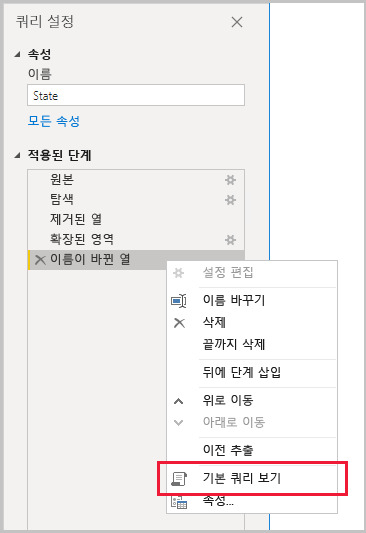
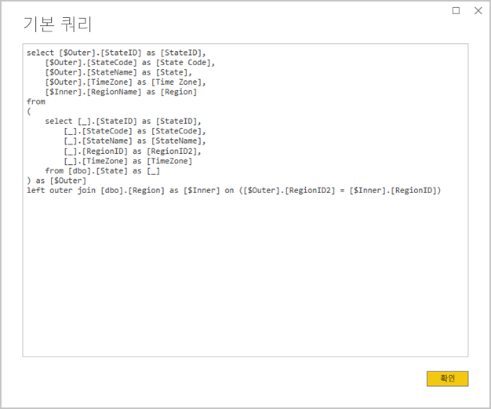
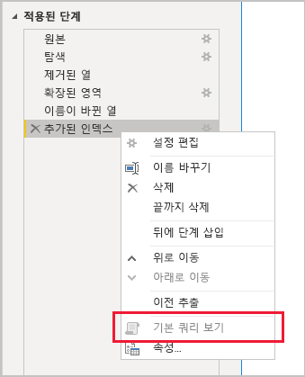

# <a name="the-importance-of-query-folding"></a>쿼리 폴딩의 중요도

이 문서는 Power BI Desktop에서 모델을 개발하는 데이터 모델러를 대상으로 작성되었습니다. 쿼리 폴딩의 정의와 중요한 이유를 설명합니다. 또한 쿼리 폴딩을 수행할 수 있는 데이터 원본 및 변환과 전체 또는 부분적으로 파워 쿼리의 쿼리를 폴딩할 수 있는지 확인하는 방법도 설명합니다. 마지막으로, 쿼리 폴딩을 수행하는 시기 및 방법에 대한 모범 사례 지침을 제공합니다.

## <a name="background"></a>배경

쿼리 폴딩은 파워 쿼리의 쿼리에서 원본 데이터를 검색 및 변환하는 단일 쿼리 문을 생성하는 기능입니다. 파워 쿼리 매시업 엔진은 가능한 경우 항상 쿼리 폴딩을 수행하려고 합니다. Power BI 모델 테이블을 기본 데이터 원본에 연결하는 가장 효율적인 경로를 생성하기 때문입니다.

쿼리 폴딩은 다음과 같은 여러 가지 이유로 데이터 모델링에서 중요한 항목입니다.

- **모델 테이블 가져오기:** 리소스 사용률 및 새로 고침 기간 측면에서 효율적으로 모델 테이블을 가져오기 위해 데이터 새로 고침이 수행됩니다.
- **DirectQuery 및 이중 스토리지 모드 테이블:** 각 DirectQuery 및 이중 스토리지 모드 테이블은 폴딩 가능한 파워 쿼리의 쿼리를 기반으로 해야 합니다.
- **증분 새로 고침:** 증분 데이터 새로 고침은 리소스 사용률 및 새로 고침 기간 측면에서 효율적입니다. 실제로, 테이블의 쿼리 폴딩이 불가능함을 확인할 경우 증분 새로 고침 구성 창에 경고 메시지가 표시됩니다. 쿼리 폴딩이 불가능하면 증분 새로 고침의 의미가 없습니다. 매시업 엔진이 모든 원본 행을 검색하고 필터를 적용하여 증분 변경 내용을 확인해야 합니다.

쿼리 폴딩은 파워 쿼리의 전체 쿼리나 해당 단계의 하위 집합에 대해 수행할 수 있습니다. 전체 또는 부분적으로 쿼리 폴딩이 불가능한 경우 Power BI의 파워 쿼리 매시업 엔진이 직접 데이터 변환을 처리하여 보정해야 합니다. 이 작업을 위해 원본 쿼리 결과를 검색해야 할 수 있으며, 큰 데이터 세트에서는 리소스가 많이 사용되고 속도가 느립니다.

데이터 모델러는 가져오기 모델 디자인의 효율성을 위해 가능한 경우 항상 쿼리 폴딩이 수행되도록 하는 것이 좋습니다.

## <a name="sources-that-support-query-folding"></a>쿼리 폴딩을 지원하는 원본

쿼리 언어의 개념이 쿼리 폴딩을 지원하도록 하는 대부분의 데이터 원본입니다. 여기에는 관계형 데이터베이스, OData 피드(SharePoint 목록 포함), Exchange 및 Active Directory가 포함될 수 있습니다. 그러나 플랫 파일, Blob, 웹 등의 데이터 원본은 일반적으로 쿼리 폴딩을 지원하지 않습니다.

## <a name="transformations-that-can-achieve-query-folding"></a>쿼리 폴딩이 가능한 변환

쿼리 폴딩이 가능한 관계형 데이터 원본 변환은 단일 SELECT 문으로 작성할 수 있는 변환입니다. 적절한 WHERE, GROUP BY, JOIN 절을 사용하여 SELECT 문을 생성할 수 있습니다. SQL 데이터베이스에서 지원하는 일반적인 기본 제공 함수를 사용하는 열 식(계산)도 포함할 수 있습니다.

일반적으로, 다음 글머리 기호 목록에서는 쿼리 폴딩이 가능한 변환을 설명합니다.

- 열 제거
- 열 이름 바꾸기(SELECT 열 별칭)
- 정적 값 또는 파워 쿼리 매개 변수를 사용한 행 필터링(WHERE 절 조건자)
- 그룹화 및 요약(GROUP BY 절)
- 레코드 열(원본 외래 키 열)을 확장하여 두 개의 원본 테이블 조인 얻기(JOIN 절)
- 동일한 원본을 기반으로 하는 폴딩 가능한 쿼리의 비유사 항목 병합(JOIN 절)
- 동일한 원본을 기반으로 하는 폴딩 가능한 쿼리 추가(UNION ALL 연산자)
- ‘단순 논리’를 사용한 사용자 지정 열 추가(SELECT 열 식). 단순 논리는 복잡하지 않은 연산을 의미하며, 수학 또는 텍스트 조작 함수와 같이 SQL 데이터 원본에 해당하는 함수가 있는 M 함수 사용을 포함할 수 있습니다. 예를 들어 다음 식은 **OrderDate** 열 값의 연도 구성 요소를 반환하여 숫자 값을 반환합니다.

    ```powerquery-m
    Date.Year([OrderDate])
    ```

- 피벗 및 피벗 해제(PIVOT 및 UNPIVOT 연산자)

## <a name="transformations-that-prevent-query-folding"></a>쿼리 폴딩이 금지된 변환

일반적으로, 다음 글머리 기호 목록에서는 쿼리 폴딩이 금지된 변환을 설명합니다. 전체 목록은 아닙니다.

- 서로 다른 원본을 기반으로 하는 쿼리 병합
- 서로 다른 원본을 기반으로 하는 쿼리 추가(공용 구조체 작성)
- ‘복잡한 논리’를 사용한 사용자 지정 열 추가. 복잡한 논리는 데이터 원본에 해당하는 함수가 없는 M 함수 사용을 의미합니다. 예를 들어 다음 식은 **OrderDate** 열 값의 서식을 지정하여 텍스트 값을 반환합니다.

    ```powerquery-m
    Date.ToText([OrderDate], "yyyy")
    ```

- 인덱스 열 추가
- 열 데이터 형식 변경

파워 쿼리의 쿼리가 여러 데이터 원본을 포함하는 경우, 데이터 원본 개인 정보 수준의 호환성이 없으면 쿼리 폴딩이 불가능할 수 있습니다. 자세한 내용은 [Power BI Desktop 개인 정보 수준](../desktop-privacy-levels.md) 문서를 참조하세요.

## <a name="determine-when-a-query-can-be-folded"></a>쿼리 폴딩이 가능한 경우 확인

파워 쿼리 편집기 창에서 파워 쿼리의 쿼리 폴딩이 가능한 경우를 확인할 수 있습니다. **쿼리 설정** 창에서 마지막으로 적용된 단계를 마우스 오른쪽 단추로 클릭할 때 **기본 쿼리 보기** 옵션이 활성화되면(회색으로 표시되지 않음) 쿼리 폴딩이 가능합니다.



폴딩된 쿼리를 보려면 **기본 쿼리 보기** 옵션을 선택합니다. 그러면 파워 쿼리에서 데이터 소싱을 위해 사용하는 기본 쿼리가 표시됩니다.



**기본 쿼리 보기** 옵션이 활성화되지 않으면(회색으로 표시됨) 모든 쿼리 단계의 폴딩이 불가능함을 나타냅니다. 그러나 단계의 하위 집합은 폴딩이 가능할 수도 있습니다. 마지막 단계부터 뒤로 작업하면서 각 단계를 검사하여 **기본 쿼리 보기** 옵션이 활성화되는지 확인할 수 있습니다. 이 경우에는 단계 시퀀스에서 쿼리 폴딩이 불가능해지는 위치를 알게 됩니다.



## <a name="best-practice-guidance"></a>모범 사례 지침

간단히 말해, DirectQuery 또는 이중 스토리지 모드 테이블의 경우 파워 쿼리의 쿼리에서 쿼리 폴딩을 수행해야 합니다. 관계형 원본을 기반으로 하는 가져오기 테이블의 경우 단일 SELECT 문을 생성할 수 있으면 쿼리 폴딩이 수행되도록 하여 ‘데이터 새로 고침 성능을 극대화’합니다. 그래도 매시업 엔진이 변환을 처리해야 하는 경우에는 특히 큰 데이터 세트에서 필요한 작업을 최소화해야 합니다.

다음 글머리 기호 목록에서는 모범 사례 지침을 제공합니다.

- **최대한 많은 처리를 데이터 원본에 위임합니다.** 파워 쿼리의 쿼리에서 모든 단계의 폴딩이 불가능한 경우 쿼리 폴딩이 금지된 단계를 검색합니다. 가능한 경우 시퀀스에서 후속 단계를 앞으로 이동하여 쿼리 폴딩에 포함될 수 있도록 합니다. 파워 쿼리 매시업 엔진은 원본 쿼리를 생성할 때 쿼리 단계를 다시 정렬할 수 있을 만큼 스마트할 수 있습니다.

관계형 데이터 원본의 경우, 단일 SELECT 문이나 저장 프로시저의 절차적 논리 내에서 쿼리 폴딩이 금지된 단계를 수행할 수 있으면 다음에 설명된 대로 기본 쿼리 문을 사용하는 것이 좋습니다.

- **기본 SQL 쿼리 사용:** 파워 쿼리의 쿼리가 관계형 원본에서 데이터를 검색하는 경우 기본 SQL 쿼리를 사용할 수 있습니다. 쿼리는 실제로 저장 프로시저 실행을 포함하여 유효한 모든 문일 수 있습니다. 문이 여러 개의 결과 집합을 생성하는 경우 첫 번째 결과 집합만 반환됩니다. 문에서 매개 변수를 선언할 수 있으며, [Value.NativeQuery](/powerquery-m/value-nativequery) M 함수를 사용하여 매개 변수 값을 안전하고 편리하게 전달하는 것이 좋습니다. 파워 쿼리 매시업 엔진이 후속 쿼리 단계를 폴딩할 수 없으므로 기본 쿼리 문에 모든(또는 많은) 변환 논리를 포함하는 것이 중요합니다.

    기본 SQL 쿼리를 사용할 때는 다음 두 가지 중요한 사항을 고려해야 합니다.

    - DirectQuery 모델 테이블의 경우 쿼리가 SELECT 문이어야 하며, CTE(공용 테이블 식) 또는 저장 프로시저를 사용할 수 없습니다.
    - 증분 새로 고침은 기본 SQL 쿼리를 활용할 수 없으므로, 파워 쿼리 매시업 엔진이 모든 원본 행을 검색하고 필터를 적용하여 증분 변경 내용을 확인해야 합니다.

    > [!IMPORTANT]
    > 기본 쿼리는 데이터 검색 이상의 작업을 수행할 수 있습니다. 데이터를 수정하거나 삭제하는 문을 포함하여 유효한 모든 문을 실행할 수 있으며, 여러 번 실행하는 것도 가능합니다. 최소 권한의 원칙을 적용하여 데이터베이스 액세스에 사용하는 계정에 필수 데이터에 대한 읽기 권한만 부여되도록 하는 것이 중요합니다.

- **원본에서 변환 데이터 준비:** 파워 쿼리의 특정 쿼리 단계를 폴딩할 수 없음을 확인할 경우 데이터 원본에 변환을 적용할 수 있습니다. Power BI에서 쿼리하기 전에 원본 데이터를 논리적으로 변환하는 데이터베이스 뷰를 작성하거나 데이터를 실제로 준비하고 구체화하면 됩니다. 관계형 데이터 웨어하우스는 일반적으로 사전 통합된 조직 데이터 원본으로 이루어진 준비된 데이터의 좋은 예입니다.

## <a name="next-steps"></a>다음 단계

쿼리 폴딩 및 관련 항목에 대한 자세한 내용은 다음 리소스를 확인하세요.

- [Power BI Desktop에서 복합 모델 사용](../desktop-composite-models.md)
- [Power BI Premium의 증분 새로 고침](../service-premium-incremental-refresh.md)
- [Table.View를 사용하여 쿼리 폴딩 구현](/power-query/handlingqueryfolding)
- 궁금한 점이 더 있나요? [Power BI 커뮤니티에 질문합니다.](https://community.powerbi.com/)
