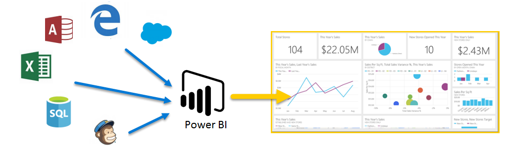

Power BI에 대한 **단계별 학습**을 시작하겠습니다. 이 자가 진행식 온라인 과정에서는 순차적 방식으로 Power BI를 설명하므로 기초부터 지식을 쌓을 수 있습니다.

이 과정은 개념, 세부 정보 및 예제를 습득하는 데 유용한 논리 흐름을 통해 이해하기 쉬운 부분으로 지침을 제공하도록 구성되어 있습니다. 또한 학습에 도움이 되는 다양한 시각적 개체 및 동영상이 포함되어 있습니다.

이 **단계별 학습** 과정에는 많은 **단원**이 포함되어 있으며, 각 단원에는 많은 **항목**이 있습니다. 이 **시작** 단원의 처음 몇몇 항목 이후에 나오는 거의 모든 항목에는 학습할 내용을 설명하는 동영상이 포함되어 있습니다. 동영상 아래의 내용은 자신의 진도에 맞게 검토 및 학습할 수 있도록 개념을 추가로 설명합니다.

Power BI의 **초보자**인 경우 이 과정을 통해 지식을 계속 쌓을 수 있으며, Power BI의 **숙련자**인 경우 이 과정을 통해 개념을 결합하고 부족한 지식을 채울 수 있습니다. 이 과정을 즐기시기 바라며, 앞으로 더 많은 내용을 추가할 예정입니다.

## Power BI란?
**Power BI**는 관련 없는 데이터 소스를 시각적으로 몰입도가 뛰어나고 일관된 대화형 정보로 변환하는 소프트웨어 서비스, 앱 및 커넥터의 컬렉션입니다. 데이터가 간단한 Excel 스프레드시트이든 클라우드 기반 온-프레미스 하이브리드 데이터 웨어하우스 컬렉션이든 **Power BI**를 통해 손쉽게 데이터 소스를 연결하고, 중요한 내용을 시각화(또는 검색)하고, 이 내용을 원하는 모든 사람과 공유할 수 있습니다.

**Power BI**는 단순하고 빠르기 때문에 Excel 스프레드시트 또는 로컬 데이터베이스에서 빠른 정보를 생성할 수 있습니다. 하지만 **Power BI**는 강력하면서도 엔터프라이즈급이기 때문에 광범위한 모델링 및 실시간 분석뿐 아니라 사용자 지정 개발에 즉시 사용할 수 있습니다. 따라서 Power BI는 개인 보고서 및 시각화 도구일 수 있으며, 그룹 프로젝트, 사업부 또는 회사 전체의 분석 및 의사 결정 엔진으로 역할도 할 수 있습니다.

## Power BI의 요소
Power BI는 **Power BI Desktop**이라는 Windows 데스크톱 애플리케이션, **Power BI 서비스**라는 온라인 SaaS(*Software as a Service*), Windows Phone 및 태블릿뿐 아니라 iOS 및 Android 디바이스에서 사용할 수 있는 모바일 Power BI **앱**으로 구성됩니다.

이 세 가지 요소(**Desktop**, **서비스** 및 **모바일**)는 직원들이 자신 또는 자신의 역할에 가장 효과적인 방식으로 비즈니스 통찰력을 생성, 공유 또는 소비하도록 설계되었습니다.

## Power BI와 사용자 역할을 일치시키는 방법
Power BI 사용 방법은 프로젝트 또는 팀에서 사용자의 역할에 따라 달라질 수 있습니다. 또한 다른 역할을 맡은 사람은 Power BI를 다른 방식으로 사용할 수도 있습니다.

예를 들어 여러분은 주로 **Power BI 서비스**를 사용하지만 많은 숫자를 다루는 비즈니스 보고서를 만드는 동료는 **Power BI Desktop**을 중점적으로 사용하고 여러분이 보는 Power BI 서비스에 Desktop 보고서를 게시할 수 있습니다. 그리고 영업을 담당하는 다른 동료는 주로 Power BI 전화 앱을 사용하여 자신의 영업 할당량 관련 진행 상황을 모니터링하고 새로운 잠재 고객의 세부 정보를 확인할 수 있습니다.

달성하려는 목표 또는 지정된 프로젝트나 작업에서 맡은 역할에 따라 **Power BI**의 각 요소를 서로 다른 시점에 사용할 수 있습니다.

여러분은 실시간 대시보드에서 재고 및 제조 진행 상황을 보고 **Power BI Desktop**을 사용하여 팀을 위해 고객 참여 통계에 대한 보고서를 만들 수 있습니다. Power BI를 사용하는 방법은 상황에 가장 적합한 도구인 Power BI의 기능 또는 서비스를 기반으로 할 수 있지만 Power BI의 각 부분을 사용할 수 있으므로 매우 유연하고 매력적입니다.

이 세 가지 요소(**Desktop**, **서비스** 및 **모바일**)에 대해서는 이 **단계별 학습** 과정의 뒷부분에서 좀 더 자세히 알아보겠습니다. 또한 향후 문서에서는 Power BI Desktop에서 보고서를 만들고, 서비스에서 공유하며, 모바일 디바이스에서 세분화할 예정입니다.

## Power BI의 작업 흐름
Power BI의 일반적인 작업 흐름은 보고서가 만들어지는 **Power BI Desktop**에서 시작합니다. 이 보고서는 Power BI **서비스**에서 게시된 다음 **Power BI 모바일** 앱 사용자가 정보를 소비할 수 있도록 공유됩니다.

항상 이런 방식으로 진행되는 것은 아니지만 이 흐름을 사용하여 Power BI의 여러 부분과 각 부분이 상호 보완되는 방식을 살펴보겠습니다.

이 과정의 개요, Power BI의 정의 및 세 가지 주요 요소를 살펴보았으므로 이제 **Power BI**의 사용이 무엇과 유사한지 알아보겠습니다.

