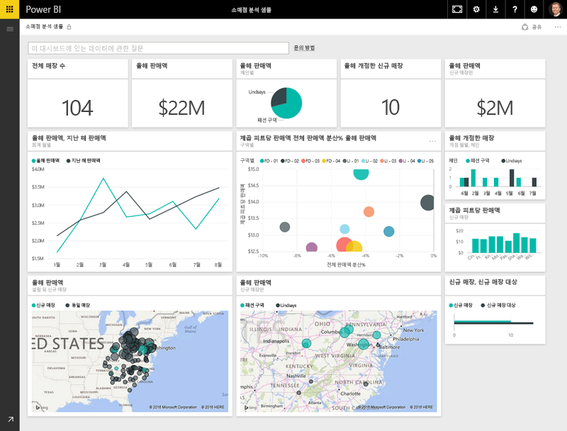
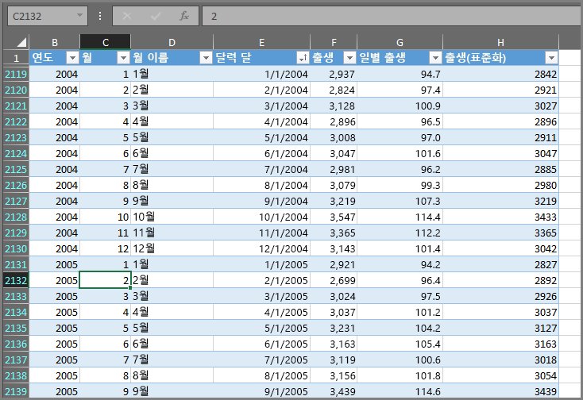
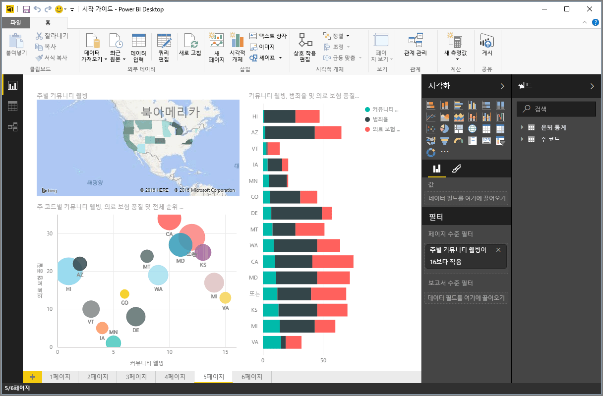
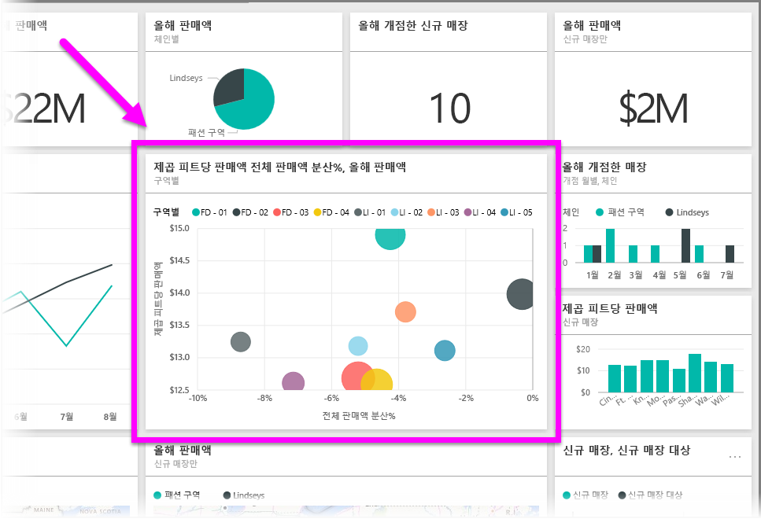

Power BI에서 수행하는 모든 작업을 몇 가지 기본 **구성 요소**로 분할할 수 있습니다. 이러한 구성 요소를 이해하면 각 구성 요소를 확장할 수 있으며, 정교하고 복잡한 보고서를 만들기 시작할 수 있습니다. 건물은 목재, 철근, 콘크리트 및 유리로 만들어지고, 자동차 금속, 직물 및 고무로 만들어지듯이 결국 아무리 복잡해 보이는 것도 기본 구성 요소로 만들어집니다. 물론 건물과 자동차는 기본 구성 요소의 정렬 방식에 따라 기본적일 수도 있고 정교할 수도 있습니다.

이러한 기본 구성 요소를 알아보고 이들로 만들 수 있는 몇 가지 간단한 예를 살펴본 다음 복잡한 것을 만들 수 있는 방법에 대해 간략히 설명하겠습니다.

Power BI의 기본 구성 요소는 다음과 같습니다.

* 시각화
* 데이터 세트
* 보고서
* 대시보드
* 타일

## 시각화
**시각화**(**시각적 개체**라고도 함)는 차트, 그래프, 색상으로 구분된 지도 또는 데이터를 시각적으로 나타내기 위해 만들 수 있는 다른 흥미로운 개체와 같은 데이터의 시각적 표현입니다. Power BI에는 모든 종류의 다양한 시각화 유형이 있으며 이는 계속 추가될 예정입니다. 다음 그림에서는 Power BI 서비스에서 만든 다양한 시각화 요소의 컬렉션을 보여 줍니다.

시각화는 의미 있는 무언가를 나타내는 단일 숫자와 같이 단순하거나, 특정 사회 문제 또는 관심사에 대한 투표자의 정서를 보여 주는 그라데이션 색상 지도와 같이 시각적으로 복잡할 수 있습니다. 시각적 개체의 목적은 숫자 또는 텍스트의 원시 테이블에서 파악하기 어려울 수 있는 데이터를 컨텍스트 및 통찰력을 제공하는 방식으로 나타내는 것입니다.

## 데이터 세트
**데이터 집합**은 Power BI에서 해당 시각화 요소를 만드는 데 사용하는 데이터의 컬렉션입니다.

다음 그림과 같이 Excel 통합 문서의 다음 테이블을 기반으로 하는 간단한 데이터 집합이 있을 수 있습니다.

**데이터 집합**은 Power BI에서 사용할 수 있는 고유한 컬렉션 데이터(데이터 집합)를 제공하기 위해 필터링하고 조합할 수 있는 다양한 소스의 조합일 수도 있습니다.

예를 들어 세 개의 데이터베이스 필드, 하나의 웹 사이트 테이블, Excel 테이블 및 메일 마케팅 캠페인의 온라인 결과에서 데이터 집합을 만들 수 있습니다. 이 고유한 조합은 여러 소스에서 가져왔음에도 불구하고 여전히 단일 **데이터 집합**으로 간주됩니다.

데이터를 필터링한 후 Power BI로 가져오면 자신에게 중요한 데이터에 중점을 둘 수 있습니다. 예를 들어 마케팅 캠페인에서 메일을 받은 고객만 데이터 집합에 포함되도록 연락처 데이터베이스를 필터링 수 있습니다. 그런 다음 캠페인에 포함된 고객의 하위 집합(필터링된 컬렉션)을 기반으로 시각적 개체를 만들 수 있습니다. 필터링은 데이터 및 작업에 집중하는 데 도움이 됩니다.

Power BI의 중요한 부분은 포함된 데이터 **커넥터**의 규모입니다. 원하는 데이터가 Excel 또는 SQL 데이터베이스에 있든, Azure 또는 Oracle에 있든, Facebook, Salesforce 또는 MailChimp와 같은 서비스에 있든 Power BI에는 이러한 데이터에 손쉽게 연결하고 필요한 경우 필터링한 후 데이터 집합으로 가져올 수 있는 기본 제공 데이터 커넥터가 있습니다.

데이터 집합이 있으면 해당 데이터 집합의 여러 부분을 다양한 방식으로 표시하는 시각화 요소를 만들기 시작할 수 있으며, 표시된 데이터를 사용하여 통찰력을 얻을 수 있습니다. 이러한 방식으로 보고서가 생성됩니다.

## 보고서
Power BI에서 **보고서**는 하나 이상의 페이지에 함께 표시된 시각화 요소의 컬렉션입니다. 영업 프레젠테이션용으로 만들 수 있는 다른 모든 보고서 또는 학교 과제용으로 작성하는 보고서와 마찬가지로 Power BI에서 **보고서**는 서로 관련된 항목의 컬렉션입니다. 다음 그림에서는 Power BI Desktop의 **보고서**를 보여 줍니다. 6페이지 보고서의 다섯 번째 페이지가 표시되어 있습니다. Power BI 서비스에서 보고서를 만들 수도 있습니다.

보고서를 사용하면 필요한 경우 여러 페이지에 많은 시각화 요소를 만들 수 있으며, 자신에게 가장 적합한 방식으로 이를 정렬할 수 있습니다.

분기별 판매량에 대한 보고서, 특정 부문의 제품 성장률에 대한 보고서 또는 북극곰의 이주 패턴에 대한 보고서를 만들 수 있습니다. 주제가 무엇이든 보고서를 사용하여 시각화 요소를 하나 이상의 페이지에 수집하고 구성할 수 있습니다.

## 대시보드
보고서의 단일 페이지 또는 시각화 요소 컬렉션을 공유할 준비가 되면 **대시보드**를 만듭니다. 자동차의 대시보드와 마찬가지로 Power BI **대시보드**는 다른 사용자와 공유할 수 있는 단일 페이지의 시각적 개체 컬렉션입니다. 또한 표시하려는 데이터 또는 스토리에 대한 빠른 통찰력을 제공하는 선택된 시각적 개체 그룹이기도 합니다.

대시보드는 캔버스(Power BI Desktop 또는 서비스에서 시각화 요소를 배치하려는 빈 배경)라고도 하는 단일 페이지에 적합해야 합니다. 이를 예술가 또는 미술가가 사용하는 캔버스라고 생각하면 됩니다. 즉, 흥미롭고 매력적인 시각적 개체를 만들고, 조합하고, 재작업하는 작업 영역입니다.
다른 사용자 또는 그룹과 대시보드를 공유하여 이들이 Power BI 서비스 또는 모바일 디바이스에 있을 때 대시보드와 상호 작용하도록 할 수 있습니다.

## 타일
Power BI에서 **타일**은 보고서 또는 대시보드에 있는 단일 시각화 요소로서, 각 개별 시각적 개체를 포함하는 사각형 상자입니다. 다음 그림에는 다른 타일로 둘러싸인 하나의 타일(밝은 상자로 강조 표시됨)이 표시되어 있습니다.

Power BI에서 보고서 또는 대시보드를 *만들* 때 타일을 이동하거나 정렬하여 원하는 방식으로 정보를 표시할 수 있습니다. 타일을 더 크게 만들거나, 높이 또는 너비를 변경하거나, 원하는 대로 다른 타일을 포함할 수 있습니다.

대시보드 또는 보고서를 보거나 소비하는 경우, 즉 작성자 또는 소유자가 아니지만 공유된 경우 상호 작용할 수는 있지만 타일 크기 또는 정렬 방식을 변경할 수는 없습니다.

## 모두 통합
이는 Power BI와 해당 구성 요소의 기본 사항입니다. 잠시 검토해 보겠습니다.

Power BI는 상주하는 위치에 상관없이 데이터에 연결하고 필요한 경우 필터링한 다음 다른 사람과 공유할 수 있는 매력적인 시각화 요소를 만들 수 있는 Power BI로 가져올 수 있도록 해주는 서비스, 앱 및 커넥터의 컬렉션입니다.  

이제 Power BI의 기본 구성 요소에 대해 어느 정도 이해했으니 여러분에게 의미 있는 데이터 집합을 만들고 여러분의 스토리를 전달하는 시각적으로 매력적인 보고서를 만들 수 있을 것입니다. Power BI를 통해 전달되는 스토리는 복잡하지 않아도 매력적일 수 있습니다.

일부 사용자의 경우 데이터 집합의 단일 Excel 테이블을 사용한 다음 자신의 팀과 대시보드를 공유하는 것이 Power BI를 사용하는 매우 유용한 방법일 것이고,

다른 사용자의 경우 다른 데이터베이스 및 실시간 소스와 결합되는 실시간 Azure SQL 데이터 웨어하우스 테이블을 사용한 다음 이를 실시간으로 필터링하여 매순간의 제조 진행 상황을 모니터링하는 데이터 집합을 구축하는 것이 바로 자신들이 추구하는 Power BI의 가치일 것입니다.

둘 다 프로세스는 동일합니다. 데이터 집합을 만들고 매력적인 시각적 개체를 작성하여 다른 사람들과 공유합니다. 마찬가지로 각각에 대한 결과도 둘 다 동일합니다. 끊임없이 확장되는 데이터를 활용하여 실행 가능한 통찰력으로 전환합니다.

데이터 통찰력에 간단한 데이터 집합이 필요하든 복잡한 데이터 집합이 필요하든 Power BI는 신속하게 시작하도록 도와주며, 데이터에 필요한 만큼 복잡하도록 확장할 수 있습니다. Power BI는 Microsoft 제품이기 때문에 강력하고 확장 가능하며 Office에 친숙하고 엔터프라이즈 수준을 지원할 수 있습니다.

이제 작동 방식을 살펴보겠습니다. 먼저 Power BI 서비스를 간략하게 살펴보겠습니다.

