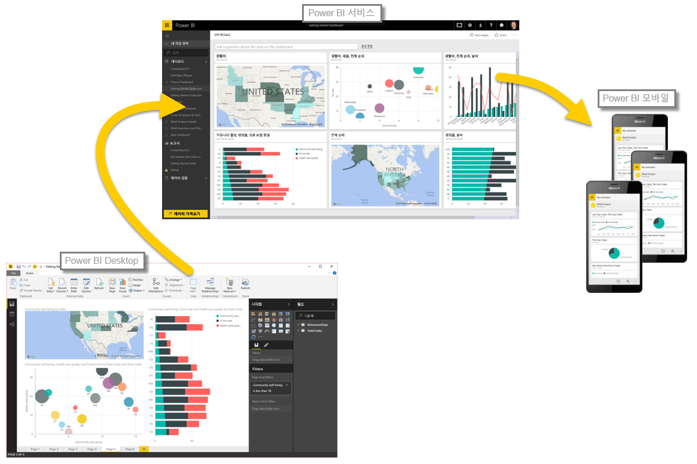

Power BI의 기본 사항을 배웠으므로 이제 몇 가지 실습 환경과 둘러보기로 넘어가겠습니다. 동영상 둘러보기 가이드는 Microsoft Power BI 팀의 프로그램 관리자인 **Will Thompson**입니다. 이 과정의 뒤부분에는 몇몇 게스트 가이드도 등장합니다.

Will이 Power BI로 수행할 수 있는 여러 작업을 설명할 때 이 모든 활동 및 Power BI로 수행할 수 있는 모든 분석은 대체로 일반적인 흐름을 따른다는 점을 염두에 두어야 합니다. Power BI의 **일반적인 작업 흐름**은 다음과 같습니다.

* Power BI Desktop으로 데이터를 가져와 보고서를 만듭니다.
* 새 시각화 요소를 만들거나 대시보드를 작성하는 Power BI 서비스에 게시합니다.
* 대시보드를 다른 사람, 특히 현재 작업 중인 사람과 공유합니다.
* Power BI 모바일 앱에서 공유 대시보드 및 보고서를 보고 상호 작용합니다.

앞서 설명했듯이 여러분은 데이터를 가져와 대시보드를 만드는 등 **Power BI 서비스**에서 모든 시간을 보낼 수 있습니다. 다른 팀원은 **Power BI Desktop**에서 모든 시간을 보낼 수도 있습니다. Power BI의 전체 연속체 및 그 역할에 대한 이해를 돕기 위해 전체를 보여 드리겠습니다. 그러면 여러분 자신에게 가장 적합한 사용 방법을 결정할 수 있습니다.

이제 Will이 경험을 통해 안내해 드릴 것입니다. 비즈니스에서 가장 중요한 것은 Power BI의 기본 구성 요소를 이해하는 것입니다. 이는 Power BI를 통해 데이터를 멋진 보고서 및 시각적 개체로 전환하는 방법을 학습할 수 있는 탄탄한 기초를 제공합니다.

