이 항목에서는 Power BI의 처음 두 요소가 함께 어우러지는 방식을 좀 더 자세히 살펴보겠습니다.

* **Power BI Desktop**에서 보고서 만들기
* **Power BI 서비스**에서 보고서 게시

Power BI Desktop에서 시작하여 **데이터 가져오기**를 선택합니다. 데이터 소스를 선택할 수 있도록 데이터 소스의 컬렉션이 나타납니다. 다음 그림에서는 웹 페이지를 소스로 선택하는 과정을 보여 줍니다. 위 동영상에서 Will은 **Excel** 통합 문서를 선택했습니다.

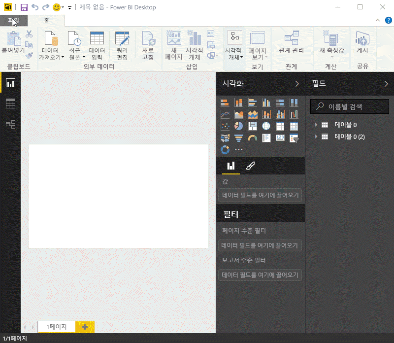

선택한 데이터 소스에 관계없이 Power BI는 해당 데이터 소스에 연결하여 이 소스에서 사용 가능한 데이터를 보여 줍니다. 다음 그림은 다양한 상태 및 몇 가지 흥미로운 은퇴 통계를 분석하는 웹 페이지의 또 다른 예입니다.

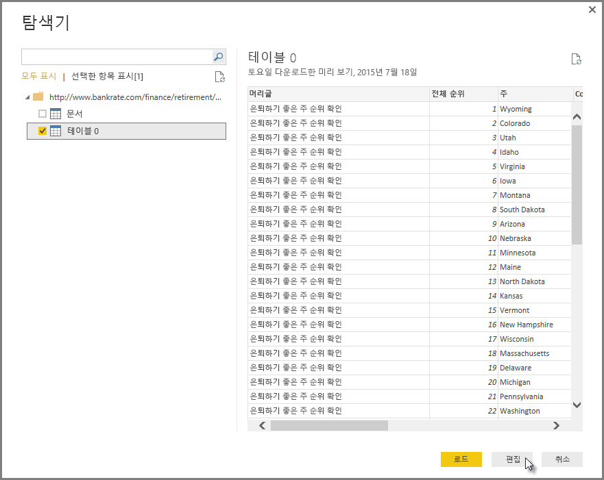

Power BI Desktop **보고서** 뷰에서 보고서 작성을 시작할 수 있습니다.

**보고서** 뷰에는 다음과 같은 5개의 기본 영역이 있습니다.

1. **리본** 메뉴 - 보고서 및 시각화와 관련된 일반적인 작업을 표시합니다.
2. **보고서** 뷰 또는 캔버스 - 시각화를 만들고 정렬합니다.
3. **페이지** 탭 영역(아래쪽에 있음) - 보고서 페이지를 선택하거나 추가할 수 있습니다.
4. **시각화** 창 - 시각화를 변경하고 색 또는 축을 사용자 지정하며 필터를 적용하고 필드를 끄는 등의 작업을 수행할 수 있습니다.
5. **필드** 창 - 쿼리 요소 및 필터를 **보고서** 보기나 **시각화** 창의 **필터** 영역으로 끌 수 있습니다.

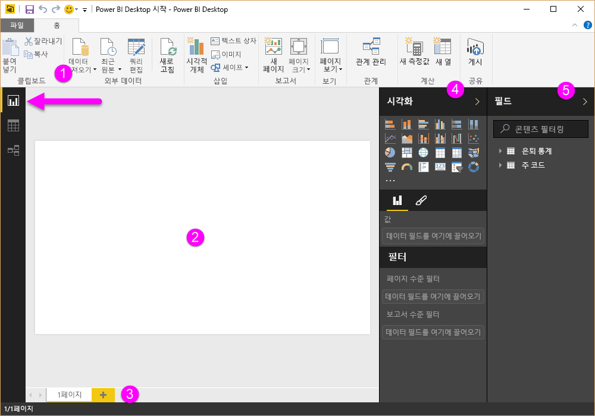

가장자리에 있는 작은 화살표를 선택하여 **시각화** 및 **필드** 창을 축소하면 **보고서** 보기에 더 많은 공간이 제공되어 멋진 시각화를 만들 수 있습니다. 시각화를 수정할 때도 위 또는 아래를 가리키는 이러한 화살표를 볼 수 있습니다. 이는 해당 섹션을 적절하게 확장하거나 축소할 수 있음을 의미합니다.

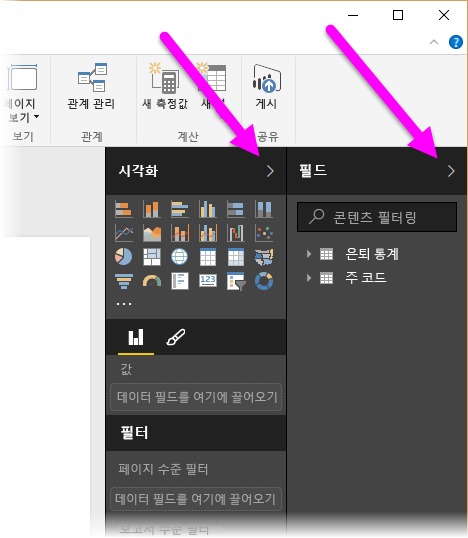

시각화를 만들려면 **필드** 목록에서 **보고서** 뷰로 필드를 끌면 됩니다. 여기서는 *RetirementStats* 에서 State필드를 끌어 결과를 확인해 보겠습니다.

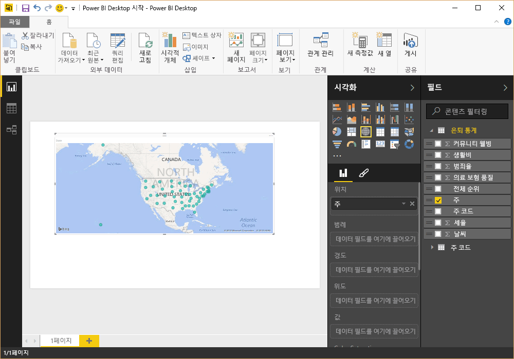

결과를 보세요. Power BI Desktop이 State 필드에 지리적 위치 데이터가 포함된 것을 인식했으므로 지도 기반 시각화를 자동으로 만들었습니다.

앞으로 약간 돌아가 보겠습니다. 몇 개의 시각화 요소로 보고서를 만든 후 이를 Power BI 서비스에 게시할 준비가 완료되었습니다. Power BI Desktop의 **홈** 리본에서 **게시**를 선택합니다.

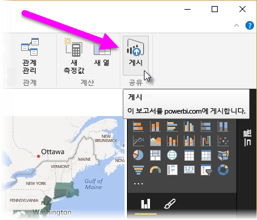

Power BI에 로그인하라는 메시지가 표시됩니다.

로그인하고 게시 프로세스가 완료되면 다음과 같은 대화 상자가 표시됩니다. **성공!** 아래의 링크를 선택하여 Power BI 서비스로 이동하면 방금 게시한 보고서를 볼 수 있습니다.

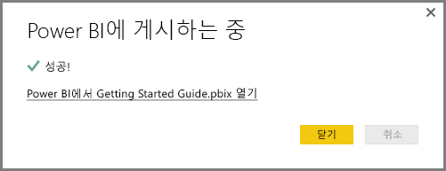

Power BI에 로그인하면 서비스에서 방금 게시한 Power BI Desktop 파일이 표시됩니다. 아래 그림에서는 Power BI Desktop에서 만든 보고서가 **보고서** 섹션에 표시되어 있습니다.

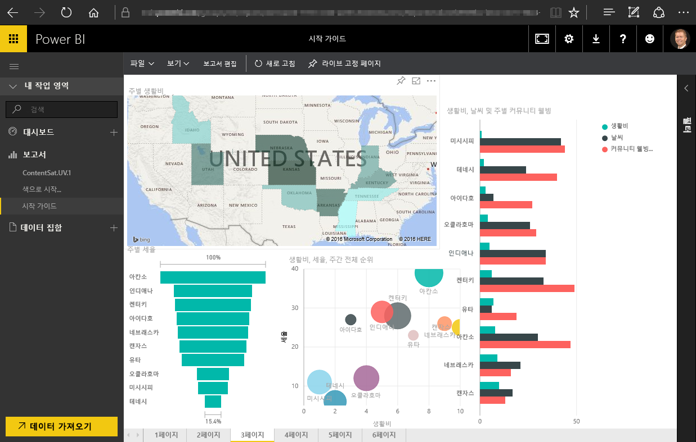

이 보고서에서 **고정** 아이콘을 선택하여 해당 시각적 개체를 대시보드에 고정할 수 있습니다. 다음 그림에서는 밝은 상자와 화살표로 강조 표시된 고정 아이콘을 보여 줍니다.

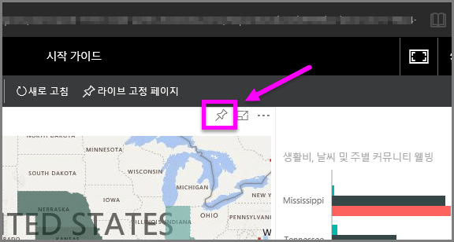

이를 선택하면 시각적 개체를 기존 대시보드에 고정하거나 새 대시보드를 만들 수 있는 다음 대화 상자가 나타납니다.

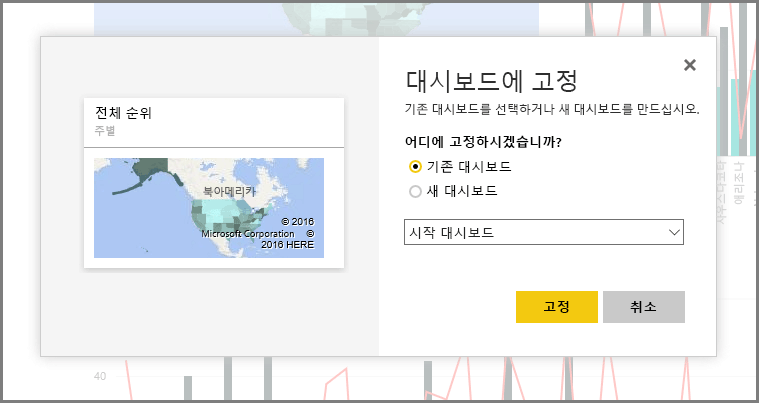

보고서에서 몇몇 시각적 개체를 고정한 경우 대시보드에서 볼 수 있습니다.

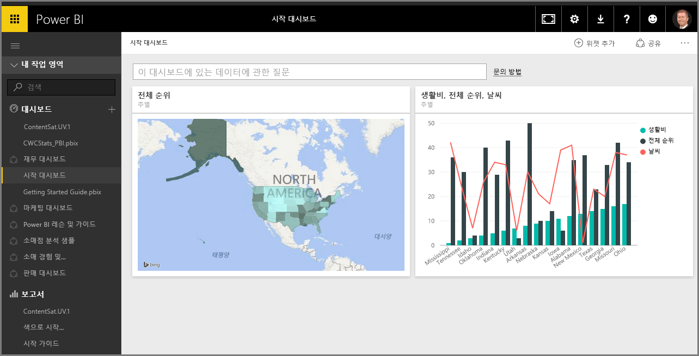

만든 대시보드를 공유하는 등 Power BI를 사용하여 수행할 수 있는 더 많은 작업이 있습니다. 공유에 대해서는 이 과정의 뒷부분에서 살펴보겠습니다.

이제 Facebook, Salesforce 등의 클라우드 서비스에 연결하여 대시보드를 자동으로 만들 수 있는 기능을 알아보겠습니다.

