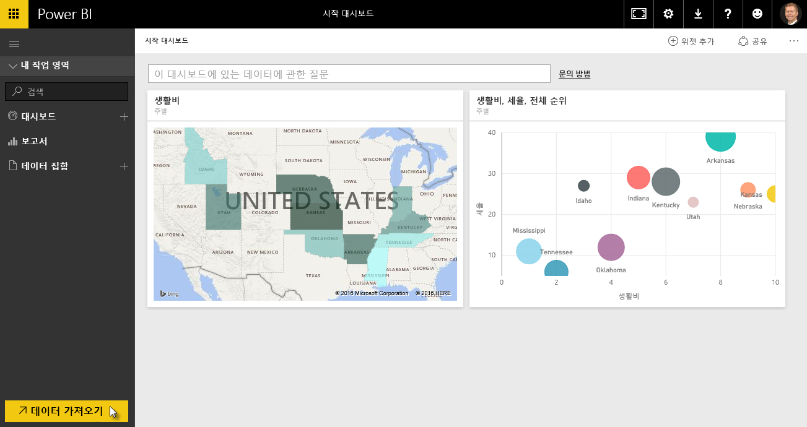
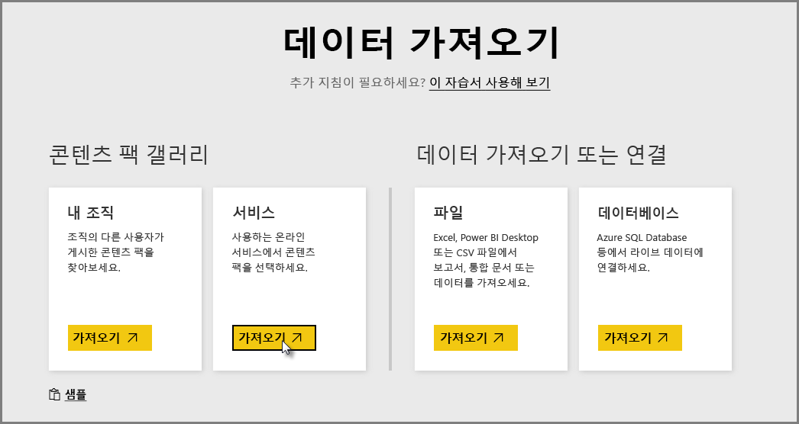
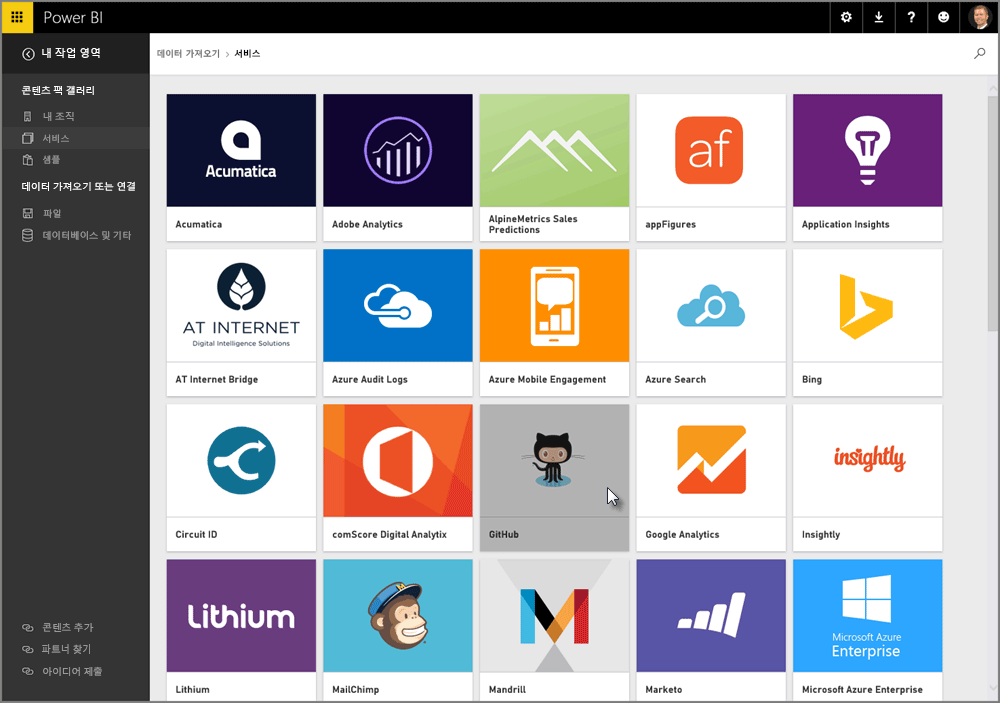
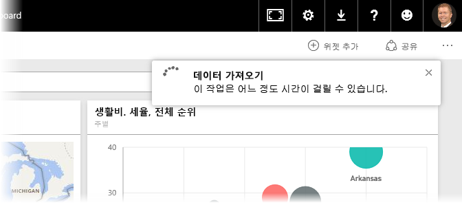
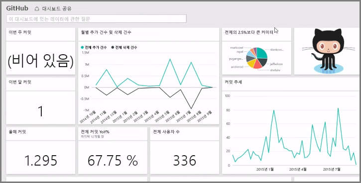
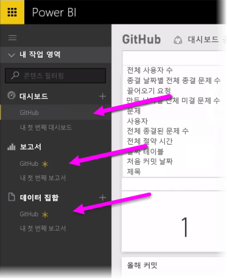
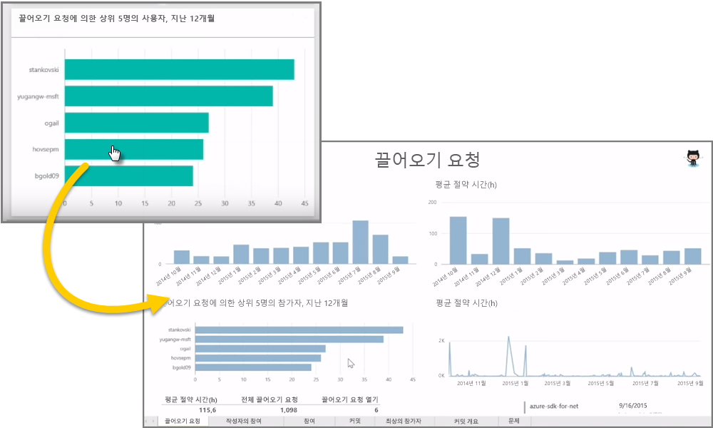
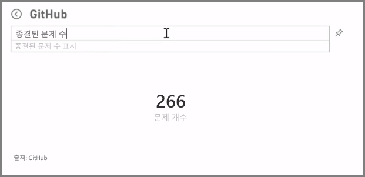
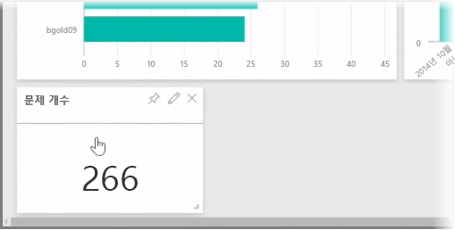
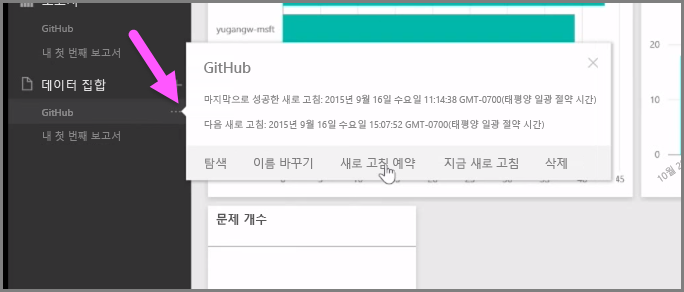

앞서 살펴본 바와 같이 Power BI의 일반적인 작업 흐름은 Power BI Desktop에서 보고서를 만들어 Power BI 서비스에 게시한 다음 다른 사람이 서비스나 모바일 앱에서 볼 수 있도록 보고서를 공유하는 것입니다.

하지만 어떤 사람은 Power BI 서비스에서 시작하므로 서비스에 대해 간략히 살펴보고 Power BI에서 시각적 개체를 빠르게 만들 수 있는 쉽고 일반적인 방법인 콘텐츠 팩에 대해 알아보겠습니다.

**콘텐츠 팩**은 Salesforce와 같은 특정 데이터 소스를 기반으로 미리 구성되고 즉시 사용할 수 있는 시각적 개체 및 보고서의 컬렉션입니다. 콘텐츠 팩을 사용하는 것은 냉동 식품을 전자레인지에 돌리거나 패스트 푸드 음식을 주문하는 것과 같습니다. 몇 번의 클릭과 설명으로 즉시 사용할 수 있는 패키지에 필요한 모든 요소를 얻을 수 있습니다.

이제 콘텐츠 팩, 서비스 및 작동 방식을 간단히 살펴보겠습니다. 이 단원에서는 개요만 살펴보고 이후 단원에서 콘텐츠 팩 및 서비스에 대해 자세히 알아보겠습니다.

## 클라우드 서비스를 사용하여 기본 대시보드 만들기
Power BI를 사용하면 데이터에 쉽게 연결할 수 있습니다. Power BI 서비스에서 홈 화면 왼쪽 아래에 있는 **데이터 가져오기** 단추를 선택하기만 하면 됩니다.

그러면 Power BI 서비스에서 사용 가능한 데이터 소스가 *캔버스*(Power BI 서비스의 가운데 영역)에 표시됩니다. Power BI에서는 Excel 파일, 데이터베이스 또는 Azure 데이터와 같은 일반적인 데이터 소스 외에 Salesforce, Facebook, Google 웹로그 분석 및 모든 종류의 다른 SaaS 서비스와 같은 **소프트웨어 서비스**(SaaS 공급자 또는 클라우드 서비스라고도 함)에도 쉽게 연결할 수 있습니다.

이러한 소프트웨어 서비스의 경우 **Power BI 서비스**는 대시보드 및 보고서에 미리 정렬된 즉시 사용 가능한 시각적 개체 컬렉션(**콘텐츠 팩**이라고 함)을 제공합니다. 콘텐츠 팩을 사용하면 선택한 서비스의 데이터로 Power BI를 신속하게 실행할 수 있습니다. 예를 들어 Salesforce 콘텐츠 팩을 사용하는 경우 Power BI는 사용자의 Salesforce 계정(자격 증명을 제공한 경우)에 연결한 다음 Power BI의 미리 정의된 시각적 개체 및 대시보드 컬렉션을 채웁니다.

Power BI는 모든 종류의 서비스에 대한 콘텐츠 팩을 제공합니다. 다음 그림에서는 **서비스** 상자(위 그림에 표시)에서 **가져오기**를 선택한 경우 사전순으로 표시되는 서비스의 첫 화면을 보여 줍니다. 아래 그림에서 볼 수 있듯이 선택할 수 있는 다양한 서비스가 있습니다.

이 가이드에서는 **GitHub**를 선택합니다. GitHub는 온라인 소스 제어용 응용 프로그램입니다. GitHub 콘텐츠 팩에 대한 정보 및 자격 증명을 입력하면 사용자의 데이터를 가져오기 시작합니다.

데이터가 로드되면 미리 정의된 GitHub 콘텐츠 팩 대시보드가 나타납니다.

**대시보드** 이외에 대시보드를 만들기 위해 GitHub 콘텐츠 팩의 일부로 생성된 **보고서**도 사용할 수 있습니다. 또한 데이터를 가져오는 동안 **데이터 집합**(GitHub에서 가져온 데이터의 컬렉션)이 만들어지며 GitHub 보고서를 만드는 데 사용됩니다.

대시보드에서 시각적 개체 중 하나를 클릭하면 해당 시각적 개체가 만들어진 **보고서** 페이지로 자동으로 이동합니다. **끌어오기 요청별 상위 5명의 사용자** 시각적 개체를 클릭하면 Power BI의 보고서에 **끌어오기 요청** 페이지(해당 시각적 개체가 만들어진 보고서 페이지)가 열립니다.

## 데이터에 대해 질문하기
데이터에 대해 질문할 수도 있습니다. 그러면 Power BI 서비스에서 사용자의 질문을 기반으로 시각적 개체를 실시간으로 만듭니다. 다음 그림에는 Power BI에서 **자연어 쿼리** 막대에 입력된 내용을 바탕으로 종결된 문제 수를 보여 주는 숫자 시각적 개체를 만드는 과정이 나와 있습니다.

원하는 시각적 개체가 있는 경우 자연어 쿼리 막대 오른쪽의 **고정** 아이콘을 선택하여 해당 시각적 개체를 대시보드에 고정할 수 있습니다. 이 가이드에서는 시각적 개체가 현재 선택된 대시보드이므로 GitHub 대시보드에 고정되었습니다.

## Power BI 서비스에서 데이터 새로 고침
콘텐츠 팩의 데이터 집합 또는 Power BI에서 사용하는 다른 데이터에 대해 **새로 고침**을 수행할 수 있습니다. 새로 고침 설정을 지정하려면 데이터 집합 옆의 줄임표(...)를 선택합니다. 그러면 메뉴가 나타납니다.

이 메뉴 아래쪽에서 **새로 고침 예약** 옵션을 선택합니다. 원하는 새로 고침 설정을 지정할 수 있는 설정 대화 상자가 캔버스에 표시됩니다.

이것으로 Power BI 서비스를 간략하게 살펴보았습니다. 서비스를 사용하여 수행할 수 있는 더 많은 작업이 있으며, 이에 대해서는 이 과정의 뒷부분에서 살펴보겠습니다. 또한 연결할 수 있는 다양한 데이터 형식과 앞으로 추가되는 콘텐츠 팩을 포함하여 모든 종류의 콘텐츠 팩이 있다는 점도 기억해야 합니다.

이제 다음 항목으로 넘어가겠습니다. 여기서는 **시작** 단원을 요약하고 다음 단계를 준비합니다.

