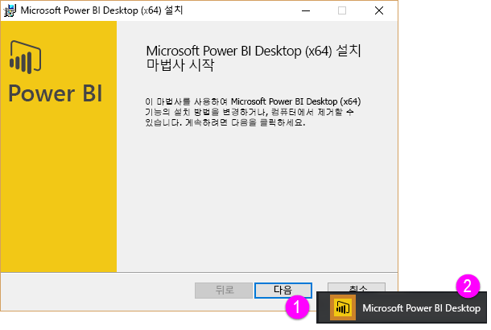

Power BI에 대한 이 **단계별 학습** 과정의 두 번째 단원인 **데이터 가져오기** 단원을 시작하겠습니다. 이 단원에서는 Power BI Desktop을 중심으로 Power BI의 다양한 데이터 중심 기능 및 도구를 살펴봅니다. 이러한 도구는 대부분 Power BI 서비스에도 적용되므로 이 단원을 학습하면 두 가지를 얻게 됩니다.

데이터를 가져올 때 원하는 만큼 데이터의 형식이 올바르거나 정리되지 않은 경우도 있습니다.  따라서 이 단원에서는 데이터를 가져오는 방법, 정리하는 방법(데이터 *정리* 또는 변환이라고도 함) 및 데이터를 보다 쉽게 가져올 수 있는 몇 가지 요령을 살펴보겠습니다. 

이 과정에서는 항상 Power BI의 작업 흐름과 동일한 경로를 따라 학습이 진행됩니다. 따라서 작업이 시작되는 곳인 **Power BI Desktop**을 살펴보겠습니다.

## Power BI Desktop 개요
Power BI Desktop은 데이터에 연결하여 데이터를 정리 및 시각화하는 도구입니다. Power BI Desktop을 사용하면 데이터에 연결한 다음 다양한 방식으로 데이터를 모델링하고 시각화할 수 있습니다. 비즈니스 인텔리전스 프로젝트를 수행하는 대부분의 사용자는 대부분의 시간 동안 Power BI Desktop을 사용합니다.

[웹에서](http://go.microsoft.com/fwlink/?LinkID=521662) Power BI Desktop을 다운로드할 수 있고, [**Windows Store**](http://aka.ms/pbidesktopstore)에서 **Power BI Desktop**을 앱으로 설치할 수도 있고 Power BI 서비스에서 다운로드할 수도 있습니다. 서비스에서 **Power BI Desktop**을 받으려면 Power BI 오른쪽 위에 있는 아래쪽 화살표 단추를 선택한 다음 Power BI Desktop을 선택하기만 하면 됩니다.

Power BI Desktop은 Windows 컴퓨터에 애플리케이션으로 설치됩니다.

다운로드한 후에는 Power BI Desktop을 설치하고 Windows의 다른 애플리케이션과 마찬가지로 실행합니다. 다음 그림에서는 애플리케이션을 시작할 때 표시되는 Power BI Desktop의 시작 화면을 보여 줍니다.

Power BI Desktop은 로컬 온-프레미스 데이터베이스부터 Excel 워크시트 및 클라우드 서비스까지 광범위한 데이터 소스에 연결됩니다. 따라서 열 분할 및 이름 바꾸기, 데이터 형식 변경, 날짜 작업 등 데이터를 정리하고 서식을 지정하여 보다 유용하게 만들 수 있습니다. 또한 데이터를 보다 쉽게 모델링하고 시각화할 수 있도록 열 간의 관계를 만들 수도 있습니다.

