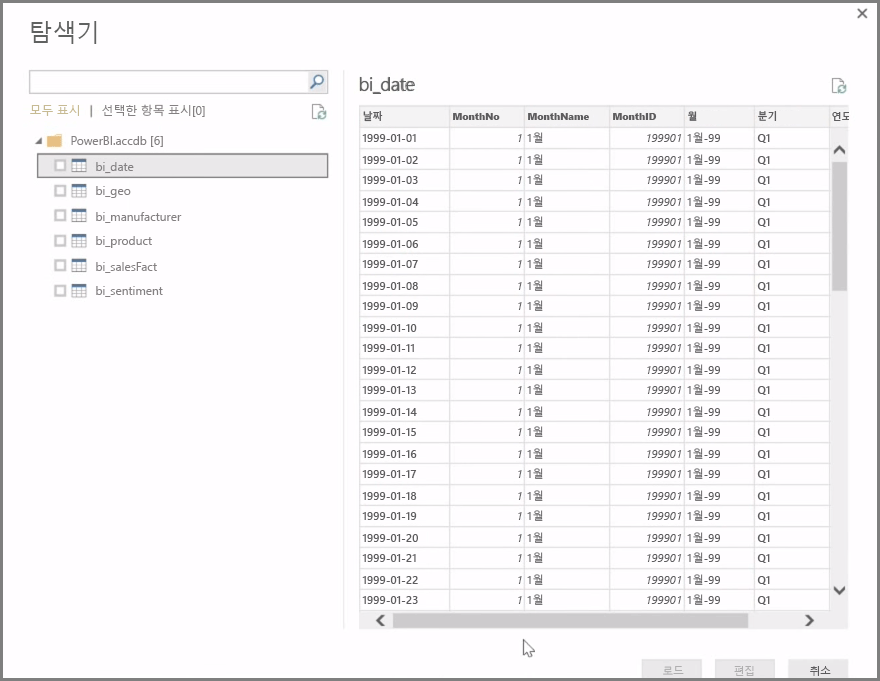
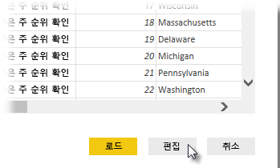

**Power BI Desktop**은 온-프레미스 데이터베이스, Excel 통합 문서, 클라우드 서비스 등 모든 범위의 데이터 소스에 연결할 수 있습니다. 현재, GitHub 및 Marketo와 같은 59가지가 넘는 클라우드 서비스에는 특정 커넥터가 있으며 XML, CSV, 텍스트 및 ODBC를 통해 제네릭 소스에 연결할 수 있습니다. Power BI는 웹 사이트 URL에서 직접 테이블 형식의 데이터를 가져옵니다! 하지만 Power BI Desktop을 열고 데이터에 연결하는 첫 과정부터 시작해 보겠습니다.

**Power BI Desktop**을 시작하고 시작 화면을 지나 이동하면 리본의 **홈** 탭에서 데이터 가져오기를 선택할 수 있습니다.

Power BI Desktop에는 월별 업데이트가 있으며, 각 업데이트에서는 **Power BI Desktop의 새로운 기능** 페이지가 업데이트, 블로그 링크 및 다운로드 링크에 대한 정보로 업데이트됩니다.

Power BI Desktop에는 사용 가능한 모든 종류의 데이터 소스가 있습니다. 연결을 설정할 소스를 선택합니다. 선택한 원본에 따라 컴퓨터 또는 네트워크에서 소스를 찾거나, 요청을 인증하기 위해 서비스에 로그인하라는 메시지가 표시됩니다.

연결이 완료된 후 표시되는 첫 번째 창은 **탐색기**입니다. 탐색기에는 데이터 소스의 엔터티 또는 테이블이 표시되며, 이를 클릭하면 해당 내용의 미리 보기가 제공됩니다. 그런 다음 선택한 테이블 또는 엔터티를 즉시 가져오거나, **편집**을 선택하여 가져오기 전에 데이터를 변환 및 정리할 수 있습니다.

Power BI Desktop으로 가져올 테이블을 선택한 후에는 **탐색기** 오른쪽 아래에 있는 **로드** 단추를 선택하여 Power BI Desktop으로 로드할 수 있습니다. 그러나 Power BI Desktop으로 로드하기 전에 해당 테이블을 변경할 수도 있습니다. 고객의 하위 집합만 필요하거나, 특정 국가에서만 발생한 판매량에 대해 해당 데이터를 필터링할 수 있습니다. 이러한 경우 모든 데이터를 Power BI Desktop으로 가져오기 전에 편집 단추를 선택하고 해당 데이터를 필터링하거나 변환할 수 있습니다.

여기서 데이터를 선택하여 다음 단원에서 편집해 보겠습니다.

