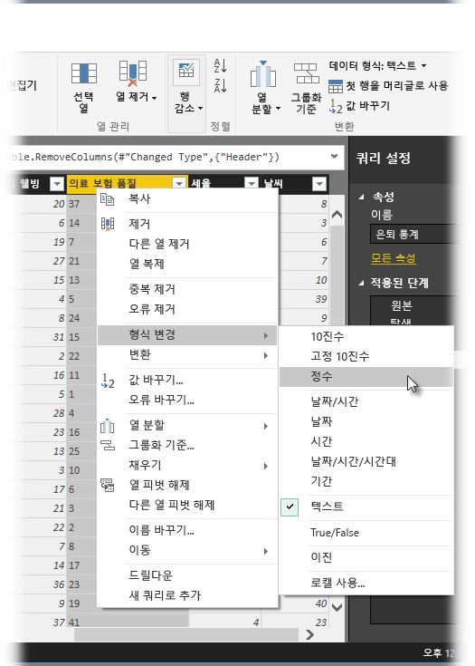
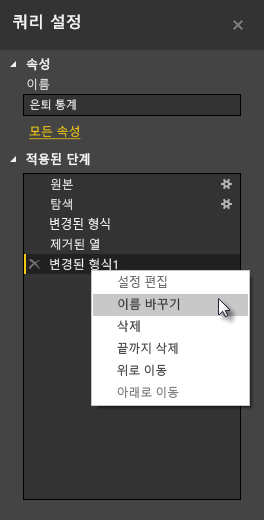
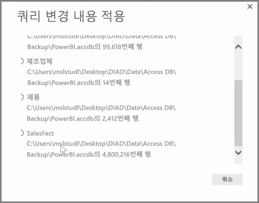

**Power BI Desktop**에는 모델 및 시각화에 즉시 사용할 수 있도록 데이터를 셰이핑하고 변환하는 강력한 도구인 **쿼리 편집기**가 포함되어 있습니다. 탐색기에서 편집을 선택하면 쿼리 편집기가 시작되고 데이터 소스에서 선택한 테이블 또는 다른 엔터티로 채워집니다.

**홈** 리본의 **쿼리 편집** 단추를 사용하여 **Power BI Desktop**에서 직접 **쿼리 편집기**를 시작할 수도 있습니다.

셰이프할 수 있는 데이터와 함께 쿼리 편집기가 로드되면 몇 가지 섹션이 표시됩니다.

1. 리본 메뉴에서 이제 많은 단추가 활성화되어 쿼리의 데이터를 조작할 수 있습니다.
2. 왼쪽 창에 쿼리(각 테이블 또는 엔터티에 하나씩)가 나열되며 선택, 보기 및 셰이핑에 사용할 수 있습니다.
3. 가운데 창에 선택한 쿼리의 데이터가 표시되고 모양 지정에 사용할 수 있습니다.
4. 쿼리 설정 창이 나타나고, 쿼리의 속성과 적용된 단계를 나열합니다.

가운데 창에서 열을 마우스 오른쪽 단추로 클릭하면 테이블에서 열 제거, 새 이름으로 열 복제 및 값 바꾸기와 같은 다양한 변환이 표시됩니다. 이 메뉴에서 일반 구분 기호를 사용하여 텍스트 열을 여러 개로 분할할 수도 있습니다.

**쿼리 편집기** 리본에는 열 데이터 형식 변경, 과학적 표기법 추가 또는 요일과 같은 날짜에서 요소 추출 등의 추가 도구가 포함되어 있습니다.

변환을 적용하면 **쿼리 편집기**의 오른쪽에 있는 **쿼리 설정** 창의 **적용된 단계** 목록에 각 단계가 표시됩니다. 이 목록을 사용하여 특정 변경 내용을 실행 취소하거나 검토할 수 있으며, 단계 이름을 변경할 수도 있습니다. 변환을 저장하려면 **홈** 탭에서 **닫기 및 적용**을 선택합니다.

**닫기 및 적용**을 선택하면 쿼리 편집기에서 쿼리 변경 내용을 적용하고 Power BI Desktop에 이를 적용합니다.

고급 변환을 포함하여 **쿼리 편집기**에서 데이터를 변환할 때 수행할 수 있는 모든 종류의 작업이 있습니다. 다음 단원에서는 **쿼리 편집기**를 사용하여 데이터를 변환할 수 있는 거의 무한한 방법을 설명하기 위해 이러한 고급 변환 중 몇 가지를 살펴보겠습니다.

