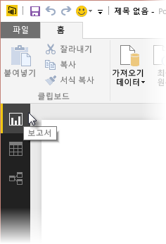
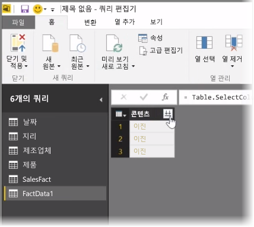
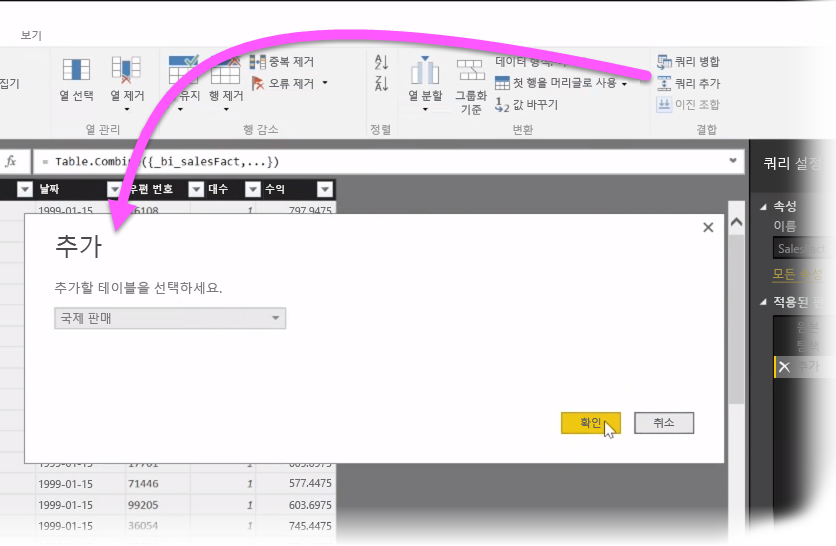
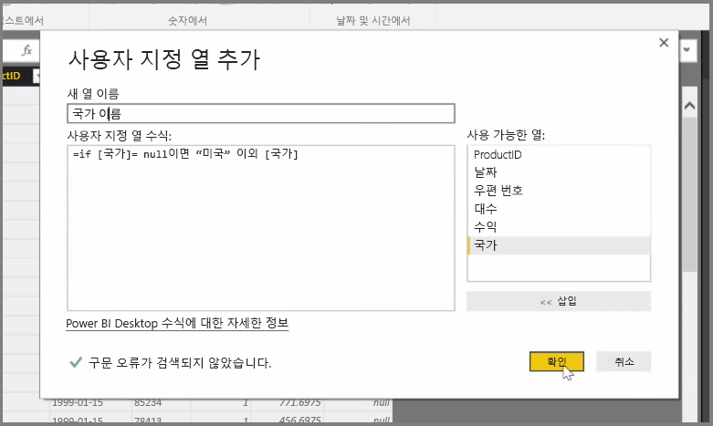

이 문서에서는 **Power BI Desktop**에 대한 몇 가지 고급 데이터 가져오기 및 정리 기술을 살펴봅니다. **쿼리 편집기**에서 데이터를 셰이핑하고 **Power BI Desktop**으로 가져온 후에는 몇 가지 방법으로 데이터를 확인할 수 있습니다. Power BI Desktop에는 다음 세 가지 보기가 있습니다. **보고서** 보기, **데이터** 보기 및 **관계** 보기. 캔버스 왼쪽 위에 있는 해당 아이콘을 선택하면 각 뷰가 표시됩니다. 다음 그림에는 **보고서** 뷰가 선택되어 있습니다. 아이콘 옆에 있는 노란색 막대는 활성화된 뷰를 나타냅니다.

뷰를 변경하려면 다른 두 아이콘 중 하나를 선택하면 됩니다. 아이콘 옆에 있는 노란색 막대는 활성화된 뷰를 나타냅니다.

Power BI Desktop은 모델링 프로세스 중 언제든지 여러 소스의 데이터를 단일 보고서로 결합할 수 있습니다. 기존 보고서에 소스를 더 추가하려면 **홈** 리본에서 **쿼리 편집**을 선택한 후 **쿼리 편집기**에서 **새 소스**를 선택합니다.

폴더를 비롯하여 **Power BI Desktop**에서 사용할 수 있는 다른 여러 데이터 소스가 있습니다. 폴더에 연결하면 일련의 Excel 파일 또는 CSV 파일과 같은 여러 파일의 데이터를 한 번에 가져올 수 있습니다. 선택한 폴더 내에 포함된 파일은 **쿼리 편집기**에 이진 콘텐츠로 표시되며, **콘텐츠** 위에 있는 양방향 화살표를 클릭하면 해당 값이 로드됩니다.

Power BI의 가장 유용한 도구 중 하나는 해당 필터입니다.  예를 들어 열 옆의 드롭다운 화살표를 선택하면 모델에서 값을 제거하는 데 사용할 수 있는 텍스트 필터의 검사 목록이 열립니다.

쿼리를 병합하고 추가할 수 있으며, 여러 테이블(또는 폴더에 있는 여러 파일의 데이터)을 원하는 데이터만 포함된 단일 테이블로 전환할 수도 있습니다. **쿼리 추가** 도구를 사용하여 새 테이블의 데이터를 기존 쿼리에 추가할 수 있습니다. Power BI Desktop에서는 쿼리의 열을 일치시키며, 이후 사용자는 필요에 따라 **쿼리 편집기**에서 조정할 수 있습니다.

마지막으로, **사용자 지정 열 추가** 도구는 고급 사용자에게 강력한 M 언어를 사용하여 처음부터 쿼리 식을 작성할 수 있는 옵션을 제공합니다. M 쿼리 언어 문을 기반으로 사용자 지정 열을 추가하고 원하는 방식으로 데이터를 가져올 수 있습니다.

