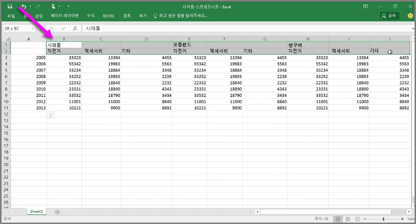
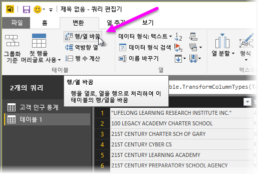
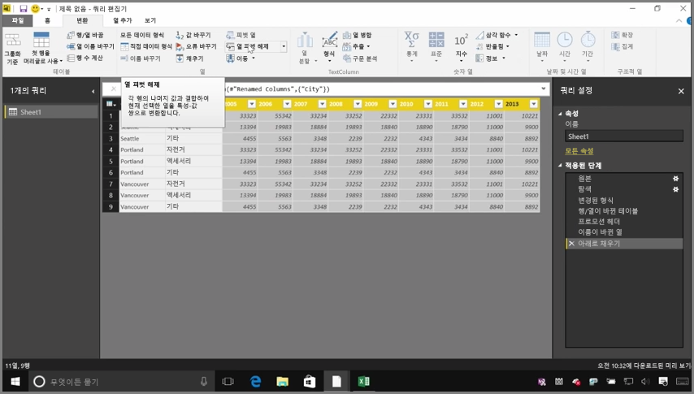
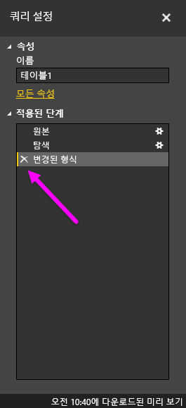

Power BI는 거의 모든 소스에서 데이터를 가져올 수 있지만 해당 시각화 및 모델링 도구는 열 형식 데이터와 가장 원활하게 작동합니다. 데이터가 간단한 열로 서식이 지정되지 않은 경우도 있습니다. 특히 Excel 스프레드시트의 경우 적절해 보이는 테이블 레이아웃이 자동화된 쿼리에 최적화되지 않은 경우도 자주 있습니다. 예를 들어 다음 스프레드시트에는 여러 열에 걸쳐 있는 헤더가 있습니다.

다행히 Power BI에는 다중 열 테이블을 사용 가능한 데이터 세트로 신속하게 변환할 수 있는 도구가 있습니다.

## 데이터 행/열 바꿈
예를 들어 **쿼리 편집기**에서 **행/열 바꿈**을 사용하는 경우 데이터를 대칭 이동(열을 행으로 전환하고 행을 열로 전환)하여 조작할 수 있는 형식으로 데이터를 분할할 수 있습니다.

이 작업을 몇 번 수행하고 나면 동영상에 설명된 대로 테이블이 Power BI에서 보다 쉽게 작업할 수 있는 테이블로 셰이핑되기 시작합니다.

## 데이터 서식 지정
데이터를 가져온 후 Power BI에서 적절히 분류하고 식별할 수 있도록 데이터 서식을 지정해야 할 수도 있습니다.

몇 번의 변환을 통해 *행을 헤더로 승격*하여 헤더를 분할하고, **채우기**를 사용하여 *null* 값을 지정된 열의 위 또는 아래에 있는 값으로 전환하고, **열의 피벗을 해제**하는 등 몇 번의 변환을 통해 Power BI에서 사용할 수 있는 데이터 세트로 해당 데이터를 정리할 수 있습니다.

Power BI를 사용하면 데이터에 대해 이러한 변환을 실험하여 Power BI에서 작업할 수 있는 열 형식의 서식으로 데이터를 가져오는 형식을 결정할 수 있습니다. 또한 사용자가 수행한 모든 작업이 쿼리 편집기의 적용된 단계 섹션에 기록되므로 변환이 의도한 방식으로 작동하지 않는 경우 단계 옆의 **x**를 클릭하여 실행을 취소할 수 있습니다.

## 시각적 개체 만들기
데이터가 Power BI에서 사용할 수 있는 서식으로 지정된 경우 데이터를 변환하고 정리하여 시각적 개체 만들기를 시작할 수 있습니다.

## 다음 단계
**축하합니다!** Power BI에 대한 **단계별 학습** 과정의 이 단원을 완료하셨습니다. 이제 Power BI Desktop으로 **데이터를 가져오는** 방법 및 해당 데이터를 셰이핑하거나 변환하는 방법을 알았으므로 매력적인 시각적 개체를 만들 수 있습니다.  

Power BI의 작동 방식 및 *사용자에게 맞게* 작동하도록 지정하는 방법을 배우는 다음 단계에서는 **모델링**할 항목을 이해하게 됩니다. 설명한 대로 **데이터 세트**는 Power BI의 기본 구성 요소이지만 일부 데이터 세트는 복잡하고 여러 데이터 원본을 기반으로 할 수 있습니다. 또한 만든 데이터 세트에 자신만의 특별한 효과(또는 *필드*)를 추가해야 하는 경우도 있습니다.

다음 단원에서는 **모델링**을 비롯하여 다양한 작업에 대해 알아봅니다. 다음 단원에서 뵙겠습니다!

