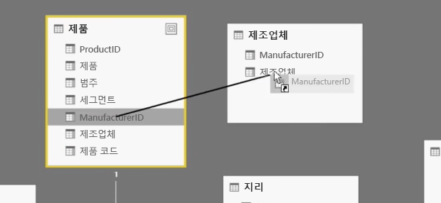
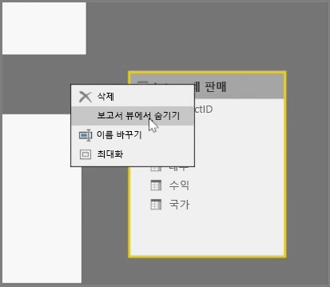
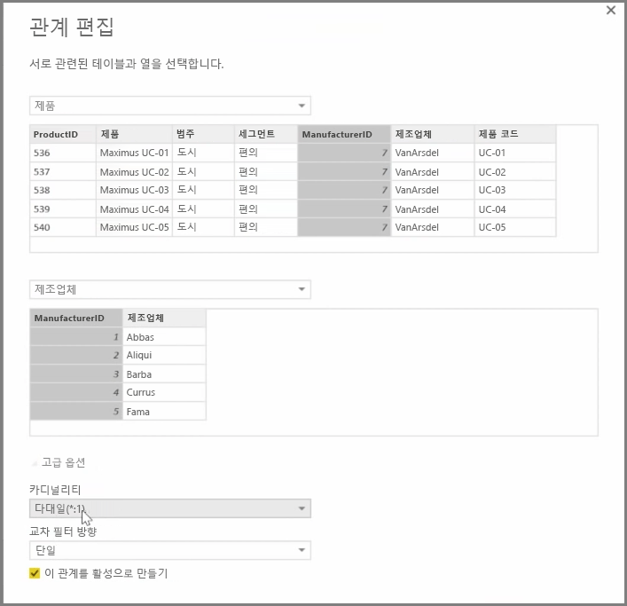

Power BI에서는 테이블 또는 요소 간의 관계를 시각적으로 설정할 수 있습니다. 데이터의 다이어그램 뷰를 보려면 보고서 캔버스 옆 화면의 맨 왼쪽에 있는 **관계 뷰**를 사용합니다.

**관계** 뷰에서는 각 테이블과 해당 열을 나타내는 블록 및 그 사이의 관계를 나타내는 선을 볼 수 있습니다.

관계를 추가하고 제거하는 작업은 간단합니다. 관계를 제거하려면 해당 관계를 마우스 오른쪽 단추로 클릭하고 **삭제**를 선택합니다. 관계를 만들려면 테이블 간에 연결할 필드를 끌어서 놓습니다.

테이블 또는 개별 열을 보고서에서 숨기려면 관계 뷰에서 해당 테이블 또는 열을 마우스 오른쪽 단추로 클릭하고 **보고서 뷰에서 숨기기**를 선택합니다.

데이터 관계의 보다 자세한 뷰를 보려면 **홈** 탭의 **관계 관리**를 선택합니다. 그러면 시각적 다이어그램 대신 목록으로 관계를 표시하는 **관계 관리** 대화 상자가 열립니다. 여기에서 **자동 검색**을 선택하여 새 데이터 또는 업데이트된 데이터에서 관계를 찾을 수 있습니다. 관계를 수동으로 편집하려면 **관계 관리** 대화 상자에서 **편집**을 선택합니다. 여기에는 관계의 *카디널리티* 및 *교차 필터* 방향을 설정할 수 있는 고급 옵션도 있습니다.

카디널리티 옵션은 *다 대 일* 및 일 대 일입니다.  다 대 일은 팩트 대 차원 형식 관계입니다. 예를 들어 제품당 여러 행이 있는 판매량 테이블이 고유한 행에 제품을 나열하는 테이블과 일치됩니다.  일 대 일은 참조 테이블에서 단일 항목을 연결하는 데 자주 사용됩니다. 

기본적으로 관계는 양방향 교차 필터로 설정됩니다. 단방향 교차 필터는 관계에서 일부 모델링 기능을 제한합니다.

데이터 간의 정확한 관계를 설정하면 여러 데이터 요소에서 복잡한 계산을 만들 수 있습니다.

