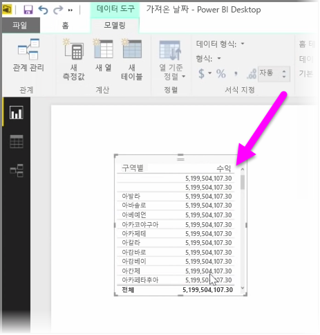
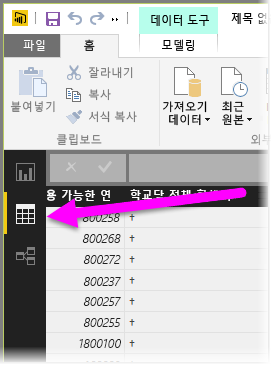
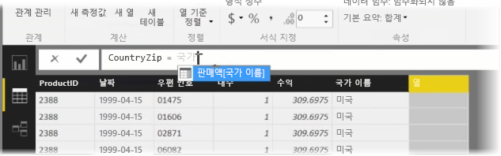
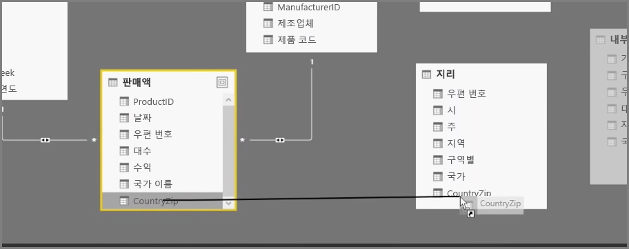
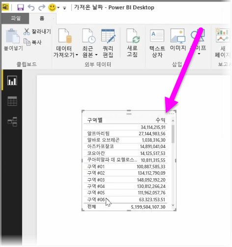

계산 열을 만들면 데이터를 간단하게 보강하고 개선할 수 있습니다. **계산 열**은 둘 이상의 기존 데이터 요소를 변환하거나 결합하는 계산을 정의하여 만드는 새 열입니다. 예를 들어 두 개의 열을 하나로 결합하여 새 열을 만들 수 있습니다.

계산 열을 만드는 한 가지 이유는 관계를 설정하는 데 사용할 수 있는 고유 필드가 없을 때 테이블 간의 관계를 설정하기 위한 것입니다. 관계의 부재는 Power BI Desktop에서 간단한 테이블 시각적 개체를 만들 때 기본 데이터가 다르다는 것을 알면서도 모든 항목에 대해 동일한 값을 가져오는 경우에 명확히 드러납니다.

데이터에서 고유 필드 간의 관계를 만들려면 예를 들어 해당 값이 데이터에 존재하는 경우 "지역 번호" 및 "전화 번호" 열의 값을 결합하여 "전체 전화 번호"에 대한 새 계산 열을 만들 수 있습니다. 계산 열은 모델 및 시각화를 신속하게 만드는 데 유용한 도구입니다.

계산 열을 만들려면 Power BI Desktop의 보고서 캔버스 왼쪽에서 **데이터 뷰**를 선택합니다.

모델링 탭에서 **새 열**을 선택합니다. 그러면 DAX(데이터 분석 식) 언어를 사용하여 계산을 입력할 수 있는 수식 입력줄이 활성화됩니다. DAX는 견고한 계산을 작성할 수 있는 강력한 수식 언어로서, Excel에도 있습니다. 수식을 입력하면 Power BI Desktop에서 수식 만들기를 지원하고 가속화하기 위해 일치하는 수식 또는 데이터 요소를 표시합니다.

식을 입력할 때 Power BI 수식 입력줄에 특정 DAX 함수 및 관련 데이터 열이 제안됩니다.

각 테이블에 계산 열이 만들어지면 이 열을 고유 키로 사용하여 열 간의 관계를 설정할 수 있습니다. 그런 다음 **관계** 뷰로 이동하여 테이블 간에 필드를 끌어서 관계를 만들 수 있습니다.

이제 **보고서** 뷰로 돌아가면 각 지역에 대해 서로 다른 값이 표시됩니다.

계산 열을 만들어 수행할 수 있는 다른 모든 종류의 작업도 있습니다.

