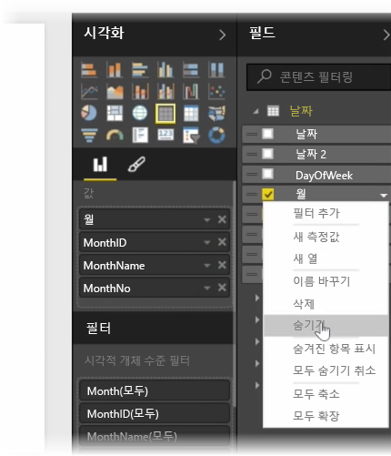
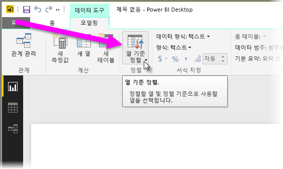
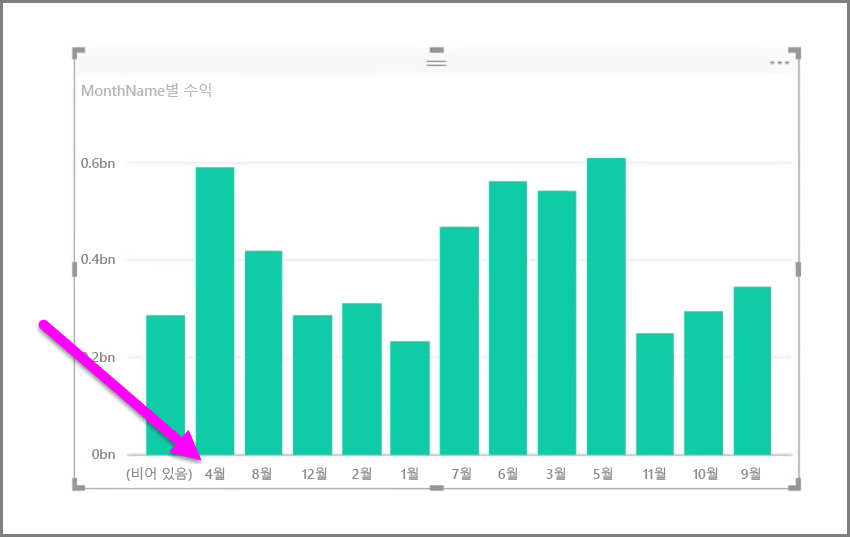

가져온 데이터에는 추가 정보이거나 해당 데이터를 다른 열에서 이미 사용할 수 있기 때문에 보고 및 시각화 작업에 실제로 필요하지 않은 필드가 포함되어 있는 경우가 종종 있습니다. Power BI Desktop에는 데이터를 최적화하여 보고서 및 시각적 개체를 만들고 공유된 보고서를 보는 데 보다 유용하게 해주는 도구가 있습니다.

## 필드 숨기기
Power BI Desktop의 **필드** 창에서 열을 숨기려면 해당 열을 마우스 오른쪽 단추로 클릭하고 **숨기기**를 선택합니다. 숨겨진 열은 삭제되지 않습니다. 기존 시각화 요소에서 해당 필드를 사용한 경우 해당 시각적 개체에 데이터가 여전히 존재하며, 이 데이터를 다른 시각화 요소에서 계속 사용할 수 있습니다. 숨겨진 필드는 **필드** 창에 표시되지 않을 뿐입니다.

**관계** 뷰에서 테이블을 보는 경우 숨겨진 필드는 회색으로 표시됩니다. 해당 데이터는 여전히 사용할 수 있고 모델의 일부분이며 뷰에서 숨겨질 뿐입니다. 언제든지 필드를 마우스 오른쪽 단추로 클릭하고 **숨기기 취소**를 선택하여 숨겨진 필드의 숨기기를 취소할 수 있습니다.

## 다른 필드에 따라 시각화 데이터 정렬
**모델링** 탭에서 제공되는 **열 기준 정렬** 도구는 데이터를 의도한 순서대로 표시하는 데 매우 유용합니다.

일반적인 예로, 월 이름이 포함된 데이터는 기본적으로 사전순으로 정렬되므로 "August"가 "February" 앞에 표시됩니다.

이 경우 필드 목록에서 필드를 선택하고 **모델링** 탭에서 **열 기준 정렬**을 선택한 다음 정렬할 필드를 선택하면 문제를 해결할 수 있습니다. 이 경우 "MonthNo" 범주 정렬 옵션은 월을 의도한 대로 정렬합니다.

필드의 데이터 형식을 설정하는 것은 정보를 올바르게 처리되도록 최적화하는 또 다른 방법입니다. 보고서 캔버스에서 데이터 형식을 변경하려면 **필드** 창에서 열을 선택한 다음 **서식** 드롭다운 메뉴를 사용하여 서식 지정 옵션 중 하나를 선택합니다. 사용자가 만든 시각적 개체 중 해당 필드를 표시하는 모든 시각적 개체가 자동으로 업데이트됩니다.

