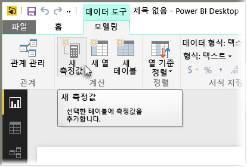
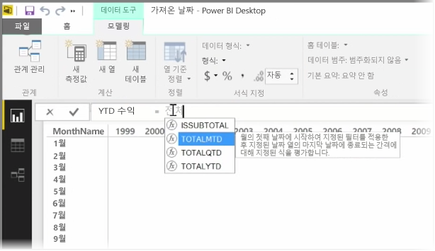
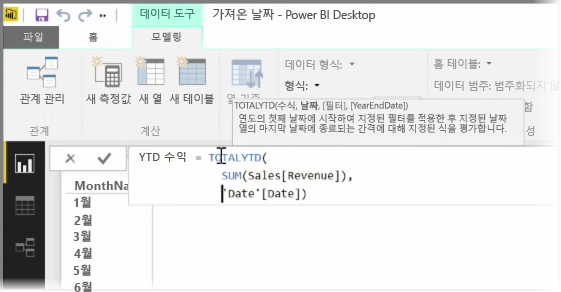
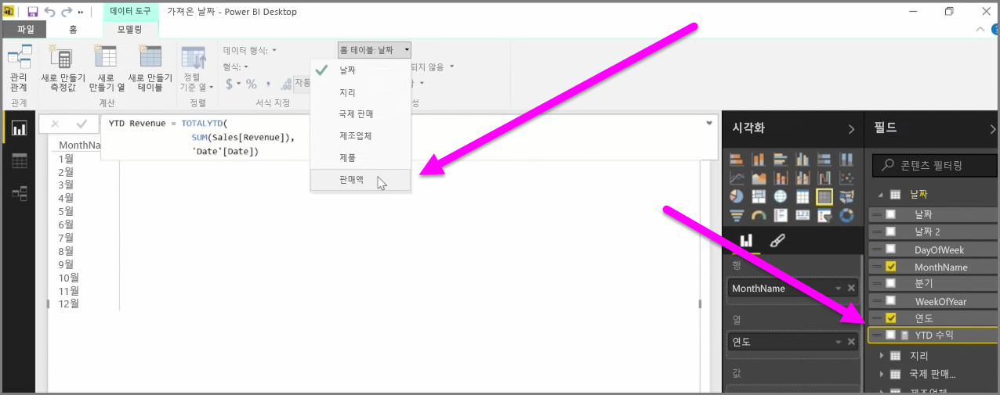

측정값은 Power BI 데이터 모델에 존재하는 계산입니다. 측정값을 만들려면 **보고서** 뷰의 **모델링** 탭에서 **새 측정값**을 선택합니다.

Power BI의 데이터 분석 식 언어인 DAX의 장점 중 하나는 특히 *연간 누계* 또는 전년동기대비와 같은 시간 기반 계산과 관련하여 유용한 함수가 많다는 점입니다. DAX를 사용하면 시간 측정값을 한 번 정의한 다음 데이터 모델에서 원하는 개수의 필드로 조각화할 수 있습니다.

Power BI에서는 정의된 계산을 측정값이라고 합니다. 측정값을 만들려면 **홈** 탭에서 **새 측정값**을 선택합니다. 그러면 측정값을 정의하는 DAX 식을 입력할 수 있는 수식 입력줄이 열립니다. 계산을 입력할 때 Power BI에서 관련 DAX 함수 및 데이터 필드를 제안하며, 일부 구문 및 함수 매개 변수를 설명하는 도구 설명도 확인할 수 있습니다.

계산이 매우 긴 경우 식 편집기에서 **ALT-Enter**를 입력하여 줄 바꿈을 더 추가할 수 있습니다.

새 측정값을 만들면 화면 오른쪽에 있는 **필드** 창의 테이블 중 하나에 해당 측정값이 표시됩니다. Power BI에서는 새 측정값을 현재 선택한 테이블에 삽입합니다. 데이터에서 측정값이 있는 정확한 위치는 중요하지 않지만 측정값을 선택하고 **홈 테이블** 드롭다운 메뉴를 사용하여 쉽게 이동할 수 있습니다.

다른 모든 테이블 열과 마찬가지로 측정값을 사용할 수 있습니다. 보고서 캔버스 또는 시각화 필드에 끌어 놓기만 하면 됩니다. 또한 측정값은 슬라이서와 원활하게 통합되어 데이터를 즉석에서 분할합니다. 따라서 측정값을 한 번 정의한 후 여러 시각화 요소에서 이를 사용할 수 있습니다.

**Calculate** DAX 함수는 유용한 모든 종류의 계산을 지원하는 강력한 함수로서, 재무 보고 및 시각적 개체에 특히 유용합니다.

