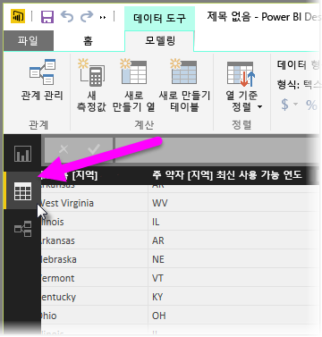
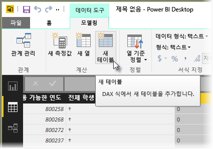
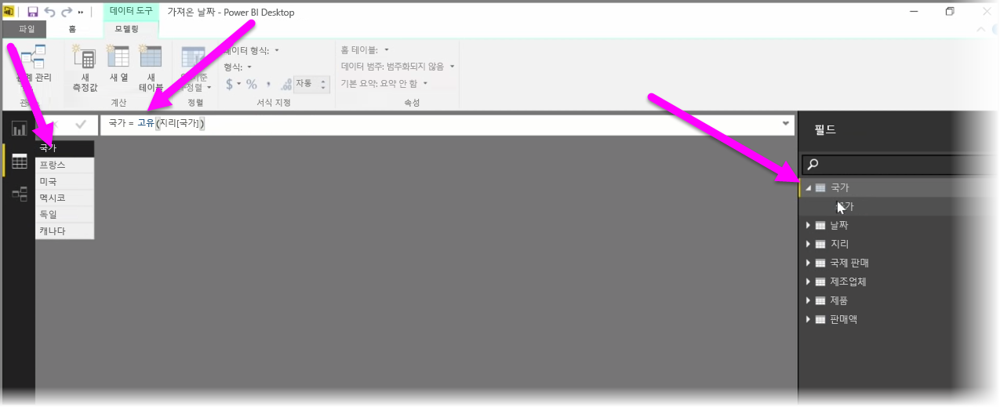

계산 테이블은 전체 범위의 새 모델링 기능을 표현할 수 있는 DAX 내의 함수입니다. 예를 들어 여러 유형의 병합 조인을 수행하거나 함수 수식의 결과에 따라 즉석에서 새 테이블을 만들려는 경우 계산 테이블을 사용하여 이를 수행할 수 있습니다.

계산 테이블을 만들려면 보고서 캔버스의 왼쪽에서 활성화할 수 있는 Power BI Desktop에서 **데이터 뷰**로 이동합니다.

모델링 탭에서 **새 테이블**을 선택하여 수식 입력줄을 엽니다.

등호 기호 왼쪽에 새 테이블의 이름을 입력하고 오른쪽에 해당 테이블을 구성하는 데 사용할 계산을 입력합니다. 계산을 완료하면 모델의 필드 창에 새 테이블이 표시됩니다.

계산 테이블을 만든 후에는 관계, 수식 및 보고서의 다른 모든 테이블과 동일한 방식으로 사용할 수 있습니다.

