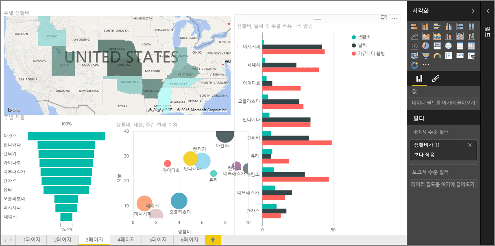

Power BI에 대한 **단계별 학습** 과정의 **시각화** 단원을 시작하겠습니다. Power BI에서 제공하는 다양한 시각화에 대한 흥미로운 둘러보기를 시작해 보겠습니다. 이외에도 앞으로 더 많은 시각화가 제공될 예정입니다.

물론 시각적 개체는 비즈니스 인텔리전스 작업의 최종 결과입니다. 우리는 데이터를 가져와 매력적이고 통찰력 있는 방식으로 제공하고 유용한 정보를 표시하기를 원합니다.  Power BI에는 모든 종류의 멋진 시각적 개체가 있으며, 이를 사용자 지정할 수 있는 방법이 거의 무한하므로 이 단원이 매우 중요합니다!

이 단원에는 많은 항목이 있는 것처럼 보일 수 있지만 걱정하지 마세요. 각 항목이 짧고 시각적 개체로 채워져 있으므로 쉽게 이해할 수 있습니다. 이 단원을 학습하면서 이러한 시각적 개체를 통해 여러분 자신의 데이터를 나타내는 방법을 발견하게 될 것입니다.

먼저 세부적인 내용을 알아야 하므로 이미 친숙한 간단한 시각적 개체인 시각화의 기본 요소부터 시작하겠습니다. 그런 다음 보다 고급이거나 일반적이지 않은 요소를 알아보고 보고서 작성 도구 상자를 살펴보겠습니다.

배울 내용이 많으므로 즐겁게 학습하세요!

## Power BI의 시각적 개체 소개
데이터 시각화는 이 과정의 앞부분에서 정의한 기본 구성 요소로서, Power BI의 핵심 요소 중 하나이며, 시각적 개체를 만드는 것은 통찰력을 발견하고 공유하는 가장 쉬운 방법입니다.

Power BI에는 단순한 가로 막대형 차트에서 원형 차트 및 지도까지 기본적으로 사용 가능한 모든 범위의 시각화 요소가 있으며, 폭포, 깔때기, 계기 등 훨씬 난해한 요소도 있습니다. 또한 Power BI Desktop에서는 도형 및 이미지 등 보고서를 꾸미는 데 도움이 되는 광범위한 페이지 서식 지정 도구를 제공합니다.

