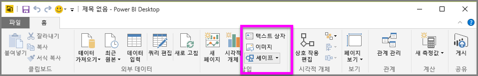
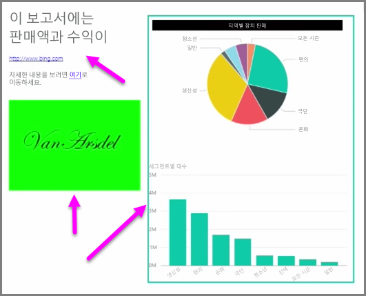

데이터 바인딩된 시각적 개체와 함께 텍스트 상자, 이미지, 도형 등의 정적 요소를 추가하여 보고서의 시각적 디자인을 개선할 수도 있습니다. 시각적 요소를 추가하려면 **홈** 탭에서 **텍스트 상자**, **이미지** 또는 **도형**을 선택합니다.

**텍스트 상자**는 큰 제목, 캡션 또는 짧은 단락의 정보를 시각화와 함께 표시하는 데 가장 적합한 방법입니다. 작성된 URL을 통해 또는 앵커 구문을 강조 표시하고 텍스트 상자 옵션 모음에서 링크 기호를 선택하여 텍스트 상자에 링크를 포함할 수 있습니다. 또한 텍스트 상자에 URL을 포함할 수 있으며, 이 경우 Power BI에서 해당 링크를 자동으로 검색하여 활성화합니다.

**이미지**를 선택하면 컴퓨터 또는 다른 네트워크 소스에서 이미지를 선택할 수 있는 파일 브라우저가 열립니다. 보고서에서 이미지의 크기를 조정하면 기본적으로 가로 세로 비율이 유지되지만 시각적 서식 지정 옵션에서는 이 기능이 비활성화될 수 있습니다.

**도형**에는 사각형 및 화살표를 포함하여 폼에 대한 다섯 가지 옵션이 있습니다. 도형은 색상이 지정된 테두리와 함께 불투명하거나 투명할 수 있습니다. 후자는 시각화 그룹 주위에 테두리를 만드는 데 유용합니다.

