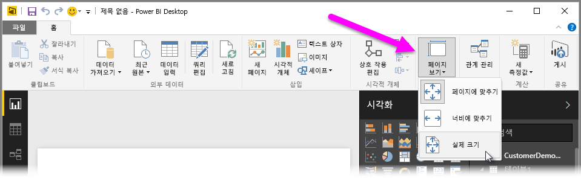
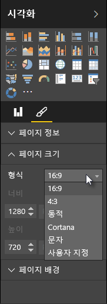

Power BI Desktop에서는 크기 및 방향과 같은 보고서 페이지의 레이아웃 및 서식을 제어할 수 있습니다.

홈 탭에서 **페이지 뷰** 메뉴를 사용하여 보고서 페이지 크기 조정 방식을 변경할 수 있습니다. 사용 가능한 옵션에는 **페이지에 맞추기**(기본값), **너비에 맞추기** 및 **실제 크기**가 있습니다.

페이지 크기 자체를 변경할 수도 있습니다. 기본적으로 보고서 페이지는 16:9입니다. 페이지 크기를 변경하려면 시각적 개체를 선택하지 않은 상태로 시각화 창에서 그림판 아이콘을 선택한 다음 **페이지 크기**를 선택하여 해당 섹션을 확장합니다.

페이지 크기에 대한 옵션에는 4x3(정사각형에 가까운 가로 세로 비율) 및 동적(페이지가 사용 가능한 공간을 채우도록 확장됨)이 있습니다. 보고서에 대한 표준 레터 크기도 있습니다. 페이지 크기를 변경한 후 캔버스에 완전히 포함되도록 시각적 개체의 크기를 조정해야 할 수도 있습니다.

또한 인치 또는 픽셀로 크기를 설정하여 사용자 지정 페이지 크기를 지정하고 전체 보고서의 배경색을 변경할 수 있습니다.

또 다른 옵션은 Cortana를 선택하는 것입니다. 그러면 Cortana를 사용한 검색에 대한 결과로 사용할 수 있도록 보고서 크기가 조정됩니다.

