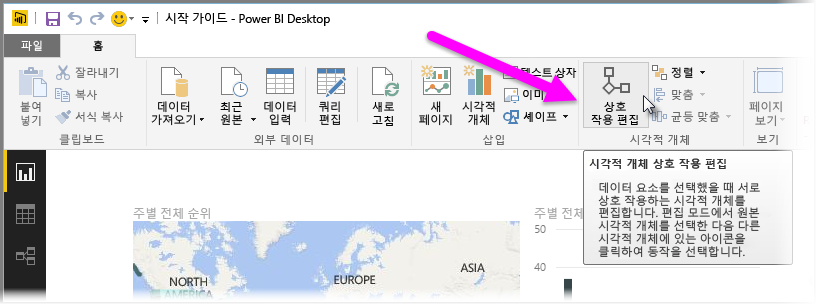
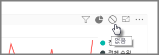
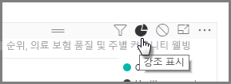
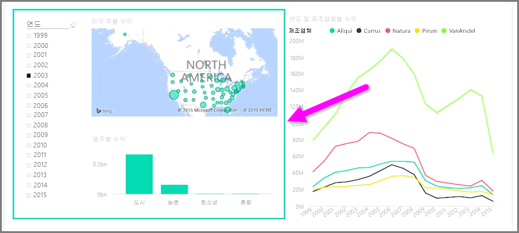

동일한 보고서 페이지에 여러 시각화가 있는 경우 슬라이서를 클릭하거나 사용하여 특정 세그먼트를 선택하면 해당 페이지의 모든 시각적 개체가 영향을 받습니다. 그러나 경우에 따라 특정 시각적 개체만 조각화할 수 있습니다. 이는 세그먼트로 데이터를 제한할 경우 중요한 의미가 제거되는 산점도와 같은 요소를 사용할 때 특히 그렇습니다. 다행히 Power BI Desktop에서는 시각적 개체 간의 상호 작용 흐름을 제어할 수 있습니다.

시각화 간의 상호 작용을 변경하려면 **홈** 리본의 시각적 개체에서 **편집**을 선택하여 **편집 모드**를 설정합니다.

>[!NOTE]
>Power BI Desktop의 **상호 작용 편집** 아이콘은 동영상이 녹화된 후 변경되었습니다.
> 
> 

이제 보고서 캔버스에서 시각적 개체를 선택하면 영향을 받는 다른 모든 시각적 개체의 오른쪽 위에 작은 불투명 *필터* 아이콘이 표시됩니다. 시각적 개체를 상호 작용에서 제외하려면 오른쪽 위의 *필터* 아이콘 근처에 있는 *없음* 기호를 클릭합니다.

경우에 따라 시각적 개체 간에 발생하는 필터 상호 작용의 유형을 조정할 수 있습니다. **편집 모드**를 켜고 필터링하는 데 사용할 시각적 개체를 선택합니다. 다른 시각적 개체에 대한 상호 작용 유형을 변경할 수 있는 경우 오른쪽 위의 필터 아이콘 옆에 *원형 차트* 아이콘이 표시됩니다.

*원형 차트* 아이콘을 클릭하여 분할된 데이터를 강조 표시합니다. 그렇지 않으면 데이터가 필터링됩니다. 이전과 마찬가지오 *없음* 아이콘을 클릭하여 모든 상호 작용을 제거할 수 있습니다.

유용한 디자인 팁은 서로 상호 작용하는 시각적 개체 주위에 투명한 도형을 그리는 것입니다. 그러면 사용자에게 해당 시각적 개체가 상호 작용 관계에 있음을 명확히 전달할 수 있습니다.

