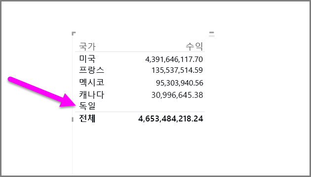
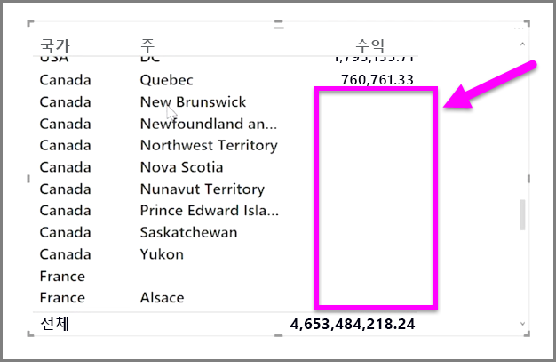

기본적으로 열 머리글은 데이터가 포함된 경우에만 보고서에 표시됩니다. 예를 들어 국가별 수익을 표시할 때 노르웨이의 판매량이 없는 경우 노르웨이는 시각화에 나타나지 않습니다.

빈 범주를 표시하려면 **시각화** 창에서 변경할 필드의 아래쪽 화살표를 클릭하고 **데이터가 없는 항목 표시**를 선택합니다.

그러면 모든 빈 열이 빈 값으로 시각적 개체에 표시됩니다.

**시각화** 창에서 임의의 필드에 대해 **데이터가 없는 항목 표시**를 선택하면 시각화 창에 표시된 모든 필드에 적용됩니다. 따라서 다른 필드를 추가하는 경우 드롭다운 메뉴를 다시 방문하지 않더라도 데이터가 없는 모든 항목이 표시됩니다.

