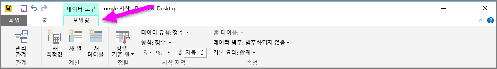
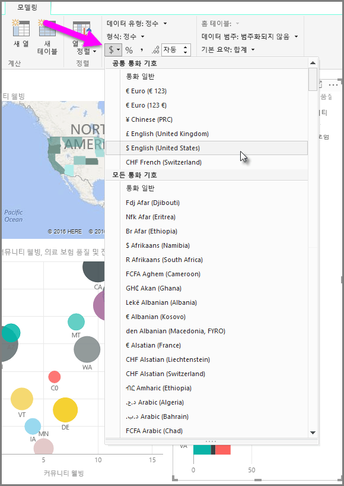
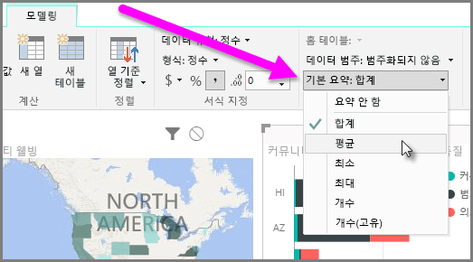
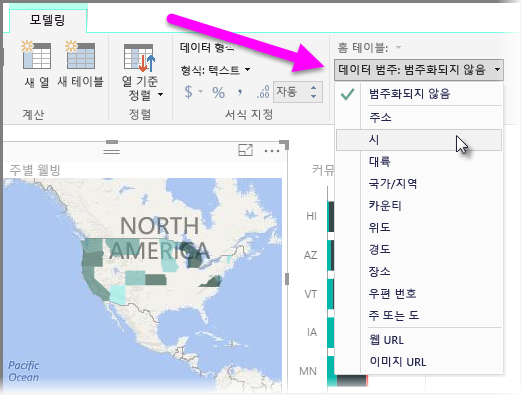

Power BI에는 모델의 필드에 할당할 수 있는 속성이 있습니다. 이는 보다 명확한 방식으로 데이터를 보고 및 시각화하고 표시하는 데 도움이 됩니다. 예를 들어 숫자 목록의 평균을 구하되, Power BI에서 자동으로 목록의 합계를 구하도록 할 수 있습니다. Power BI를 사용하면 이러한 숫자 목록의 요약 방식을 조정할 수 있습니다.

## 요약에 대한 숫자 제어
Power BI에서 숫자 데이터 필드를 요약하는 방식을 제어하는 방법을 예를 들어 보여 줍니다.

보고서 캔버스에서 시각적 개체를 선택한 다음 **필드** 창에서 필드를 선택합니다. **모델링** 탭이 리본에 나타나고 데이터 서식을 지정하는 옵션 및 데이터 속성이 표시됩니다.

다음 그림에 표시된 통화 기호 드롭다운을 선택하여 사용되는 통화 기호 유형을 선택할 수 있습니다.

필드의 서식을 지정하는 다양한 옵션이 있습니다. 예를 들어 통화에서 백분율로 서식을 변경할 수 있습니다.

Power BI에서 데이터를 요약하는 방식도 변경할 수 있습니다. **기본 요약** 아이콘을 선택하여 합계, 개수 또는 평균 표시를 비롯하여 필드 요약 방식을 변경합니다.

## 위치 데이터 관리 및 명료화
지도에 위치를 그릴 때 유사하게 변경할 수 있습니다. 지도를 선택한 다음 **필드** 창에서 *위치* 값에 사용할 필드를 선택합니다. **모델링** 탭에서 **데이터 범주**를 선택한 다음 드롭다운 메뉴에서 위치 데이터를 나타내는 범주를 선택합니다. 예를 들어 주, 국가 또는 도시를 선택합니다.

