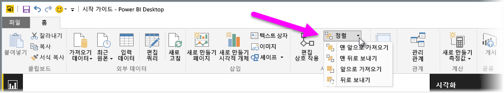
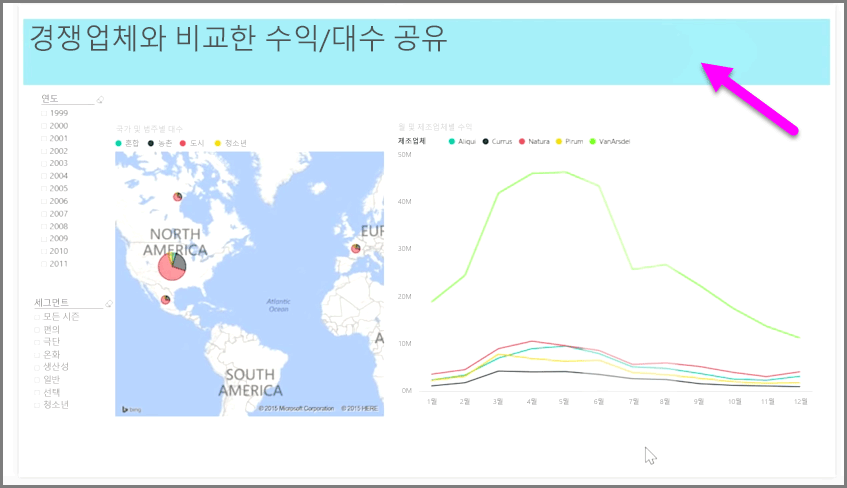

보고서에 많은 요소가 있는 경우 Power BI를 사용하여 요소가 서로 겹치는 방식을 관리할 수 있습니다. 항목이 계층화되거나 서로 위에 정렬되는 방식을 종종 Z 순서라고 합니다.

보고서에서 요소의 Z 순서를 관리하려면 요소를 선택하고 리본의 **홈** 탭에서 **정렬** 단추를 사용하여 해당 Z 순서를 변경합니다.

**정렬** 단추 메뉴의 옵션을 사용하여 보고서 요소의 순서를 원하는 방식으로 지정할 수 있습니다. 하나의 시각적 계층을 앞 또는 뒤로 이동하거나 순서의 맨 앞 또는 맨 뒤로 보낼 수 있습니다.

정렬 단추는 도형을 장식 배경 또는 테두리로 사용하거나 개별 차트 또는 그래프의 특정 섹션을 강조 표시할 때 특히 유용합니다. 다음과 같은 연한 파란색 사각형을 보고서 제목 배경으로 사용하는 것과 같이 정렬 단추를 사용하여 배경을 만들 수도 있습니다.

