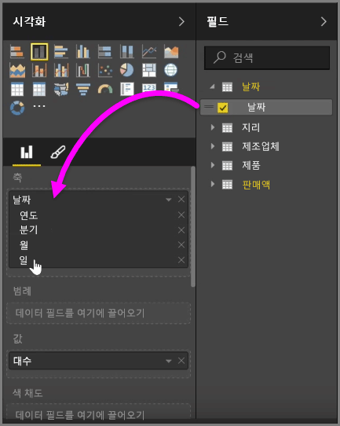
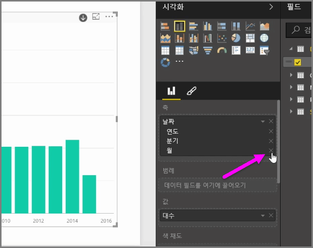
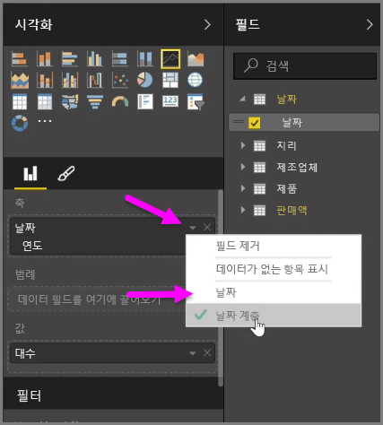
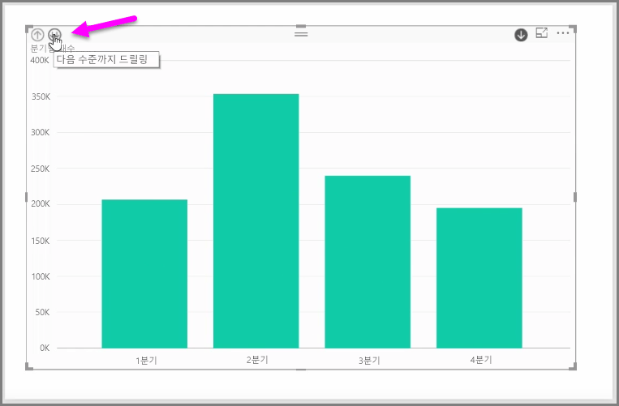

*축* 필드 버킷의 시각적 개체에 *날짜* 필드를 추가한 경우 Power BI에서 *년*, *분기*, *월* 및 일을 포함하는 시간 계층을 자동으로 추가합니다.  이 작업을 수행하면 Power BI에서 사용자가 여러 시간 수준으로 드릴다운할 수 있도록 하여 시각적 개체가 보고서를 보는 사람과 시간 기반 상호 작용할 수 있도록 허용합니다.

계층이 있는 경우 시간 계층 드릴다운을 시작할 수 있습니다. 예를 들어 차트에서 연도를 클릭하면 계층의 다음 수준(이 예제에서는 *분기*)으로 드릴다운된 후 시각적 개체에 표시됩니다.

이 자동으로 만들어진 계층에서는 다른 사용자가 공유된 보고서를 드릴할 수 있는 수준을 관리할 수도 있습니다. 이렇게 하려면 시각화 창에서 제거할 계층 옆에 있는 X를 클릭하기만 하면 됩니다. 삭제된 수준은 보고서에서 제거되고 드릴 시 더 이상 해당 수준이 표시되지 않습니다.

계층의 수준을 되돌려야 하는 경우에는 *날짜* 필드를 제거한 다음 **필드** 창에서 다시 추가하면 됩니다. 그러면 계층이 자동으로 다시 만들어집니다.

시각적 개체에 계층을 사용하지 않으려는 경우가 있을 수 있습니다. *날짜* 필드(시각적 개체에 추가한 경우) 옆의 아래쪽 화살표를 선택하여 제어할 수 있으며, **날짜 계층** 대신 **날짜**를 선택할 수 있습니다. 그러면 Power BI에서 시각적 개체에 원시 날짜 값을 표시합니다.

또한 단일 분기 또는 단일 년을 선택하는 대신 현재 표시된 모든 데이터 요소를 한 번에 확장할 수 있습니다. 이렇게 하려면 시각적 개체의 왼쪽 위에 있는 양방향 아래쪽 화살표 아이콘인 모두 드릴을 선택합니다. 

