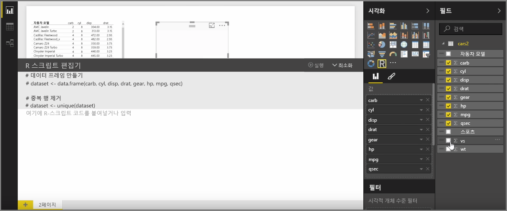
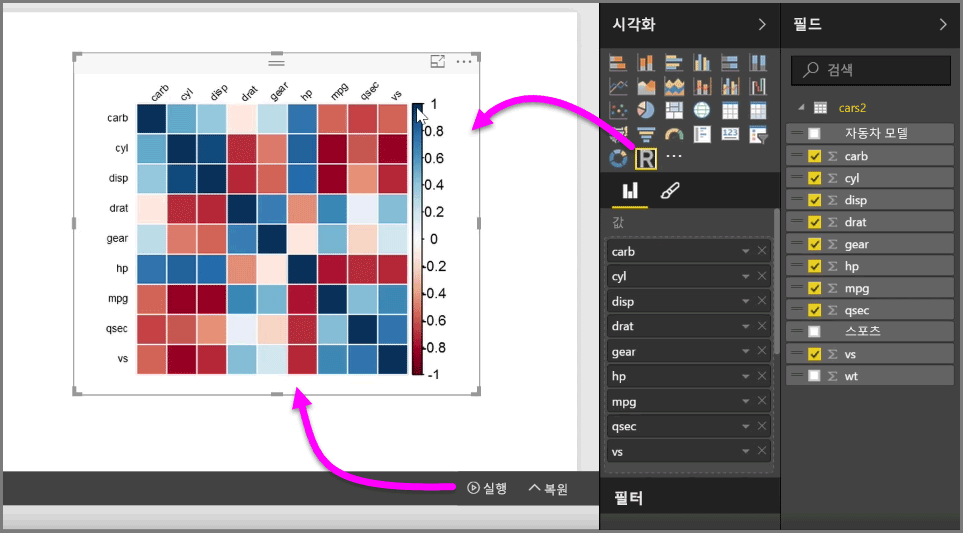
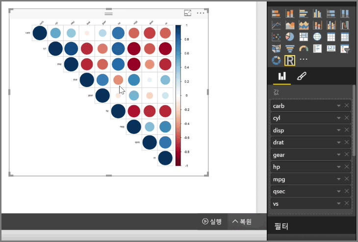

Power BI Desktop을 사용하면 분석 및 통계 분석을 수행하고 R과 통합하여 멋진 시각적 개체를 만들 수 있습니다. 이러한 R 시각화를 Power BI Desktop 보고서 내에서 호스트할 수 있습니다.

**시각화** 창에서 **R 시각적 개체l** 아이콘을 선택한 경우 Power BI는 캔버스에 R 시각적 개체를 호스트할 자리 표시자를 만든 다음 캔버스에서 바로 사용할 수 있도록 R 스크립트 편집기를 제공합니다. R 시각적 개체에 필드를 추가하면 Power BI Desktop에서 R 스크립트 편집기 창에 해당 필드를 추가합니다.

Power BI에서 R 스크립트 편집기에 생성한 항목 아래에서 R 스크립트를 만들어 시각적 개체를 생성하기 시작할 수 있습니다. 스크립트가 완료되면 **실행**을 선택합니다. 그러면 다음 상황이 발생합니다.

1. 시각적 개체에 추가된 데이터(**필드** 창에서)가 Power BI Desktop에서 R의 로컬 설치로 전송됩니다.
2. Power BI Desktop R 스크립트 편집기에 만들어진 스크립트가 R의 해당 로컬 설치에서 실행됩니다.
3. 그런 다음 Power BI Desktop이 R 설치에서 시각적 개체를 다시 가져와 캔버스에 표시합니다.

이 모든 상황은 매우 빠르게 발생하며 캔버스의 **R 시각적 개체** 시각화에 결과가 표시됩니다.

R 스크립트를 조정한 다음 **실행**을 다시 선택하여 R 시각적 개체를 변경할 수 있습니다. 다음 그림에서는 정사각형 대신 원을 표시하도록 시각적 개체를 변경했습니다.

R 시각적 개체는 Power BI Desktop의 다른 시각적 개체와 유사하므로 상호 작용할 수 있으며 캔버스의 다른 시각적 개체와 연결할 수도 있습니다. 필터링 또는 강조 표시를 통해 캔버스의 다른 시각적 개체와 상호 작용하는 경우 R 스크립트를 조정하지 않아도 R 시각적 개체가 다른 Power BI 시각적 개체와 마찬가지로 자동으로 반응합니다.

Power BI Desktop에서 바로 R의 기능을 사용하는 것이 좋습니다.

## 다음 단계
**축하합니다!** Power BI에 대한 **단계별 학습** 과정의 이 **시각화** 단원을 완료하셨습니다. 이제 Power BI에서 제공되는 많은 시각화에 대해 잘 알게 되었으며 이를 사용, 수정 및 사용자 지정하는 방법도 파악하셨습니다. 또한 시각화는 기본적으로 Power BI Desktop과 Power BI 서비스에서 동일하므로 배운 내용을 둘 다에 적용할 수 있습니다.

이제 클라우드에 대해 알아보고 **데이터를 탐색**할 수 있는 Power BI 서비스를 살펴볼 준비가 되었습니다. 아시다시피, 작업 흐름은 다음과 유사합니다.

* **Power BI Desktop**으로 데이터를 가져와 보고서를 만듭니다.
* 새 시각화 요소를 만들고 대시보드를 작성하는 Power BI 서비스에 **게시**합니다.
* 대시보드를 다른 사람, 특히 현재 작업 중인 사람과 **공유**합니다.
* **Power BI 모바일** 앱에서 공유 대시보드 및 보고서를 보고 상호 작용합니다.

보고서를 만들든 아니면 보고서를 보고 상호 작용하든 이제 멋진 시각적 개체를 만드는 방법과 이를 데이터에 연결하는 방법을 알았습니다. 다음 단원에서는 이러한 시각적 개체와 보고서의 작동 방식을 살펴보겠습니다.

다음 단원에서 뵙겠습니다!

