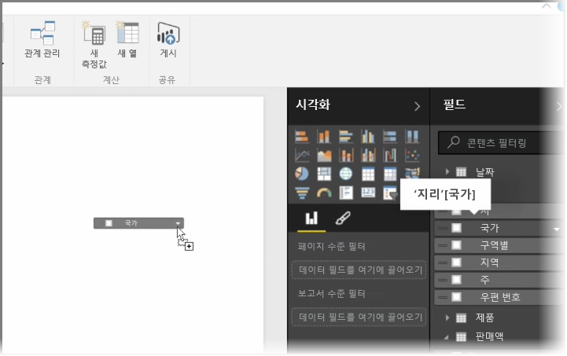
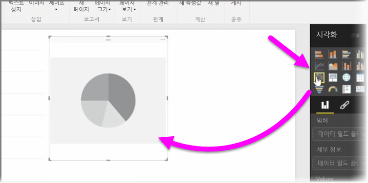
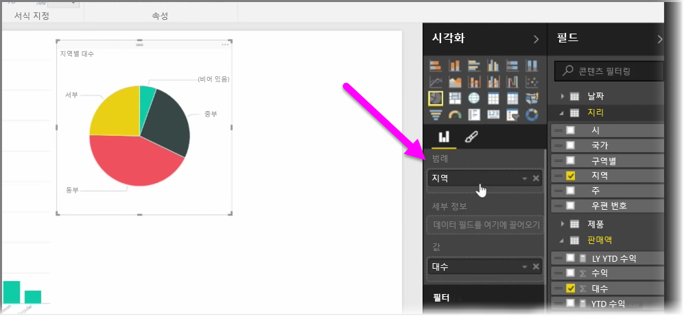
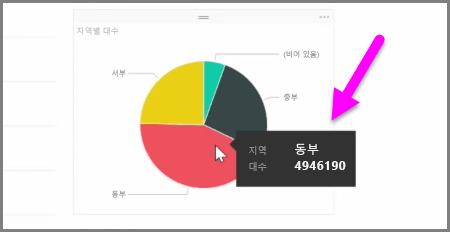
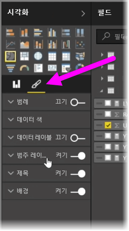

이 문서에서는 새 가로 막대형 차트, 원형 차트 및 트리맵을 만들고 이를 보고서에 맞게 사용자 지정하는 방법을 알아봅니다.

Power BI Desktop에서 새 시각화를 만드는 방법에는 두 가지 방법이 있습니다.

* **필드** 창에서 필드 이름을 끌어 보고서 캔버스에 놓습니다. 기본적으로 시각화는 데이터 테이블로 표시됩니다.
  
  
* **시각화** 창에서 만들려는 시각화 유형을 클릭할 수도 있습니다. 이 방법을 사용하는 경우 기본 시각적 개체는 선택한 시각적 개체의 유형과 유사한 빈 자리 표시자입니다.
  
  

그래프, 지도 또는 차트를 만든 후에는 **시각화** 창의 맨 아래쪽으로 데이터 필드를 끌어 시각적 개체를 작성 및 구성할 수 있습니다. 사용 가능한 필드는 선택한 시각화의 유형에 따라 변경됩니다. 데이터 필드를 끌어서 놓으면 변경 내용을 반영하도록 시각화가 자동으로 업데이트됩니다.

시각화를 선택한 다음 핸들을 끌어 시각화의 크기를 조정할 수 있습니다. 또한 시각화를 클릭하고 끌어서 캔버스의 모든 위치로 이동할 수 있습니다. 서로 다른 유형의 시각화 간에 변환하려면 변경할 시각적 개체를 선택한 다음 **시각화** 창의 아이콘에서 다른 시각적 개체를 선택하기만 하면 됩니다. Power BI는 선택한 필드를 가장 유사한 새 시각적 개체로 변환합니다.

시각화의 일부를 가리키면 레이블 및 합계와 같은 해당 세그먼트에 대한 세부 정보가 포함된 도구 설명이 나타납니다.

**시각화** 창에서 **그림판** 아이콘을 선택하여 배경 맞춤, 제목 텍스트 및 데이터 색과 같은 시각적 개체의 디자인을 변경할 수 있습니다.

시각적 개체의 디자인 변경에 사용할 수 있는 옵션은 선택한 시각적 개체의 유형에 따라 다릅니다.

