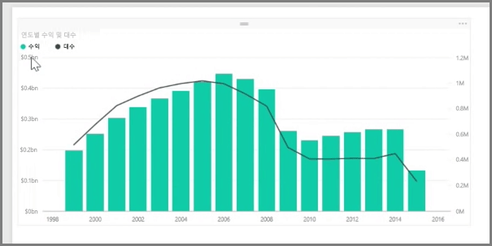
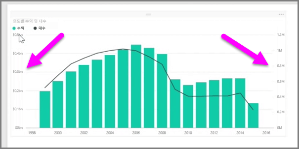
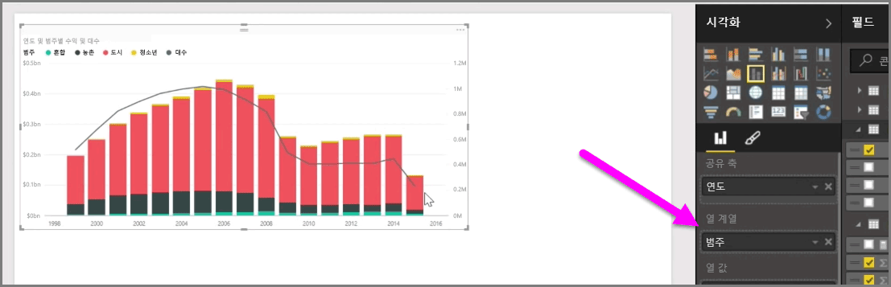

수익과 단위처럼 눈금이 완전히 다른 두 측정값을 시각화하려는 경우 서로 다른 축 눈금으로 선과 막대를 표시하는 **혼합형 차트**가 매우 유용합니다. Power BI는 기본적으로 널리 사용되는 **꺾은선형** 및 **누적 세로 막대형** 차트를 포함하여 다양한 유형의 혼합형 차트를 지원합니다.

혼합형 차트를 만들 때 **공유 축**(X축)에 대한 필드가 제공된 다음 두 필드(이 예제의 경우 열과 선)에 대한 값이 제공됩니다. 두 개의 Y축 범례는 각각 시각화의 한 쪽에 표시됩니다.

시각화 창의 열 계열 필드로 범주를 끌어 각 열을 범주별로 분할할 수도 있습니다. 이렇게 하면 각 막대가 각 범주 내의 값에 비례하여 색이 지정됩니다.

혼합형 차트는 눈금이 완전히 다른 여러 측정값을 단일 시각화에서 시각화하는 데 효과적인 방법입니다.

