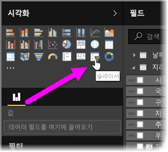
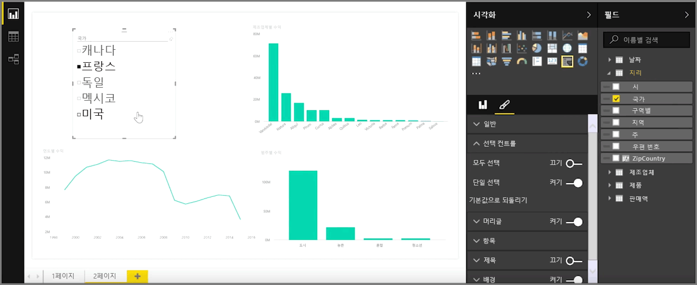
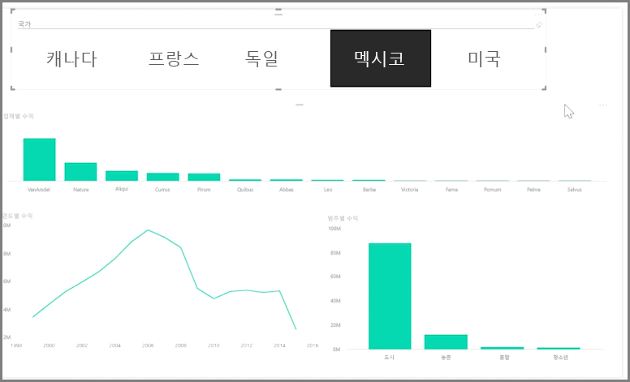

슬라이서는 특히 사용 중인 보고서의 일부로, 가장 강력한 유형의 시각화 중 하나입니다. **슬라이서**는 보고서를 보고 있는 모든 사용자가 연도 또는 지리적 위치와 같은 특정 값으로 데이터를 분할할 수 있도록 해주는 **Power BI Desktop**의 캔버스 상 시각적 개체 필터입니다.

보고서에 슬라이서를 추가하려면 **시각화** 창에서 **슬라이서**를 선택합니다.

조각화할 필드를 끌어서 슬라이서 자리 표시자 위에 놓습니다. 그러면 시각화가 확인란이 있는 요소 목록으로 바뀝니다. 이러한 요소는 필터입니다. 즉, 분할할 요소 옆의 상자를 선택하면 동일한 보고서 페이지에 있는 다른 모든 시각화가 선택한 요소로 필터링되거나 조각화됩니다. 

슬라이서의 서식을 지정하는 데 사용할 수 있는 몇 가지 옵션이 있습니다. 여러 입력을 한 번에 적용하도록 설정하거나 **단일 선택** 모드로 전환하여 한 번에 하나씩 사용하도록 설정할 수 있습니다. 또한 슬라이서 요소에 **모두 선택** 옵션을 추가할 수 있습니다. 이는 목록이 매우 긴 경우에 유용합니다. 슬라이서의 방향을 세로(기본값)에서 가로로 변경하면 검사 목록이 아니라 선택 모음이 됩니다.

